<!-- 本文件由《易经六十四卦》整理稿原样纳入；64 张卦象图位于 docs/images/guaxiang/。 -->

----
 修身，人也；遇不遇，天也。得失不动心，所以顺天也；行险侥幸，是逆天也。求之者，人也；得之与否，天也。得失不动心，所以顺天也。强取必得，是逆天理也。逆天理者，患祸必至。
 
《彖》：彖為一卦之義，吾人觀讀彖，有助於對卦之了解。
《象》：象為一卦之神，每卦皆有象，每爻皆有象，所有的卦皆以象為法則。

# 十天干

- **甲 乙 丙 丁 戊 己 庚 辛 壬 癸**
- 甲 丙 戊 庚 壬 —— 阳（单数）
- 乙 丁 己 辛 癸 —— 阴（偶数）

- 甲己合，合化土，中正之合。甲主动，己被动。      
- 乙庚合，合化金，仁义之合。庚主动，乙被动。      
- 丙辛合，合化水，威制之合。丙主动，辛被动。      
- 丁壬合，合化木，淫匿之合。壬主动，丁被动。      
- 戊癸合，合化火，无情之合。戊主动，癸被动。

# 十二地支

- **子 | 丑 | 寅 | 卯 | 辰 | 巳 | 午 | 未 | 申 | 酉 | 戌 | 亥**
- 子 寅 辰 午 申 戌 —— 阳（单数）
- 丑 卯 巳 未 酉 亥 —— 阴（偶数）

- | **地支** | 子 | 丑 | 寅 | 卯 | 辰 | 巳 | 午 | 未 | 申 | 酉 | 戌 | 亥 |      
- | **本气** | 癸 | 己 | 甲 | 乙 | 戊 | 丙 | 丁 | 己 | 庚 | 辛 | 戊 | 壬 |      
- | **中气** | ﹣ | 癸 | 丙 | ﹣ | 乙 | 庚 | 己 | 丁 | 壬 | ﹣ | 辛 | 甲 |      
- | **余气** | ﹣ | 辛 | 戊 | ﹣ | 癸 | 戊 | ﹣ | 乙 | 戊 | ﹣ | 丁 | ﹣ |

# 八纯卦——其法皆自下而上，阳甲隔位顺轮，阴甲隔位逆转。

乾卦（阳性）：天性向下，代表刚、健、实心、代表充实自己。
坤卦（阴性）：地性德厚，代表顺、柔、承载万物，含章之美。

艮卦——阳爻在上为止的象——山、止、大、三男。
坎卦——阳爻在中为陷的象——水、陷、险、二男。
震卦——阳爻在初为动的象——雷、动、长男。

兑卦——阴爻在上为悦的象——泽、悦、三女。
离卦——阴爻在中为丽的象——火、丽、中虚、二女。
巽卦——阴爻在初为风的象——风、顺、入、长女。

**四阳卦——阳甲**
~~~
    卦宫:        乾     坎    艮     震
    上爻（过）： 壬戌   戊子   丙寅   庚戌
    五爻（君）： 壬申   戊戌   丙子   庚申
    四爻（宰）： 壬午   戊申   丙戌   庚午
    三爻（相）： 甲辰   戊午   丙申   庚辰
    二爻（将）： 甲寅   戊辰   丙午   庚寅
    初爻（民）： 甲子   戊寅   丙辰   庚子
~~~

**四阴卦——阴甲**
~~~
    卦宫:        坤     巽    兑     离
    上爻（过）： 癸酉   辛卯   丁未   己巳
    五爻（君）： 癸亥   辛巳   丁酉   己未
    四爻（宰）： 癸丑   辛未   丁亥   己酉
    三爻（相）： 乙卯   辛酉   丁丑   己亥
    二爻（将）： 乙巳   辛亥   丁卯   己丑
    初爻（民）： 乙未   辛丑   丁巳   己卯
~~~

# 乾宫八卦——属金

## 《乾为天》（纯卦）乾上 乾下（六冲）

~~~
 【本卦】
▆▆▆▆▆▆▆▆▆     父母壬戌土   世
▆▆▆▆▆▆▆▆▆     兄弟壬申金
▆▆▆▆▆▆▆▆▆     官鬼壬午火
▆▆▆▆▆▆▆▆▆     父母甲辰土   应
▆▆▆▆▆▆▆▆▆     妻财甲寅木
▆▆▆▆▆▆▆▆▆     子孙甲子水
~~~
六龙御天之卦，广大包容之象。
判曰：乾者，健也。大哉乾元。荫覆无偏，玄运造化，万物资始。云行雨施。变化不言。东西任意，南北安然。

### 卦象——此卦高祖與呂后走在芒碭山卜得之，餘人難壓（yā）也。

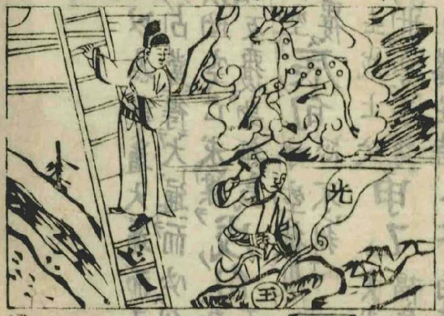
- 圖中：鹿在雲中，石上玉，有光明，人琢玉。月當空，官人登雲梯，望月。
- 卦圖象解：
	- 一、官人在梯上：平步青雲象。
	- 二、鹿在雲中：作為行事心中不可求祿，則祿至矣。
	- 三、石上玉有光明：示人才如玉之含光，吉也。
	- 四、人磨玉：示人堅心不移，夕惕若厲，隨時戒之。
	- 五、工匠：有重立門户之象。
	- 六、梯上官人：棺也。卜疾厄凶也。
	- 七、官人望磨玉人：示人即平步青雲須戒盛，且望下看，念中無妄，則升遷平安，如爭位則旦夕而亡也。

### 人间道——乾为天

- 下一卦[《坤为地》](#《坤为地》（纯卦）坤上%20坤下（六冲）#人间道——坤)

> [!引申] 
萬物皆成於天地之間，故天之高，地之厚德，皆為吾人所效法。聖人觀天而知天之運行恆古不變，且永不止息，此天之道。乾為萬物之始，以象言其為天，為陽，為父，為君。

- 乾：元、亨、利、貞。
	- 元為萬物之始生，亨為萬物之成長，利為萬物之遂成，貞為萬物之堅心，此為乾之性，恒古不變，示人须有堅定不移之心志，萬事乃成於此。
- 《彖》曰：大哉乾元！萬物資始，乃統天。雲行雨施，品物流形。大明终始，六位時成，時乘六龍以御天。乾道變化，各正性命，保合大和，乃利貞。首出庶務，萬國咸寧。
	- 乾道之浩大，萬物由此而生，乾道因統天，故即為天道，萬物生後，雲行雨施，品物流形，此物之長也。六爻之卦位，各因時而成，此為天之運行，因天道之剛健而自強不息的運作，生育出萬物，且各有分類，各有所性，各有所命。吾人言『天所賦為命，物所受為性。』自此常存此道，因天道生成之剛正，利於吾人堅心向道，果必吉。天之道首出萬物而皆亨吉，人君之道遵循天道，以致四海顺从。
- 《象》曰：天行健，君子以自彊不息。
	- 此乾之卦象言，始終如一，永恆不變，人之行為能如此則至健，可以見天道也。吾人之自強不息，乃法天之則也，此為天紀。
- 初九：潛龍勿用。
	- 初爻為陽位，且陽居此，因爻理本無形，聖人假借龍之物象來示人乾之初象如聖人始萌，如物之始端，若龍之潛隱，由於始生，未為可用之時機，當韜光養晦，以俟時之至。
	- 《象》曰：“潛龍勿用”，陽在下也。
		- 陽居最下始生之位，猶植物之生於土中，未出頭，始萌之狀。故君子如處此時，乃應進德修業，未為可用之時機也。
- 九二：見龍在田，利見大人。
	- 以個人而言，此時如舜之田漁，其德已著，乃時之至，故利見大德之君，以行其道。以君王言，此時亦利見大德之人臣，以共成其功。以天下百姓言，亦利見大德之人才，以受其恩澤。
	- 《象》曰：“見龍在田”，德施普也。
		- 此時君子之德已普及各地，人民已感受其教化之力量也。
- 九三：君子終日乾乾，夕惕若厲，无咎。
	- 三爻位是在下卦之最上，雖為臣位，但未離下位，此時君子知朝夕不懈，隨時警惕，即處危地，但因戒惕而無災至。時今在下位之人，因德已顯彰，民心將至，天下將歸於他，試想其危懼之程度，故聖人設戒於此時，此易之論時也。
	- 《象》曰：“終日乾乾”，反復道也。
		- 此時居下卦之最上，要再進前，但又未脱下位之關係，進退動靜，必依有道，且旦夕進修勵（lì）德，此時之法則也。
- 九四：或躍在淵，无咎。
	- 或乃進與不進之時，聖人示戒進之時機，如時機不對，亦可不進，“或”之意也，無災。
	- 《象》曰：“或躍在淵”，進无咎也。
		- 或乃量可而進，待之以時，時至而動，動必以明，無災。
- 九五：飛龍在天，利見大人。
	- 此乃進乎天位君位之時，天下利見有大德之人，來共成天下之大事，聖人居此位，乃知時之至矣。廣納天下大德之人共成之。
	- 《象》曰：“飛龍在天”，大人造也。
		- 君子能進君位，而行其正道，天下大治矣。
- 上九：亢龍有悔。
	 - 上九為位之極點，過此時太過也。聖人知此為時之極限，乃知進退存亡而終至無過，就不至於後悔也。
	 - 《象》曰：“亢龍有悔”，盈不可久也。
		- 滿則溢，此天之道也，故易示人滿必不可持久，太過必生悔矣。
- 用九：見群龍無首，吉。
	- 用九之道，即用鲍陽剛之道，須剛柔相濟方為中道，如過乎剛，以至剛為天下之優先，此凶之道也。
	- 《象》曰：用九，天德不可爲首也。
		- 用九，意為用剛之道也，天道陽剛，又用剛而為先，此之過矣。

### 文言曰

   - 元者，善之長也；亨者，嘉之會也；利者，義之和也；貞者，事之幹也。
	- 易中唯乾坤二卦有文言，此乃補強乾坤天地之道。
	- 元者，萬物之始皆為善，天之生必有其用，此為造化之跡也。
	- 亨者，乃其成長之嘉且美也。
	- 利者，任何行為必合於義也。
	- 貞者，萬物之用，必以堅心不移方可成矣。
- 君子體仁，足以長人。
	- 分均，仁也，此仁之道大矣，君子體之，以仁普及教化，所以長人也。
- 嘉會，足以合禮。
	 - 不合理則為非禮，合於理之生長，為美之至嘉也。故萬般事物皆有一定之法則，吾人須體理之治，則發展合於天道自然。
- 利物，足以合義。
	- 合於義，則能利於萬物之遂行。後出，義也。能斷後，則為義也。而今人類製造之物，無法完全回收，造成自然界之失衡，此不合於義之道也，不合於利物之理。
- 貞固，足以幹事。
	- 因堅定不移之意志，則定以成事。
 - 君子行此四德者，故曰“乾：元，亨，利，貞”。
	 - 能行此四德，則合乎乾天之道。
  - 初九曰：“潛龍勿用”，何謂也？子曰：龍德而隱者也，不易乎世，不成乎名，遁世无悶，不見是而无悶，樂則行之，憂則違（wéi）之，確乎其不可拔，潛龍也。
	- 乾卦之用，即用九之道。初九為陽剛之微現，如龍之潛隱，聖人居之陋側，堅守其道不因世之變而改變，時不至，隱其行，不求為人知也，自信自樂，見可而動，知災而避，守正道之心堅而不移，此真潛龍也。
- 九二曰：“見龍在田，利見大人”，何謂也？子曰：龍德而正中者也。庸言之信，庸行之谨，閑邪存其誠，善世而不伐，德博而化。易曰：見龍在田，利見大人，君德也。
	- 因非為君位，但有中正之德，謹言慎行，但求處於無過之地，遇邪道，但求存誠，德施普及，但不伐其惡，以誠純一，雖不為君，但為君之德也。
- 九三曰：“君子終日乾乾，夕惕若厲，无咎”，何謂也？子曰：君子進德脩業，忠信所以盡德也；脩辭立其誠，所以居業也。知至至之，可與幾也；知終終之，可與存義也。是故居上位而不驕，在下位而不憂，故乾乾因其時而惕，雖危无咎矣。
	- 位居下卦之上者，已近君位，又因有君之德顯，為免招凶，故君子居此時，必求進德修業，終日謹慎言行，知進退之機，此義之道。不以居上位或處下位而驕傲或憂慮，不予人有野心之戒，故雖處危地但無災至也。
- 九四曰：“或躍在淵，无咎”，何謂也？子曰：上下无常，非爲邪也；進退无恆，非離群也；君子進德脩業。欲及時也，故无咎。
	- “或”即進退須待時之意，時行時止，不可恆久不變。君子之順時而動，猶影之隨形，並非欲為邪吝之人，亦非欲離同類也。此位乃近君惻之人也。
- 九五曰：“飛龍在天，利見大人”，何謂也？子曰：同聲相應，同氣相求，水流濕，火就燥，雲從龍，風從虎，聖人作而萬物睹。本乎天者親上，本乎地者親下，則各從其類也。
	- 此有中正之德的人，居於君王之位，天下人皆歸仰其德，上應於下，下從於上，故聖人做而萬人皆明，因同德相感，故賢人出，各有其類，本為君位之人則親和於君王，本為位低之賢，則近於下位之人，此乃自然之水流濕，火就燥，雲從龍，風從虎之義。故利見大人。
- 上九曰：“亢龍有悔”，何謂也？子曰：貴而无位，高而无民，賢人在下位而无輔，是以動而有悔也。
	- 有陽剛之正德而居不適位，則動而必悔，因无民无輔，獨力難成也。
- “潛龍勿用”，下也。
	- 居下位之時，即有中正之德，亦宜潛隱，不可就用也。
- “見龍在田”，時舍也。
	- 因時而止，此利普施其德於一地，範圍有限。
- “終日乾乾”，行事也。
	- 君子行事之法則，不居君位，則終日警惕，進德修業，不求有大功。
- “或躍在淵”，自試也。
	- 處君側，可自試時機為何，動靜隨消息而進或止，不可躁進，求凶之道。
- “飛龍在天”，上治也。
	- 有君王之位人，又有中正之德者，如龍在天，乃上上之治，其意如此。
- “亢龍有悔”，窮之災也。
	- 因窮困之極，乃有太過之舉動，此災之至也。
- 乾元“用九”，天下治也。
	- 用九之道，因天與聖人同知且同用，天下因治。
- “潛龍勿用”，陽氣潛藏。
	- 方陽衰而潛藏之時，君子效此，亦晦隱，不可用也。
- “見龍在田”，天下文明。
	- 龍之陽剛德性，見於地上，如此天下則見其文明也。
- “終日乾乾”，與時偕行。
	- 待時而動，不可分秒懈怠。
- “或躍在淵”，乾道乃革。
	- 因知進退之得宜，故能離下卦，而躍居上位，故曰上下之革。
- “飛龍在天”，乃位乎天德。
	- 正於君位，天德乃現，如龍升天。
- “亢龍有悔”，與時偕極。
	- 時之過，再居此時，則人與時皆過也
- 乾元“用九”，乃見天則。
	- 用九，乃天之則也，天之法則即為天道，聖人稟道而行，得失吉凶立知於事之初，此為天則。
- 乾“元”者，始而亨者也。
	- 用陽剛之天則，初始即可亨通也。
- 利貞者，性情也。
	- 陽剛之性既亨通，須始終如一，則能生生不息。
- 乾始能以美利利天下，不言所利，大矣哉。
	- 乾始之道，能使天下皆感其美，而天下因之而利，又不歌功頌德，將功歸己，此則大矣。
- 大哉乾乎！剛健中正，純粹精也；六爻發揮，旁通情也；時乘“六龍”，以御天也；“雲行雨施”，天下平也。
	- 此言乾道之偉大，因純之剛健中正，按步就班，順時順位而行之，則可以統御天下，陰陽和暢，天下則進入和平之道也。
- 君子以成德爲行，日可見之行也。“潛”之爲言也，隱而未見，行而未成，是以君子弗用也。
	- 君子以行為而示人其德性，隨時可見。初因方潛未為見用，故君子弗用也。
- 君子學以聚之，問以辯之，寬以居之，仁以行之，易曰：“見龍在田，利見大人”，君德也。
	- 聖人居下位，德已顯，卻未得位時，必求進德修身，不怪時之不與，但求身體力行此雖不為君，卻是為君之德才。
- 九三：重剛而不中，上不在天，下不在田，故乾乾因其時而惕，雖危无咎矣。
	- 因九三位為過中而又居下卦之上，屬相位，上又未至君位，又為陽剛之性，故屬危懼之地，聖人知戒，競競惕惕以防危，故雖處此時而无咎也。
- 九四：重剛而不中，上不在天，下不在田，中不在人，故“或”之；或之者，疑之也，故无咎。
	- 九四為近君位，亦屬危地，或進或退，但求平安耳，故可无咎。君子能曲能伸。
- 夫大人者，與天地合其德，與日月合其明，與四時合其序，與鬼神合其吉凶，先天而天弗爲，後天而奉天時，天且弗違，而況於人乎？况於鬼神乎？
	- 聖人先知於天故天與其同，後於天又順於天，此合乎天道，故人與鬼神皆不能違，天為至大，存天地之間，道也。鬼神，造化之跡也。
- “亢”之爲言也，知進而不知退，知存而不知亡，知得而不知喪，其唯聖人乎！知進退存亡，而不失其正者，其唯聖人乎！
	- 亢之義乃不知進退存亡之機也，聖人知亢而處此，凡事皆不失正道，故不為亢，唯聖人可為也。

## 《天风姤》（一世）乾上 巽下

~~~
  伏 神        【本 卦】
              ▆▆▆▆▆▆▆▆▆     父母壬戌土
              ▆▆▆▆▆▆▆▆▆     兄弟壬申金
              ▆▆▆▆▆▆▆▆▆     官鬼壬午火   应
              ▆▆▆▆▆▆▆▆▆     兄弟辛酉金
妻财甲寅木     ▆▆▆▆▆▆▆▆▆     子孙辛亥水
              ▆▆▆   ▆▆▆     父母辛丑土   世
~~~
风云相济之卦，君臣会合之象。
判曰：姤者，遇也。以阴遇阳，以柔遇刚，本无所望，而卒然值之，不期而遇。占者得之，所谋无不吉也。

### 卦象——此卦漢呂后擬立呂氏謀漢社稷，卜得之果不利也。

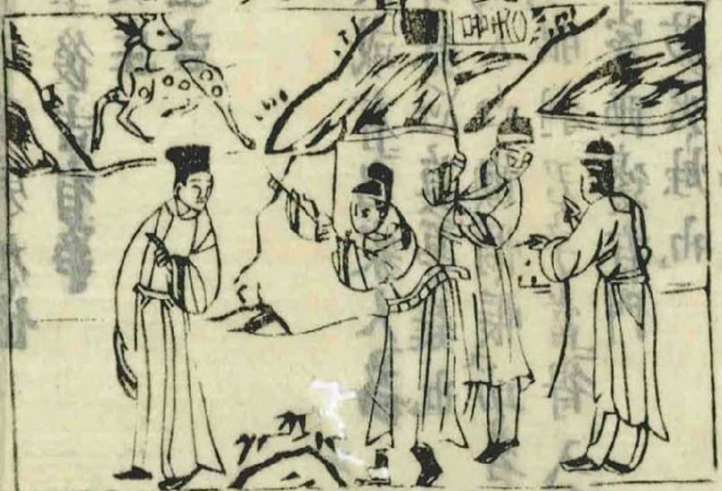
- 圖中：官人射鹿，文書有喜字，二人執索，綠衣人指路。
- 卦圖象解：
	- 一、官人射鹿：丈夫也，取祿狀，野外之財，射，發也。
	- 二、文書上有喜字：摇摇欲墜，根只一線，夫妻凶。
	- 三、二人執索：互相牽累。
	- 四、綠衣人指路：掌生死簿之人，信差（今日）。
	- 五、二重山：重阻也。出也。

### 人间道——姤

- 上一卦[《泽天夬》](#《泽天夬》（五世）兑上%20乾下#人间道——夬)——下一卦[《泽地萃》](#《泽地萃》（二世）兑上%20坤下#人间道——萃)

> [!引申]
夬，決也，潰決之後，必有遇，姤，遇也，故次夬卦。此卦，乾上巽下，即風行天下，風行時必觸及萬物，故為遇之象。

- 姤：女壯，勿用取女。
	- 姤之道在戒陰壯之始，娶女本欲其柔且順從，但初進為陰，而渐進長盛，且有壯於陽者，古来女壯必失男女之道，家道必敗。戒之在初始。
- 《彖》曰：
	- 姤，遇也，柔遇剛也。勿用取女，不可與長也。
		- 姤，乃柔之遇剛，小人之道始遇君子之陽剛，須戒之在始，勿取如是之女，不可使小人之道長。
	- 天地相遇，品物咸章也。剛遇中正，天下大行也。姤之時義大矣哉。
		- 萬物之生始於天陽地陰之交遇，不遇則不生。但须剛遇中正之道，猶人君之遇賢臣，剛與中正合德，其道必及於天下，姤之道即在遇之始，遇之正則吉，遇之不正須始戒。
- 《象》曰：天下有風，姤，后以施命誥四方。
	- 君之道，能如風之及於萬物，方可施政令而及於四方，故遇之道能行，天下必因中正之遇，上下配合，而政令能如風之遍及萬物。
- 初六：繫于金柅（nǐ），貞吉，有攸往，見凶，羸豕孚蹢（zhí ）躅（zhú）。
	- 柅，止車之物，金，堅固意，因姤乃陰始於初而將長盛之卦，小人之道，於始初即應如止車之柅，且繫之，使不進也。此吉。如令其渐盛，不知始戒，有凶，猶羸弱之豕其雖不強，然為陰物，故知其能跳躍之時，必消之，故小人之道於始即消除，則必不能成大，而無有作為矣。
	- 《象》曰：繫于金柅，柔道牽也。
		- 陰柔小人之道，始進則如車之受金柅而止，不使其進，正道必存，吉也。
- 九二：包有魚，无咎，不利賓。
	- 姤相遇之道在於專一，陽剛將位之人與五君位應，其志必專一，遇則無災，如又遇於旁人，變其志，則有悔，其不利在不能專一。陰柔之人志易變，必不能專。
	- 《象》曰：包有魚，義不及賓也。
		- 二位乃初遇志同之時，因不事二主，當如苞苴（jū）之魚，只能及於主人，無法及於客賓一樣。
- 九三：臀无膚，其行次且，厲，无大咎。
	- 時義乃謂初進之人與上位相遇而恰合，此時居上位之人同志於初始進之人，如為求其助，而親密於下，此凶，乃行且困難，必令居不安也，如臀之無膚狀，居此時如懷危懼不妄動，可無咎也。
	- 《象》曰：其行次且，行未牽也。
		- 相位之人求姤遇於初進之人，中有將位阻隔，故行次且困頓，知危立改，必可未至大殃也。
- 九四：包无魚，起凶。
	- 君側之人始遇初進同志之相應，但因其已先遇九二位之人，此遇已失，此意味臣位之人不中正，必失其民，故凶。故遇之道，必下不離散，今如下位之人散，上必失道也。
	- 《象》曰：无魚之凶，遠民也。
		- 下民遠離，乃起因於已之不中正，或已中正，而下民不相應也。
- 九五：以杞包瓜，含章，有損自天。
	- 九五乃至尊之位，上位下求賢才，瓜乃美實但居於下，今上位之人能屈而求下，此乃包含之美德，人君能如此，則必有遇所求之人才，故能屈尊求下內心至誠，如有隕石自天而下，此遇之善道也。
	- 《象》曰：九五含章，中正也。有隕自天，志不合，命也。
		- 九五至尊，能含有中正之德，求賢而屈下，此存志乃合於天理，必如隕石般，天助而得良才，遇之大道。
- 上九：姤其角，吝，无咎。
	- 至剛而居上，莫過於角，人之遇，必由降屈相求，巽順相應，此合之由來，如居高而剛極，持才自傲，人何將與之，此人之遠離，乃肇因於己之過亢，非他人之罪也。
	- 《象》曰：姤其角，上窮吝也。
		- 遇之如角之亢極，以剛而遇，必致窮極末路，人必散之。

## 《天山遁》（二世）乾上 艮下

~~~
  伏 神        【本 卦】
              ▆▆▆▆▆▆▆▆▆     父母壬戌土
              ▆▆▆▆▆▆▆▆▆     兄弟壬申金   应
              ▆▆▆▆▆▆▆▆▆     官鬼壬午火
              ▆▆▆▆▆▆▆▆▆     兄弟丙申金
妻财甲寅木     ▆▆▆   ▆▆▆     官鬼丙午火   世
子孙甲子水     ▆▆▆   ▆▆▆     父母丙辰土
~~~
豹隐南山之卦，近善远恶之象。
判曰：遁者，退也。处遁之时，阳道欲亏，恶事即起，善事欲衰。欲进欲退，疑惑难为，以小制大，君子避之。

### 卦象——此孟嘗（cháng）君進白狐裘，夜渡函谷關，卜得知，果脱身也。

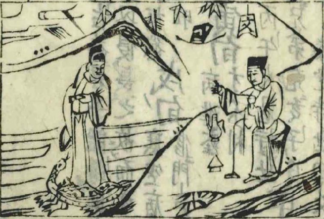
- 圖中：一山，一水，酒旗上文字，官人踏龜，月半雲中，幞頭上樹，樹下人獨酌。
- 卦圖象解：
	- 一、一山：阻也。
	- 二、一水：險也。
	- 三、酒旗上文字：酒為忘憂之物，文在旗上，受人提攜也。
	- 四、官人踏龜：歸，鬼也；玄武自來，水上求財。
	- 五、幞頭上樹：求去辭官也。
	- 六、月半雲中：主半清半濁象，事未明晰。
	- 七、人在水邊：等待平安狀，蒞臨也。
	- 八、樹下人獨酌：休也，無事也，萌生退意狀。

### 人间道——遁

- 上一卦[《雷风恒》](#《雷风恒》（三世）震上%20巽下#人间道——恒)——下一卦[《雷天大壮》](#《雷天大壮》（四世）震上%20乾下（六冲）#人间道——大壮)

> [!引申] 
恆者，久也，久不動則有去意，遯乃退也，故遯所以繼恆也，此卦天下有山，天陽向上，物雖上陵但止而不進，以陰陽之道論，二陰居下有上進之勢，陽將消退，故此時乃論小人渐盛，君子退避之時，此遯之義也。

- 遯：亨，小利貞。
	- 遯，乃君子潛藏之時，君子退而伸其道，人退道不屈，則可亨，雖無大力，但仍有小吉，因知時避退，此善之道也。
- 《彖》曰：
	- 遯亨，遯而亨也。剛當位而應，與時行也。
		- 君子處遯之道，知退生吉，退所以為伸道。故雖退之時，君子處之，未必真遯，當隨時消息，有可以致力，當不避之，以扶持其道，並非於遯時，藏而不為也。
	- 小利貞，浸而長也，遯之時義大矣哉！
		- 小人之道長時，不可求大功，但利於小功，君子之人能察於其微，始即深以戒之，退而伸道，不使道消，此處遯之時意義之大處也。
- 《象》曰：天下有山，遯；君子以遠小人，不惡而嚴。
	- 山在天下，由下起而上止，天上進分之相違，此遯之象，因違和而須遯。君子遠小人之道，若以惡聲厲色，只增其怨忿而已，唯用莊嚴威色，使其敬畏，小人自然遠矣。
- 初六：遯尾，厲，勿用有攸往。
	- 因遯本即退去，故初爻為往退之初，反為其尾，此時以柔處遯，不可往，往則有災。
	- 《象》曰：遯尾之厲，不往何災也。
		- 退處之時，居於尾者，此危也，唯晦藏於下或末端，可得吉，因往有晦不若不往，故晦藏可免災也。
- 六二：執之用黃牛之革，莫之勝説。
	- 二與五位相應，居正而相親合，其交之堅，若牛革之繋，不可言語。
	- 《象》曰：執用黃牛，固志也。
		- 二與五位用中正之道相結，且堅心其志，猶牛革之堅也。
- 九三：係遯，有疾厲，畜臣妾，吉。
	- 遯退之道，其貴在速及遠，如有事累，則不速，於遯時則有危也。此爻即言，人之親，若以女子小人而言，其皆懷恩而不知義，親愛之則忠，犯錯而嚴厲時，則生暗害，此小人之道。然君子之道非如是，待之以正，即令有拖累亦不有災，如君王有危而不棄黎民，雖危亦可無咎，古之前例多矣。
	- 《象》曰：係遯之厲，有疾憊（bèi）也，畜臣妾吉，不可大事也。
		- 係遯之道，於養臣妾親暱人時可吉，但不可以擔當大事，待人取中正之道，不以私心而生偏，取諸於公，則可行大事矣。
- 九四：好遯，君子吉，小人否。
	- 君子之人亦有所好，處退之時，必去而不疑，以道來制欲，故為吉，而小人反之，其不能以義處之，唯私慾之所好，即令身陷亦不能自制，故於小人則否。故君子必易出難進，小人則易進難出。
	- 《象》曰：君子好遯，小人否也。
		- 君子知時而退不疑，小人則無法克制私慾，以至於凶也。
- 九五：嘉遯，貞吉。
	- 君王處得中道，動靜間必以時，故嘉美，終吉。今人卻動靜皆以私慾，表裡不一，不以中正之道處，知進不知退，此凶也。
	- 《象》曰：嘉遯貞吉，以正志也。
		- 內心正則動必正，此退之美也，今人不以退為美，只動之以欲，因志不正也。
- 上九：肥遯，无不利。
	- 此退之極致，退求遠且無累於他人，此退之有餘，無往不利矣。今人即令退，亦追求有所牽累他人，其動不正，唯自苦而已，小人自招之累也。
	- 《象》曰：肥遯无不利，无所疑也。
		- 退之求其遠，且無所拖累，此退之道至極，必無不利。且剛決而不疑，君子之遯道，雖退，因得道，卻能無往不利。

## 《天地否》（三合）乾上 坤下（ 六合）

~~~
  伏 神        【本 卦】
              ▆▆▆▆▆▆▆▆▆     父母壬戌土   应
              ▆▆▆▆▆▆▆▆▆     兄弟壬申金
              ▆▆▆▆▆▆▆▆▆     官鬼壬午火
              ▆▆▆   ▆▆▆     妻财乙卯木   世
              ▆▆▆   ▆▆▆     官鬼乙巳火
子孙甲子水     ▆▆▆   ▆▆▆     父母乙未土
~~~
天地不交之卦，人口不圆之象。
判曰：否者，塞也。天地不交，阴阳闭塞。夫妇不和，别离南北。君子道消，小人道长。人物乖违，不通之象。

### 卦象——此卦蘇秦將遊説六國，卜得之，果為相矣。

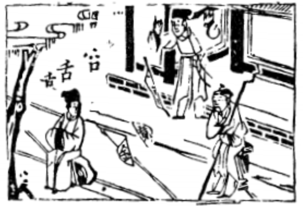
- 圖中：男人臥病，鏡破，人路上坐，張弓箭頭落地，人拍掌笑，口舌。
- 卦圖象解：
	- 一、男子臥病：男子為陽，陽同佯，裝病之象也。
	- 二、镜破：不可赴也。破鏡難圓之象。
	- 三、人路上坐：小人阻路，不讓進也。
	- 四、張弓箭頭落地：鳥盡弓藏也。
	- 五、人拍掌笑：幸災樂禍之小人，做假攻訐兩人感情得逞狀，夫妻凶。
	- 六、舌：主口舌，官司，謡言生害。
	- 七、口上有四點：四點為黑，暗中誣陷之謡言，古人謂三口成虎，即意此。

### 人间道——否

- 上一卦[《地天泰》](#《地天泰》（三世）坤上%20乾下（六合）#人间道——泰)——下一卦[《天火同人》](#《天火同人》（归魂）乾上%20离下#人间道——同人)

> [!引申] 
上泰之終，六爻以陰柔（小人）處之，則為否之初。天地相交，陰陽相通，則為泰，今天在上，地在下，是天地隔絶，不相往來，故成否卦。

- 否之匪人。不利君子貞，大往小來。
	- 舉凡天地之間皆為人道，今天地不交，不生萬物，是無人道，故曰匪人。處此之時，君子不可堅心，因正道不行，小人道長之時。
- 《彖》曰：否之匪人，不利君子貞，大往小來，則是天地不交，而萬物不通也。上下不交，而天下无邦也。内陰而外陽，内柔而外剛，内小人而外君子，小人道長，君子道消也。
	- 天地不交，萬物不生。上下不和，則天下無治國之道。治世乃上位施政來治民，人民擁戴君王而願從命，上下相交，此治國之道。今君子居於外野，小人處於朝內，故為小人道長，君子道消之時也。
- 《象》曰：天地不交，否。君子以儉德辟難，不可榮以祿。
	- 君子觀否塞之象為外健內顺(柔)。處否之時，損儉自己，避開禍亂。千萬不可榮居祿位，戀棧不去。因小人得志之時，君子仍居顯位，則禍必及己身。反之，仍居顯位不放，乃真小人也。即內小人，外君子之意。
- 初六：拔茅如，以其彙（huì），貞吉，亨。
	- 否之在最下者，為君子也。因否而不能進者，君子也。處否而能進者，小人也。因在下位，又貞固其節志，同類而聚，雖不進升，但亦吉矣。
	- 《象》曰：拔茅貞吉，志在君也。
		- 君子處否時而居下位，冀得同類而進，如遇小人，則堅守其節，但心仍在天下。
- 六二：包承，小人吉，大人否，亨。
	- 六二本陰爻位，今陰柔居之，以小人而言，其心所包容的，皆承顺上位之意，以求本身之利，此小人之吉。大人處否，則以道之陽剛自勉，絶不枉屈正道，奉承上位，雖身處否，但道仍亨也。
	- 《象》曰：大人否亨，不亂群也。
		- 處否而守其正節，乃為大人，不與小人同亂為群體，形雖否，但其道吉，此道必大。
- 六三：包羞。
	- 不中不正之人居否之時，位居相位，不能守道安命，極盡小人之能事，每日謀慮邪事，無所不包，此羞恥之大也。
	- 《象》曰：包羞，位不當也。
		- 居否時，所為邪吝，羞於公正，居此相位而不適，此不可以為正道。
- 九四：有命，无咎，疇（chóu）離祉。
	- 居君側之人，最忌有居功招忌之事，因否時君道不正，即令有濟世之大才，亦不堪用。如能使事事出於君令，威柄皆歸於上，則無災而可實現大志。當君子道行，同類必同進同出為天下黎民福祉著想。小人亦同進退也。
	- 《象》曰：有命，无咎，志行也。
		- 凡事皆由君命而出，則無災，且大志得行。
- 九五：休否，大人吉，其亡，其亡，繋于苞桑。
	- 處否之時，惟有陽剛中正之人居君位，能去天下之否，即大人吉。如循環至泰，亦須戒盛警惕否之復来，此其亡，其亡之意。此戒须如同苞桑，桑為根深蒂固之物，苞乃叢（cóng 从）生之物，其固更強，此為安固之道。此為聖人之深戒也。繫辭：『危者安其位者也，亡者保其存者也，亂者有其治者也。是故君子安而不忘危，存而不忘亡，治而不忘亂，是以身安而國家可保也。』
	- 《象》曰：大人之吉，位正當也。
		- 因有陽剛中正之德才，又居君子之位，能去天下之否，故吉也。
- 上九：傾否，先否後喜。
	- 物極必反，泰極則否，否極則泰，故否之極，即否道將覆，則泰矣，故曰後喜。
	- 《象》曰：否終則傾，何可長也。
		- 否之終必傾危，絶無永否之理，但反危為安，易亂而治，必有陽剛之才，乃能做也，故否卦之上九能傾否，如屯之上六則不能去屯同意也。

## 《风地观》（四世）巽上 坤下

~~~
  伏 神        【本 卦】
              ▆▆▆▆▆▆▆▆▆     妻财辛卯木
兄弟壬申金     ▆▆▆▆▆▆▆▆▆     官鬼辛巳火
              ▆▆▆   ▆▆▆     父母辛未土   世
              ▆▆▆   ▆▆▆     妻财乙卯木
              ▆▆▆   ▆▆▆     官鬼乙巳火
子孙甲子水     ▆▆▆   ▆▆▆     父母乙未土   应
~~~
云卷晴空之卦，春花竞发之象。
判曰：观者，观也。观国之光，风在地上，万物荣昌。财不破散，爵禄加彰。

### 卦象——此卦唐明皇與葉靜遊月宫，卜得之，雖有好事，必違也。

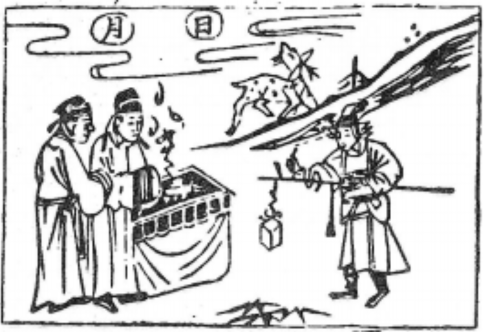
- 圖中：日月當天，官人香案邊立，鹿在山上，金甲人執印秤。
- 卦圖象解：
	- 一、日月當天：政治清明，普照大地，父母雙全。
	- 二、官人香案邊立：倌人，丈夫也。蔡姓人士，神人共明之象。
	- 三、鹿在山上：得高祿之象。
	- 四、金甲人：君側之人也，護衛也。
	- 五、執印秤：提印信而來授權也。

### 人间道——观

- 上一卦[《地泽临》](#《地泽临》（二世）坤上%20兑下#人间道——临)——下一卦[《火雷噬嗑》](#《火雷噬嗑》（五世）离上%20震下#人间道——噬嗑)

> [!引申] 
臨者，大也，萬物之成大，乃有可觀，故觀所以次臨也。凡觀視於物，即為觀也。人君上觀天道，下觀民俗，為觀之道。風行地上，遍觸萬物，乃周觀之象。以陽剛在上，為群下所觀，故觀亦有仰之義。

- 觀：盥（guàn）而不薦，有孚顒（yóng）若。
	- 人於祭祀之始，求神之時，心念最專精之時也。居上位者，正其儀表，以為下民之觀，當始與終，皆能令民之觀如初始之專精，則盡觀之道也。今人至君位後，禮數繁多，致令人心散，精一不如初始也。
- 《彖》曰：
	- 大觀在上，順而巽，中正以觀天下。
		- 五居尊位之人，能以陽剛中正之德，始終如一，為下所觀見，則必能精一也。
	- 觀，盥而不薦，有孚顒若，下觀而化也。
		- 處觀之道須嚴守如始之精一，則下民必至誠瞻仰而從教化，不薦為不使誠意少散。
	- 觀天之神道，而四時不忒，聖人以神道設敎，而天下服矣。
		- 天之道至神，故曰神道。聖人觀天之運行四時，從無差錯，其神妙如此。聖人體神之道而以設教，故天下服也。
- 《象》曰：風行地上，觀。先王以省方、觀民、設敎。
	- 風行地上，能觸萬物，聖人體之，知巡省四方，觀視民俗，設為政教，例如見奢則約之以儉，見奸則矯之以正，則民將觀之。
- 初六：童觀，小人无咎，君子吝。
	- 處最下之位，又為陰柔之本質，離陽剛過遠，是故其觀淺如童稚，故曰童觀。小人觀陽剛之道，不識君子之道，於觀之初，反而無災，如見君子亦昏淺如是，則可羞也。
	- 《象》曰：初六童觀，小人道也。
		- 此所觀不明如童稚，此實小人也，故言小人之道。
- 六二：闚（kuī）觀，利女貞。
	- 觀，乃少見而無甚明也。二居將位，而不能明見陽剛中正之道，則如女子之道，即見之不甚明，又能順從者。將位之人，能如女子之順從，則不失其正，故利。
	- 《象》曰：闚觀女貞，亦可醜也。
		- 此即君子之人不能觀見陽剛中正之大德，雖能順從，乃同女子也。亦可羞也。
- 六三：觀我生，進退。
	- 柔質居相位，處觀之時，其進退之道，乃為己者，雖非正，亦不為過也。
	- 《象》曰：觀我生進退，未失道也。
		- 觀己知生存之道，而以之進退，此未失道也。
- 六四：觀國之光，利用賓（bīn）于王。
	- 四雖陰柔居君側之位，能觀見國之光辉盛大，可見人君之道德也。此因九五君位為聖明之人，致令才德之士，皆願進朝廷輔佐，以濟天下。反之聖君因能用敬才德之人，則人才聚之。
	- 《象》曰：觀國之光，尚賓也。
		- 君子懷才自守，乃因無明主也。既觀見國之盛德光華，則志願登進王朝，以行其道。
- 九五：觀我生，君子无咎。
	- 九五君位之人，體觀之道，其視天下之俗而知己，若天下之俗，不合乎君子之道，則是己之所為，政治必不佳，不可不怪自己。
	- 《象》曰：觀我生，觀民也。
		- 人君欲觀己之施政良否，當觀於民，民俗善，則政化必善。此意即王弼云『觀民以察己之道』。
- 上九：觀其生，君子无咎。
	- 上九為不當位之人，以陽剛處之，如同賢人君子不在其位，而道德為天下所觀仰，能如此，皆君子也。
	- 《象》曰：觀其生，志未平也。
		- 吾人觀其生存之道，常不失於君子，雖不在位，則亦不失人所望之教化也。

## 《山地剥》（五世）艮上 坤下

~~~
  伏 神        【本 卦】
              ▆▆▆▆▆▆▆▆▆     妻财丙寅木
兄弟壬申金     ▆▆▆   ▆▆▆     子孙丙子水   世
              ▆▆▆   ▆▆▆     父母丙戌土
              ▆▆▆   ▆▆▆     妻财乙卯木
              ▆▆▆   ▆▆▆     官鬼乙巳火   应
              ▆▆▆   ▆▆▆     父母乙未土
~~~
去旧生新之卦，群阴剥尽之象。
判曰：剥者，落也。山高岌岌，其形似剥。阴道将盈，阳道衰弱。卦临九月，霜叶凋落。人离财散，求官失爵。

### 卦象——此卦尉遲將軍與金牙鬥爭，卜得之，不利男子。

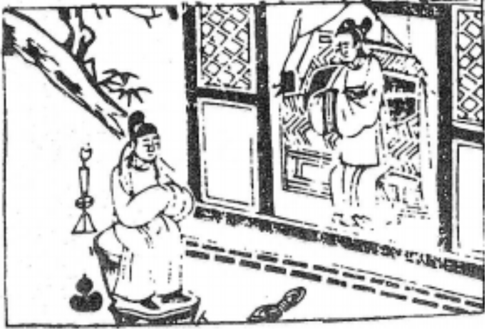
- 圖中：婦人床上坐，風中燭，葫蘆在地，山下官人坐，冠巾掛木上，一結亂絲。
- 卦圖象解：
	- 一、婦人床上坐：必有暗災，陰人得勢，陽道衰弱，小人為主官。
	- 二、燭在風中：險也。
	- 三、葫蘆：醫藥無救也；有暗計也。
	- 四、繅（sāo）絲：事務繁冗。
	- 五、山下官人坐：有靠山，但陰人為禍。
	- 六、冠巾掛木上：求去之象；又有樂之象。

### 人间道——剥

- 上一卦[《山火贲》](#《山火贲》（一世）艮上%20离下#人间道——贲)——下一卦[《地雷复》](#《地雷复》（一世）坤上%20震下（六合）#人间道——复)

> [!引申] 
盡賁飾之道，而後可亨。但飾之終，不戒，則必剝，故為之序。卦體為五陰一陽，乃意陰始自下生，渐長至極盛，群陰皆受剝於陽也。天地之間，山乃高大，但仍附於地上，此為頹剝之象也。外止內順，招剝之象也。而順且止，為處剝之道。

- 剝：不利有攸往。
	- 剝乃群陰長盛，剝削陽時，同眾小人剝喪君子，故君子不利往。
- 《彖》曰：
	- 剝，剝也，柔變剛也。不利有攸往，小人長也。
		- 剝，落也。柔盛而剛剝，陰盛陽必退，此陰陽之道，小人道長盛，君子消退也。
	- 順而止之，觀象也；君子尚消息盈虛，天行也。
		- 君子處剝之時，知不可往，順時而止，乃因能觀剝也。故此卦有順止之象，為處剝之道。君子之人見事於始，凡事之始皆有理，君子視其盈虧消息，而知處之道。順時則吉，逆時則凶，故君子事天。小人反之，不見事始之作為如何，不論事理之盈虧如何，一昧迎隨奉承，故小人事人。
- 《象》曰：山附於地，剝，上以厚下安宅。
	- 山再高大仍依附於地，聖人體此，知人君與上位者，視剝而知厚固其下位之人，以安居也，下者為上之本，從未有基本固而能剝者也。故上如有剝，必自下。故安養人民以厚國本。書曰『民惟邦本，本固邦寧』。
- 初六：剝床以足，蔑貞，凶。
	- 因剝之始皆自下，故曰剝足，陰自下進，渐消亡正道，凶之至也。
	- 《象》曰：剝床以足，以滅下也。
		- 正道之侵滅，必由下而上渐進。用剝之道即在此。
- 六二：剝床以辨，蔑貞凶。
	- 此陰漸進，為將者已受剝也，凶益甚也。
	- 《象》曰：剝床以辨，未有與也。
		- 小人之侵剝君子，若君子有對應，則小人不能為害，如無對應，則有被滅之凶。
- 六三：剝之，无咎。
	- 眾陰在下剝陽之時，三之相位獨剛應之，則可無災，但因勢孤弱，雖可無災，但未必能大亨。
	- 《象》曰：剝之，无咎，失上下也。
		- 為相之人居剝之時，无災之因乃同類而相失，不與同道，故也。
- 六四：剝床以膚（fū），凶。
	- 剝之及身時也，其凶可知。乃因不知始剝於下，以致進盛至此。
	- 《象》曰：剝床以膚，切近災也。
		- 象為剝及皮膚，因四為君側之人，如君之膚，示災禍之近身也。
- 六五：貫魚，以宮人寵，无不利。
	- 剝本及於君，凶可知，但聖人於此，知人性之從善如流，以示寵方式，使群陰如魚之貫序，則可無所不利。此寵如對妻妾之同態也。
	- 《象》曰：以宮人寵，終无尤也。
		- 於剝之及身時，能以寵妻妾之方式對待，則終無災。
- 上九：碩果不食，君子得輿，小人剝廬。
	- 果之大者，如不食，則有復生之理。陰道盛極，天下大亂，但亂極則必思治，故眾人之心，必願載君子，故如得輿。此陰極生陽也。若為小人於此，則必無安身之地。
	- 《象》曰：君子得輿，民所載也；小人剝盧，終不可用也。
		- 因正道消剝至極，則人必思治，上九為陽剛之君子，為民所載也，小人處剝之極，終不可用也。

## 《火地晋》（游魂）离上 坤下

~~~
  伏 神        【本 卦】
              ▆▆▆▆▆▆▆▆▆     官鬼己巳火
              ▆▆▆   ▆▆▆     父母己未土
              ▆▆▆▆▆▆▆▆▆     兄弟己酉金   世
              ▆▆▆   ▆▆▆     妻财乙卯木
              ▆▆▆   ▆▆▆     官鬼乙巳火
子孙甲子水     ▆▆▆   ▆▆▆     父母乙未土   应
~~~
龙剑出匣之卦，以臣遇君之象。
判曰：晋者，进也。日出于地，柔而上行，巡运照耀，升进其明。居官益位，祸灭福生，利见王侯，任意必亨。

### 卦象——此卦昔司馬進策，卜得之，後果為丞相。

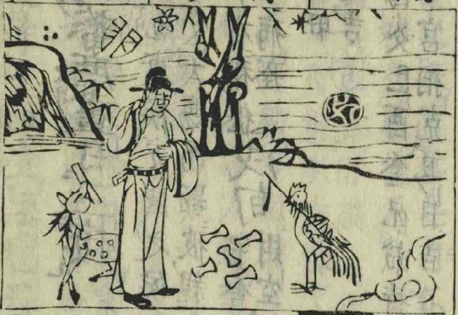
- 圖中：文字破，官人掩面，毬在泥上，雞啣秤，枯木生花，鹿啣書，一堆金寶。
- 卦圖象解：
	- 一、文字破：官事不成，退位象。
	- 二、官人掩面：無顏見人，悲象。
	- 三、毬在泥上：所求必陷險也。
	- 四、雞啣秤：雞，酉也，肖雞人也，落日之象。秤：示公平，稱心也。
	- 五、枯木生花：晚發也。
	- 六、鹿啣書：祿與命到也。
	- 七、一堆金寶：財祿豐收之象，占疾厄，則有焚金紙之象。主喪服，二人去一也。
	- 八、人立水邊：恐泣之象，主喪服。
	- 九、三點在石上：心象，示人心在石上，不動念，堅心也。

### 人间道——晋

- 上一卦[《雷天大壮》](#《雷天大壮》（四世）震上%20乾下（六冲）#人间道——大壮)——下一卦[《地火明夷》](#《地火明夷》（游魂）坤上%20离下#人间道——明夷)

> [!引申] 
繼壯盛之後，則必進，晉，進也，明出於地，升而明，故晉，此論進之道，離，中虛為明，乃明出於地上也。

- 晉：康侯用錫馬蕃庶，晝日三接。
	- 有能治安之諸侯，名康侯，其因能明，下體順附，承王之象，則見眾多之馬駕，有重賜，乃寵遇之至也，此上明下順，乃進盛之時。
- 《彖》曰：晉，進也。明出地上，順而麗乎大明，柔進而上行，是以康侯用錫馬蕃庶，晝日三接也。
	- 晉乃明進而盛，此外明內順，故能包明至大明，如順德之良臣，附麗於明主也。柔居君位，能明而順，上附於君，下順於民，故為康侯，此為諸侯之道也。
- 《象》曰：明出地上，晉，君子以自昭明德。
	- 君子觀明出地上，近明為晉，故知惟昭明德於已，求己之明且有德，為晉之道。
- 初六：晉如摧如，貞吉，罔孚，裕无咎。
	- 初爻乃晉之始時，始進而求快升，必不遂其意，因上位未能遽信，必當自守安位，寬裕不求，以待上位之信方可。小人始進而求上信，則必傷於義，皆招咎悔。此君子方知進退之道。
	- 《象》曰：晉如摧如，獨行正也。裕无咎，未受命也。
		- 進退之間，惟君子能獨行正道，唯義之所趨（qū 趋），方可出仕，未受命時，皆寬裕無求。若能信於上，忠職守，卻反失去職務，則君子一日不居，必退而遠之。
- 六二：晉如愁如，貞吉。受茲介福，于其王母。
	- 進退之間守正道，當吉，二爻之位雖無援，因能守正，日久彰顯，自得上六五君位之人相應，上位自當求之，因德同也。
	- 《象》曰：受茲介福，以中正也。
		- 雖居下位之人，能永持中正之道，久必有亨。更加有明君在上，雖位遠，但必因同德受福。
- 六三：眾允，悔亡。
	- 柔居剛位，又不中正，此乃居不適位時，必有悔咎，惟居此時，能明謀從眾，順應天心，吉。
	- 《象》曰：眾允之志，上行也。
		- 能順從眾志，居下位之上，又上從明君，合於眾志。
- 九四：晉如鼫（shí）鼠，貞厲。
	- 陽剛居陰位，非適其位而居之，乃貪據其位，貪而畏人者，範鼠也，近君之位又不適，下位又求上進，居此時生畏忌之心，必生危矣。
	- 《象》曰：鼫鼠貞厲，位不當也。
		- 不正又居高位，時懷貪而懼失之心，堅守此不放，招危險也。
- 六五：悔亡，失得勿恤，往吉，无不利。
	- 柔居尊位，乃不正位，本凶。但用大明之德而上下皆附順，故反吉。因下之順附，必能盡誠委任眾人之才，以濟天下。明君不患其不能明照，患其用明之過於察察，有失委任之道，自任其明而以私意偏任，天下必無法為公。
	- 《象》曰：失得勿恤，往有慶也。
		- 有明明之君，下又上附順，能推誠委任，必能成天下之大功，往必有福也。
- 上九：晉其角，維用伐邑，厲吉，无咎，貞咎。
	- 陽剛又居最上，如角之象，此言進之極，過剛則易失於躁急，本剛又急於求進，必有失也。此惟有用於治內（伐邑）可以無患。但如用其治外，反凶。觀人之自治，能剛之人守道必固，求進燥急之人必遷善益速，唯須合中正之道，可無咎。
	- 《象》曰：維用伐邑，道未光也。
		- 盡善之道，能安內攘外，今維用伐邑，能治內不能治外，其道未光大也。

## 《火天大有》（归魂）离上 乾下

~~~
 【本卦】
▆▆▆▆▆▆▆▆▆     官鬼己巳火   应
▆▆▆   ▆▆▆     父母己未土
▆▆▆▆▆▆▆▆▆     兄弟己酉金
▆▆▆▆▆▆▆▆▆     父母甲辰土   世
▆▆▆▆▆▆▆▆▆     妻财甲寅木
▆▆▆▆▆▆▆▆▆     子孙甲子水
~~~
金玉满堂之卦，大明中天之象。
判曰：大有者，宽也。柔得尊位，官禄日实。掩恶扬善，丰财和义，广纳包容，成物之美。自天佑之，吉无不利。

### 卦象——此卦藺相如送趙壁往秦，卜得之，果還壁歸趙也。

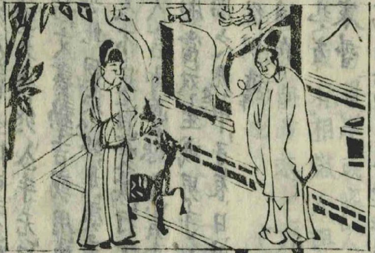
- 圖中：婦人腹中一道氣，氣中二小兒，一藥王，藥有光，女人受藥，一犬。
- 卦圖象解：
	- 一、婦人腹中一道氣：妊娠之事；事萌於內也。
	- 二、氣中二子：主雙喜臨鬥。伯仲之間象。
	- 三、一藥王：平安之象。得病有救，遇良醫也。
	- 四、藥有光：藥有名也，災中有救也。
	- 五、女人受藥：女人為陰，示表面不信，但暗中仍聽之。
	- 六、一犬：乃狗年，戌月，戌日，此論時機也；或狄姓人士。
	- 七、犬：哭笑皆有象。

### 人间道——大有

- 上一卦[《天火同人》](#《天火同人》（归魂）乾上%20离下#人间道——同人)——下一卦[《地山谦》](#《地山谦》（五世）坤上%20艮下#人间道——谦)

> [!引申] 
同人之序卦，與人同者，物必歸，此天紀也。故大有為同人之序，物歸之後，乃大有也。此卦，火在天上，火之處高，其明及遠，能照萬物，此為大有之象，一柔居尊位，眾陽應和，此居尊執柔，物乃所歸，上下相應，為天子之道。

- 大有：元亨。
	- 此乃以卦才而言，不言元亨利貞四德，乃恐與乾坤二卦相混淆，只言元亨乃盡元之義，元乃物之始，萬物生成之初皆為大善，因必有功用。此為大善之初，易經唯四卦，大有、蠱、升、鼎有元亨。其不與乾坤同，在乾為首出萬物，元始之象，在此四卦唯至善為大而已。
- 《彖》曰：大有，柔得尊位，大中而上下應之，曰大有。其德剛健而文明，應乎天而時行，是以元亨。
	- 此卦之所以為大有，乃因五以陰柔居尊位，又處以中庸大中之道，為諸陽所依歸，上下相應，此居尊執柔，有虛中之象，卦德內剛健而外明理，處事順乎天應乎人，此所以元亨。事於成後，方可見成敗，敗非先現於事前也。故有得後乃有所失，非得則何言有失乎？
- 《象》曰：火在天上，大有，君子以遏惡揚善，順天休命。
	- 火因在天上，故能照見萬物，君子觀大有之象，故知治眾之道，唯遏惡揚善，此能順天命而安眾民心，天子之道即如是。
- 初九：无交害，匪咎，艱則无咎。
	- 以陽剛之性處卑下之位，因未至於盛，故不有驕盈之慮，因無交往，故無害。人之富有於財或才，鮮不有害，富有本無罪，但人卻皆因富有而招害，乃因處富有而不知思艱戒盛，則生驕侈之心，此所以生害也。
	- 《象》曰：大有初九，无交害也。
		- 此即在大有之初始，即生戒心，須時思念艱難之時，此居安思危之來源，故能如此，則交亦無害也。故與人交往，持富有而驕，必生害也。
- 九二：大車以載，有攸往，无咎。
	- 此位以剛健之才，居於陰柔之位，而為六五君位所信任，故無災。就如大車之材，強壯能载重物，可以任重行遠，往而無災。
	- 《象》曰：大車以載，積中不敗也。
		- 大車能載重物，重物集中而不損敗，言九二才力之強，能勝大有之重任。
- 九三：公用亨于天子，小人弗克。
	- 九三居下卦之上位，為諸侯之位，諸侯雖享有土地之富，人民之眾，但仍屬天子所有，此人臣之義。但小人居此位則專其富有以為私，不知奉上以公之道。
	- 《象》曰：公用亨于天子，小人害也。
		- 諸侯能守臣節，忠順奉上，慎養其眾，為王之徵用。若小人處此位，則不知奉上之道，以所有為私有，故小人居此位，則有大害也。
- 九四：匪其彭，无咎。
	- 九四陽剛居大有之時，因近君位，如處之太盛，則致凶，彭為盛大之義，須謙損，方為吉道。
	- 《象》曰：匪其彭，无咎，明辯皙也。
		- 明智之人，處此大有盛大之時，戒在咎之將至，以謙損態度應之，不敢至於極滿招凶之道也。故無災。
- 六五：厥孚交如，威如，吉。
	- 人君之位，以陰柔守之，以誠信待於下，下亦誠信待上，上下相交，此人心易安，但若專以柔順，則必生悔慢之心，故以威信，故君子柔中有威，使下屬有畏，其吉可知也。
	- 《象》曰：厥孚交如，信以發志也；威如之吉，易而无備（bèi）也。
		- 上下相交以誠信，互相呼應，上位如無威嚴，則下屬易生毁謾，故君須戒無威。
- 上九：自天祐之，吉，无不利。
	- 此位乃大有卦之終極，仍明之極意。人唯至明，故不居於已有，有極大之位，而不為已有，則無盈滿之災，君能至此，則合於天道，得天之祐，則無往不吉。大同之世來矣。
	- 《象》曰：大有上吉，自天祐也。
		- 大有至極處，本有變化，但由所為皆順天合道，此君子滿而不溢，故天祐之。尊尚賢人，崇尚信義，故為上吉。

# 兑宫八卦——属金

## 《兑为泽》（纯卦）兑上 兑下（六冲）

~~~
 【本卦】
▆▆▆   ▆▆▆     父母丁未土   世
▆▆▆▆▆▆▆▆▆     兄弟丁酉金
▆▆▆▆▆▆▆▆▆     子孙丁亥水
▆▆▆   ▆▆▆     父母丁丑土   应
▆▆▆▆▆▆▆▆▆     妻财丁卯木
▆▆▆▆▆▆▆▆▆     官鬼丁巳火
~~~
江湖养物之卦，天降雨泽之象。
判曰：兑者，悦也。泽润万物，恩惠兆民。居上爱下，悦而忻忻。利有攸往，无不亨贞。

### 卦象——此卦唐三藏去西天取經，卜得之，乃知必歸唐國。

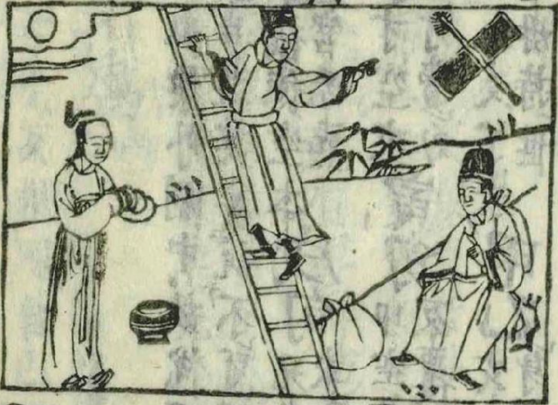
- 圖中：人坐看一堆擔，月在天邊，秀才登梯，一女在合邊立，文字上箭。
- 卦圖象解：
	- 一、人坐看一擔：任務完成狀，有人相助象，助人為樂之貴人。
	- 二、月在天邊：清明之治。
	- 三、秀才登梯：金榜登科象。
	- 四、一女在合邊立：女人介入，先成後破。
	- 五、文字上箭：得機而發，射：發象。

### 人间道——兑为泽

- 上一卦[《巽为风》](#《巽为风》（纯卦）巽上%20巽下（六冲）#人间道——巽为风)——下一卦[《风水涣》](#《风水涣》（五世）巽上%20坎下#人间道——涣)

> [!引申] 
巽者，入也，物能相入，必有相悦方成，故兌為巽之序。

- 兌：亨，利、貞。
	- 兌之道，可以致亨。人能悦於物，物亦相悦，必足以亨。然兌之道在貞正，求悦不以正道，必成邪吝，終致悔咎。
- 《彖》曰：兌，説也，剛中而柔外，説以利貞，是以順乎天而應乎人，説以先民，民忘其勞，説以犯難，民忘其死，説之大，民勸矣哉。
	- 兑，悦也。外柔內剛，中心誠實之象，悦之道可亨，乃因其能貞正。上順天理，下應人心，能使民以悦，則民忘勞苦，且欣然為國犯難。忘其生死，此悦之道至極矣，民莫不信之。
- 《象》曰：麗澤，兌，君子以朋友講習。
	- 兩兌相重，即兩澤互麗，交相浸潤，互有滋益之象，君子觀之乃知朋友講習，互相增益，為天下之大悦，有互相明益之象。
- 初九：和兌，吉。
	- 初雖陽剛，但因居卑下，乃知卑下和順，此悦必無所偏私，此兌之正道，故吉。
	- 《象》曰：和兌之吉，行未疑也。
		- 初位必隨時順處，心無所欲，惟求能和而已，是以吉也。其行必未有可疑。
- 九二：孚兌，吉，悔亡。
	- 二位有剛中之德，內實孚信，雖近小人，但不失君子之道，悦而不失剛中之德，所以能吉而不慮亡矣。
	- 《象》曰：孚兌之吉，信志也。
		- 君子之悦，自心中之至誠，故必不失道，小人之悦，必忘形而自失不知。
- 六三：來兌，凶。
	- 陰棄居陽剛之位，不適也，比得兌之道不以中正，為悦而求悦，人之有求必因私欲，己離正道，故凶。
	- 《象》曰：來兌之凶，位不當也。
		- 柔居陽剛，自處必不中正，和欲而求悦，必招凶。
- 九四：商兌未寧，介疾有喜。
	- 陽剛處陰位，居不中正，故有未決，未能定也。居兑之時，不為悦所惑，能知命守剛正，疾惡去仇，必能得君之信，而有喜也。
	- 《象》曰：九四之喜，有慶也。
		- 九四君側之人能有喜慶，必来自君之信孚，得遂行其陽剛之志也。
- 九五：孚于剝，有厲。
	- 九五君位得中正之道，居悦時，乃可盡善，但聖人復設戒於有厲，即雖中正聖賢在上，天下仍有小人，為免惑於悦，小人之入而不自知，故於此設戒。
	- 《象》曰：孚于剝，位正當也。
		- 居悦知剝之戒，人於事始知戒，可以無災咎也。
- 上六：引兌
	- 悦之至極則愈悦，故言引兌。天下萬事過之皆不宜，有凶至。
	- 《象》曰：上六引兌，未光也。
		- 悦之至極，已太過於事理，其果必不能更光也。

## 《泽水困》（一世）兑上 坎下（六合）

~~~
 【本卦】
▆▆▆   ▆▆▆     父母丁未土
▆▆▆▆▆▆▆▆▆     兄弟丁酉金
▆▆▆▆▆▆▆▆▆     子孙丁亥水   应
▆▆▆   ▆▆▆     官鬼戊午火
▆▆▆▆▆▆▆▆▆     父母戊辰土
▆▆▆   ▆▆▆     妻财戊寅木   世
~~~
河中无水之卦，守己待时之象。
判曰：困者，危也。水在泽下，万物不生。君子困穷，小人滥盈。三山幽谷，向暗背明。占者有难，守而勿争。

### 卦象——此卦李德裕罷（bà）相時，卜得之，乃知身命無氣也。

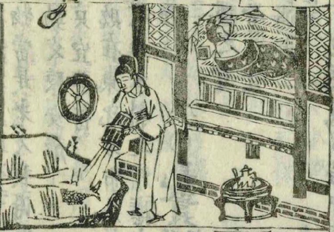
- 圖中：一輪獨在地上，一人臥病，葯爐，貴人倾水救旱池魚，池中青草。貴人倾水救旱池魚，池中青草。
- 卦圖象解：
	- 一、一輪獨在地下：獨行也無依也，方向不明也。
	- 二、一人臥病，招危難也。
	- 三、藥爐：有人來救，待時緩進也。
	- 四、貴人傾水救旱池魚：旱池，無財也，有貴人資援。
	- 五、池中青草：仍有生氣狀。

### 人间道——困

- 上一卦[《泽地萃》](#《泽地萃》（二世）兑上%20坤下#人间道——萃)——下一卦[《水风井》](#《水风井》（五世）坎上%20巽下#人间道——井)

> [!引申] 
升至極，不知進退，私欲使然，終必至困，故困次升也。此卦「兌」上「坎」下，水在澤上乃有水也，今水在澤下乃枯涸無水之象，此示人之困乏象，本卦論人紀中，君子受小人掩蔽，居窮困之時也。

- 困：亨，貞，大人士口，无咎，有言口不信。
	- 困之時，如何用困之道，乃易之精神，大人居困時，以樂天安命，隨時善處，自得其樂，必吉。有愚頑之人，居困而力求言，人必不信也。
- 《彖》曰：困，剛揜（yǎn）也。險以説，困而不失其所亨，其唯君子乎？
	- 困之生乃因剛為柔所掩蔽，專言君子之道為小人所掩蔽，而困窮之時君子知困之道，外悦內險，處困而能以悦之度量居之，不失正道，則其道必自然亨通，能如此之人，必為君子貞，大人吉，以剛中也。有言不信，尚口乃窮也。
              - 處困時，君子能吉，乃因堅守剛中之道，不變節。於困之時，所言人必不信，如反求己之口才以脱困，必更致困，此即為尚口之戒。
- 《象》曰：澤无水，困。君子以致命遂志。
	- 澤中無水，困之象。居此時君子以力盡防患之法，如仍難免，則歸之於命，泰然處之，絶不因困窮而變其志節。小人遇困，志節必變，但求附於他人，以求脱困，其終必凶。
- 初六：臀困于株木，入于幽谷，三歲不覿（dí  见；相见）。
	- 陰柔之人位居卑下，又無上位救助，猶如無葉之木，無法蔭庇下物，因無庇蔭，故不能安居於此，如進入幽暗之谷，無法自出，有三年的時間無法入亨。
	- 《象》曰：入于幽谷，幽不明也。
		- 自陷於深谷，乃出自己之不明也。
- 九二：困于酒食，朱紱（fú）方來，利用享祀：征凶，无咎。
	- 常人無不為酒食所困，不知酒食之施，乃生於人有所欲，常言：宴無好宴。君子之飲與小人不同，能困君子的，必是其剛正之道不足以濟天下之困，此其困擾也。居此時君子必求至誠以守，等待時機，可利用祭祀以示至誠，俟貴人至，求之方吉。若不安居困，自往求之，其招凶皆自取也。
	- 《象》曰：困于酒食，中有慶也。
		- 居困時，雖未能施惠於人，如能守其剛中之德，必能亨。而有吉慶也。
- 六三：困于石，據于蒺藜，入于其宮，不見其妻，凶。
	- 處困可羞之時，卻用外剛來飾內險，益增自困，必堅重如石，而不安之情如手握蒺藜之物，因刺多而不能握，進退不得狀，必失所居，凶。
	- 《象》曰：據于蒺藜，乘剛也。入于其宮，不見其妻，不祥也。
		- 此言內之不安，欲求外剛來飾，乃用剛之不正，必終失所安，果必不祥也。
- 九四：來徐徐，困于金車，吝，有終。
	- 居君側之人，不以中正之道處困時，而才能又不足濟困，其來動必遲遲，困於金車之內，必不見容於世，可羞也，如知濟困得中正之道，乃有歸也。
	- 《象》曰：來徐徐，志在下也，雖不當位，有與也。
		- 居不適位，志在求下，其雖徐徐而來，即令未善，但因與正相應，必有果矣。
- 九五：劓（yì）刖（yuè），困于赤紱（fú），乃徐有説，利用祭祀。
	- 劓，乃上有傷，刖，乃下有傷，人君之困，乃上下無應，天下之民不來也，必起用剛正之賢才，以至誠待之，並利用祭祀，示道之至誠於天，則民必徐來。
	- 《象》曰：劓刖，志未得也，乃徐有説，以中直也，利用祭祀，受福也。
		- 上下不應，君王之困，其志不遂，於此必用祭祀以至誠，求得天下之賢，必能濟天下之困，終享其福慶也。
- 上六：困于葛藟（lěi），于臲（niè ）卼（wù），曰動悔。有悔，征吉。
	- 困至極，必生變，如物之纏束於身，動則有悔，無所不困，即動靜皆困，必求進，方有吉處。
	- 《象》曰：困于葛藟，未當也，動悔有悔，吉行也。
		- 為困纏身，無法求變，乃未知困之道，知動有悔，求悔而去，必可出困，其行必吉矣。

## 《泽地萃》（二世）兑上 坤下

~~~
 【本卦】
▆▆▆   ▆▆▆     父母丁未土
▆▆▆▆▆▆▆▆▆     兄弟丁酉金   应
▆▆▆▆▆▆▆▆▆     子孙丁亥水
▆▆▆   ▆▆▆     妻财乙卯木
▆▆▆   ▆▆▆     官鬼乙巳火   世
▆▆▆   ▆▆▆     父母乙未土
~~~
鱼龙会聚之卦，如水就下之象。
判曰：萃者，聚也。内外喜悦，上下俱柔。万事蕃息，利禄悠悠。求谋有济，解释忧愁。

### 卦象——此卦韓信被呂后疑惑，卜得知，果被其戮也。

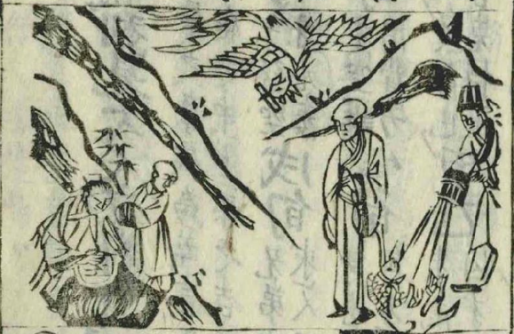
- 圖中：貴人磨玉，一僧指小兒山路，一人救火，一魚在火上火，一鳳啣書。
- 卦圖象解：
	- 一、貴人磨玉：進修也，專心一致也，免破損也。
	- 二、一僧指：指引也，局外人也，光頭人也，曾姓人也。
	- 三、小兒山路：退引山林，以退為進象，示上坡也。倪姓。
	- 四、一人救火：救災禍也；猶行醫濟世救人之道也。
	- 五、一魚在火上：得救狀，或餐飲業。
	- 六、一鳳啣書：喜訊至也。

### 人间道——萃

- 上一卦[《天风姤》](#《天风姤》（一世）乾上%20巽下#人间道——姤)——下一卦[《地风升》](#《地风升》（四世）坤上%20巽下#人间道——升)

> [!引申] 
物相遇而後，同氣相求，則生聚象，萃，聚也。物相聚成群，為萃，故次姤卦之後也此卦，澤上地下，水之聚象，水之在地上，乃方聚之時也。

- 萃：亨，王假有廟。利見大人，亨，利貞。用大牲吉，利有攸往。
	- 人之至誠專一莫過於宗廟祭祀之時，王者能令天下之人其心專一，莫過於利用宗廟，故聖人制祭祀之禮以養民之德。此聚之義大也。民聚之時，能得賢才，則必聚而正，如不正，治之不以正理，則亂之生亦由人之聚，故聚必以道，非正之道，即令有聚，亦不能安處也。於聚時祭禮用大牲厚禮，乃示慎重且富是天下必同之，今人聚而人不能亨其豐盛，則必散也。是故古今皆然，凡能與大功立大業之人，第一必得其時，第二必聚而後能用，此動必吉，天理莫及此也。
- 《彖》曰：
	- 萃，聚也，順以説，剛中而應，故聚也。
		- 萃卦，乃上悦下順之象，上位以中道用民，合於民心，下又能順從於上之政令且又剛陽相應，堅心赤誠如此，必能聚天下之人才。
	- 王假有廟，致孝享也。
		- 王者要有聚民心之道，必立宗廟以示孝順之至誠，能順天下之人心，必以孝方成。
	- 利見大人亨，聚以正也。
		- 聚之以正道，必能得人才治之，乃因其正也。
	- 用大牲吉，利有攸往，順天命也。
		- 祭祀時用厚禮祭天，必可有為，此順天命也。
	- 視其所聚，而天地萬物之情可見矣。
		- 天地萬物間皆有聚，有動，有散等，聖人觀象，可見萬物之情性也。
- 《象》曰：澤上於地，萃，君子以除戎器，戒不虞。
	- 澤上於地，為集聚之象，君子知始戒之慎，故眾民相聚之初，就也生戒，因眾聚必有爭，私心所成，故先除兵械，乃能戒而無虞。
- 初六：有孚不終，乃亂乃萃，若號，一握爲笑，勿恤，往无咎。
	- 聚之始，柔居之，陰柔之人，必無法堅守正節，為求與人同而捨其正道，但為求同，此不終之戒。人心必亂，同氣相求而生聚，或哀號作苦以求相應，其果必為眾人之笑柄，若能堅心往從陽剛正道，必無過咎，否則成小人矣。
	- 《象》曰：乃亂乃萃，其志亂也。
		- 若人之心志受人惑而亂，必不能固守節志，乃失其正道也。
- 六二：引吉，无咎，孚乃利用禴（yuè）。
	- 二之位與五相對應，位雖有差距，此時乃當聚而未及合之時，如能相引聚則可無咎，此因其中正之德未變，如德變，則必不相吸引。故於群小人聚時能獨立其間，且與上位之德同，必能合，此其意也。即令不重外飾，專以至誠，則終必合矣。
	- 《象》曰：引吉无咎，中未變也。
		- 萃之時，以能聚為吉，同志相求，平安，其位有差距，因中正誠心同德必能無咎。
- 六三：萃如磋如，无攸利，往无咎，小吝。
	- 不正之人，求能與人聚合，但人皆不應，為人棄絶，上下皆不應，唯退求事外之賢與之相應，如此則可無咎。人之動有求，即令得之，亦可羞也。
	- 《象》曰：往无咎，上巽也。
		- 上六居柔之極，故能往而無災。
- 九四：大吉无咎。
	- 九四之位，能以陽剛，與君位對應，得君臣之萃，下又得群陰之聚，此上下能因其陽剛而聚，此至善也。
	- 《象》曰：大吉无咎，位不當也。
		- 能有吉且無災之果，即令位不當，因上下與已合德，故也。
- 九五：萃有位，无咎。匪孚，元永貞，悔亡。
	- 九五居天下之尊，有萃聚天下之力，則無災，此時必自修其德，正其位，處不以私，為得其位也。如有人不信而未能歸從，當自省是否不正，堅固中正不變之德性，則無不歸矣。
	- 《象》曰：萃有位，志未光也。
		- 為王者，必以誠信以示天下，如此方有感於民，則人莫不歸矣。如仍有不從，乃已之志未能光顯也。
- 上六：齎咨涕洟，无咎。
	- 小人居高位，求人與其聚，而人皆不與，此可嘆也，人之棄絶，實出於已，怎可歸咎他人如再不知自省，反嗟嘆而致涕泣，此小人狀也。
	- 《象》曰：齎咨涕洟，未安上也。
		- 小人之對人皆因貪而失所宜，以致终窮困，此起因於不能安居其位也。

## 《泽山咸》（三世）兑上 艮下

~~~
  伏 神        【本 卦】
              ▆▆▆   ▆▆▆     父母丁未土   应
              ▆▆▆▆▆▆▆▆▆     兄弟丁酉金
              ▆▆▆▆▆▆▆▆▆     子孙丁亥水
              ▆▆▆▆▆▆▆▆▆     兄弟丙申金   世
妻财丁卯木     ▆▆▆   ▆▆▆     官鬼丙午火
              ▆▆▆   ▆▆▆     父母丙辰土
~~~
山泽通气之卦，至诚感神之象。
判曰:咸者，感也。天地感应，万物和平。男女感应，夫妇康宁。感应之事。无有不享

### 卦象——此卦漢王昭君，卜得之，知和番不回也。

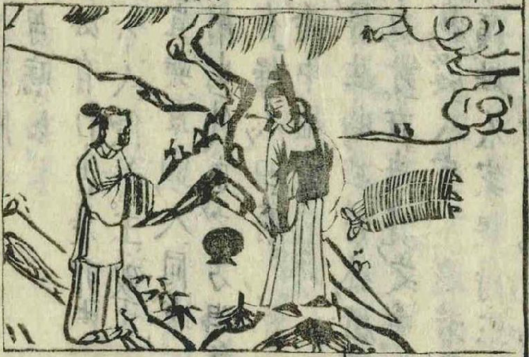
- 圖中：空中有一拳，錢寶一堆，貴人在山頂，女人上山，一合子。
- 卦圖象解：
	- 一、空中有一拳：貴人提拔，憑空而得。
	- 二、錢寶一堆：求財得財。
	- 三、貴人在山頂：孤立狀，即將下坡，退休狀。
	- 四、女人上山：夫妻吉，陰人卜之知走馬上任。
	- 五、合子：先成後破，因誠感方吉，物感必凶。

### 人间道——咸

- 上一卦[《离为火》](#《离为火》（纯卦）离上%20离下（六冲）#人间道——离为火)——下一卦[《雷风恒》](#《雷风恒》（三世）震上%20巽下#人间道——恒)

> [!引申] 
易經上經乃論天地萬物之本，有天地後有萬物，聖人觀其間象，以巨視之角度來體察出天道。咸卦之始，為易經下經，其論夫婦人倫之始，較重於人道。咸之為卦，兌上艮下，乃少女少男之意，表示世上男女相感之深，莫過於少男少女，童稚之間無隔閡，人人皆以平常心處之，男女相悦又無所求，互相以誠及悦相處對應，此時之感，即咸之深意。

- 咸：亨，利，貞，取女吉。
	- 咸，感也，舉凡君臣上下，夫婦、父子等皆有感之道，人人能以少男少女之童悦相感以誠悦，即以平常心相待，則必有亨通之理。今人皆以媚説，上下之位處以邪僻，皆感之不正也。艮為止，澤為悦，乃外悦內止之意，以此之意近女，乃得正而吉也。
- 《彖》曰：
	- 咸，感也，柔上而剛下，二氣感應以相與，止而説，男下女，是以亨利貞，取女吉也。
		- 陰陽相交，乃男女相感之義同，男女之交，男以篤實至誠之心，女以喜悦之心相應，此男女之感於正道，故能亨通得正。
	- 天地感而萬物化生，聖人感人心而天下和平，觀其所感，而天地萬物之情可見矣。
		- 感之道到極限時，聖人能以至誠之心感億兆人之心，使天下和平，其情之偉大可見，但須知感通之理，須以默而觀之，不可道破，此感方可久矣。
- 《象》曰：山上有澤，咸；君子以虛受人。
	- 澤在山上有渐潤通澈狀，此感之道。君子觀山澤通氣知須虛其中方能受人，凡人之心能中虛必可受，實則不能入矣。
- 初六：咸其拇。
	- 初與四相感，初之時感必未深，不能動人，如拇指之動，不可進也，須識勢而為。
	- 《象》曰：咸其拇，志在外也。
		- 感應之志雖動，但未大，不足以進。初志之感與四相應，故曰在外。
- 六二：咸其腓，凶，居吉。
	- 腓，足肚也，人之動，足必先行，足肚自動也。二位無法守道而妄求於上，故凶。進退之道乃安居其位，以待上求，此吉也。
	- 《象》曰：雖凶，居吉，順不害也。
		- 陰居二位，其得位中正，在咸之時，因質本柔，必戒以先動，求之必凶，守居不動吉。
- 九三：咸其股，執其隨，往吝。
	- 股在身之下，足之上，不能自主，隨身而動。九三陽剛之才，感於所動而隨其動，如此已失其正道，其動必羞也。
	- 《象》曰：咸其股，亦不處也，志在隨人，所執下也。
		- 人有陽剛之質，卻又不能自主，反隨於人而動，此所執者必卑賤甚也。
- 九四：貞吉，悔亡，憧憧往來，朋從爾（ěr）思。
	- 人之所動皆因感也，九四在中，乃當心臓之位，為心感之主，感之正則吉，不正則凶。今人以私心感人，所感狹小也。天地萬物各有不同，事亦變化萬千，能殊途同歸，此感之極至，必以公正無私方可行。人之向往，必有屈求，人之來至，必因有信，此屈信相感，利之所生處。
	- 《象》曰：貞吉悔亡，未感害也。憧憧往來，未光大也。
		- 人能正則必吉，事皆以私，則生害也，互相往來以私心相感，此感之道狹，必未光大也。
- 九五：咸其脢，无悔。
	- 居尊位之人，必以至誠感於天下，脢，背肉也，其與心相背，目所不見狀，此意能背其私心，感於非所見而能悦者，以人君可以無悔。今人不知，皆感於所見而悦，所不見而仇視之，此感不正，招自凶亡也。
	- 《象》曰：咸其脢，志未也。
		- 人感於所不見而生戒，其必淺也，此私心之用也。
- 上六：咸其輔，頰，舌。
	- 上為感之極位，陰柔居之，此即不能以至誠感物，唯求於口舌之間感人，乃小人女子之常態，必不能動於人，故云頰。
	- 《象》曰：咸其輔頰舌，滕口説也。
		- 世間唯至誠能感人，如靠口舌説話之才，感人必不能長久。

## 《水山蹇》（四世）坎上 艮下

~~~
  伏 神        【本 卦】
              ▆▆▆   ▆▆▆     子孙戊子水
              ▆▆▆▆▆▆▆▆▆     父母戊戌土
              ▆▆▆   ▆▆▆     兄弟戊申金   世
              ▆▆▆▆▆▆▆▆▆     兄弟丙申金
妻财丁卯木     ▆▆▆   ▆▆▆     官鬼丙午火
              ▆▆▆   ▆▆▆     父母丙辰土   应
~~~
飞雁衔芦之卦，背明向暗之象。
判曰：蹇者，难也。利往西南，不利东北。向暗背明，多有壅塞。求事未遂，尚多疑惑。

### 卦象——此卦鍾離末將收楚，卜得之，乃知身不王矣。

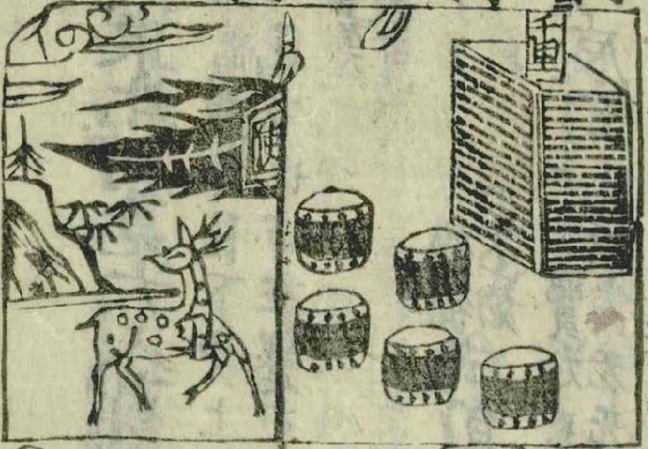
- 圖中：日當天，旗一面上有使字，鼓五面，中有一鹿，堠上千里字。
- 卦圖象解：
	- 一、日當天：君明之象，吳姓。
	- 二、旗一面上有使字：出使，和平之象，使——二人一口，示單人也。
	- 三、鼓五面者：時為五更天，佔五面地，王為君王，一方之主，有多國或多島之象。
	- 四、中有一鹿：攜財福至，旅客帶財來狀，商人至也。
	- 五、堆子千里字：行西南，千里封候，候姓也。
	- 六、千里為重：有第二次方吉。

### 人间道——蹇

- 上一卦[《火泽睽》](#《火泽睽》（四世）离上%20兑下#人间道——睽)——下一卦[《雷水解》](#《雷水解》（二世）震上%20坎下#人间道——解)

> [!引申] 
睽，乖違也，乖離必生難，蹇即難也，因時之乖違，必有蹇難，故蹇次睽為序卦。此卦坎上艮下，坎，險也，艮，止也，前有險而止不進，為蹇之意也。

- 蹇：利西南，不利東北，利見大人，貞吉。
	- 西南為坤，坤体順，東北為艮，艮体險止，此言於蹇難之時，利處平易之地，不利止於危險，今人遇險而止，不知因險而止，乃更險也。
- 《彖》曰：
	- 蹇，難也，險在前也。見險而能止，知矣哉！
		- 蹇有險阻之難也，因險在前，止而不進狀。處蹇之道，乃能見險而止，此知蹇難也，此止非真止也，乃不犯險而進之意。
	- 蹇：利西南，往得中也：不利東北，其道窮也。
		- 蹇之時，唯利處平易之地，乃得中正之位，東北為山，險阻在前，犯險而進，道必窮。
	- 利見大人，往有功也，當位貞吉，以正邦也。蹇之時用大矣哉！
		- 蹇難之時，唯聖賢能濟天下之蹇，故用賢人能往求而成功，在位之人堅心執意如此，必能正家邦，此即知蹇之時任用賢人，適時而動，量險而行，使至正之大道能濟天下之蹇。今之為政者，不知蹇之時難，乃因不知古聖先哲之智慧也。
- 《象》曰：山上有水，蹇；君子以反身修德。
	- 山已為險阻，上又有水，故有上下險阻狀，為蹇，君子觀蹇象，知此時乃反求於己修身進德，故必省自身，以待時之至也。
- 初六：往蹇，來譽。
	- 此蹇之初，以陰柔無助而求進，蹇之甚也，是知止而不進，乃因知進退而成譽也。
	- 《象》曰：往蹇來譽，宜待也。
		- 於蹇之初，進必愈蹇，宜見幾而止，待時而進，不可燥進。
- 六二：王臣蹇蹇，匪躬之故。
	- 二爻為陰位，陰居之為正位，乃意為中正之臣，又與上五君同德而受信任，此即王臣，今處蹇難時，即令中正之人，以陰柔之質，不能勝任，故有蹇中之蹇狀，因為中正之人，其所為必忠於君，非為私己，故即令不勝，亦因其能忠而可嘉勉。
	- 《象》曰：王臣蹇蹇，終无尤也。
		- 中正之臣所為必為其君，不為私，故於蹇難時，雖未成功，但終無過也。
- 九三：往蹇，來反。
	- 以剛居下卦之上，處蹇時，下位之人皆柔，依附於上狀。欲再上進，又逄陰柔，無法相濟，故有來反，即還歸也，反回其所。
	- 《象》曰：往蹇來反，内喜之也。
		- 下之陰柔無法獨立，必附於九三之陽剛。故吾人知，於處蹇之時，必得下之心可以求安，此求內而喜之也。
- 六四：往蹇，來連。
	- 蹇之時以陰柔而往入坎險之深處為往蹇，如能與同志之人，使合眾而附之，此即来連，乃真得處蹇之道也。
	- 《象》曰：往蹇來連，當位實也。
		- 處蹇，居於上位，能不與下往而眾來，乃得眾志也，能得眾志之人，必始之於誠實待下方可得也。
- 九五：大蹇，朋來。
	- 君處蹇難之時，必天下處難也，故名大蹇，此時如能得朋來助，且須為陽剛中正之才來相輔方有效。
	- 《象》曰：大蹇朋來，以中節也。
		- 大蹇之時，須陽剛中正之才，如臣之才不足濟蹇，只守於節義，不能濟世也，今之政客，多屬此類，不知己之才不濟，而力進，徒顯其無能也。
- 上六：往蹇，來碩，吉，利見大人。
	- 六以陰柔居蹇之極處，蹇之極有將離蹇之態，如以陰柔必不得出，須有陽剛之助，以寛裕之大量，見有德之人，方可為吉。
	- 《象》曰：往蹇來碩，志在内也，利見大人，以從貴也。
		- 六位陰柔又處蹇之極，能近陽剛中正之君，來求自濟，此以從貴之義，吉也。

## 《地山谦》（五世）坤上 艮下

~~~
  伏 神        【本 卦】
              ▆▆▆   ▆▆▆     兄弟癸酉金
              ▆▆▆   ▆▆▆     子孙癸亥水   世
              ▆▆▆   ▆▆▆     父母癸丑土
              ▆▆▆▆▆▆▆▆▆     兄弟丙申金
妻财丁卯木     ▆▆▆   ▆▆▆     官鬼丙午火   应
              ▆▆▆   ▆▆▆     父母丙辰土
~~~
地中有山之卦，仰高就下之象。
判曰：谦者，退也。谦而受益，满而受亏。谦谦君子，尊人自卑。利用谦逊，万事无违。

### 卦象——此卦唐玄宗因祿山之亂，卜得之，乃知干戈必息也。

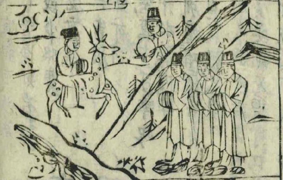
- 圖中：月當天，一人騎鹿，三人腳下亂絲，貴人捧鏡，文字上有公字。
- 卦圖象解：
	- 一、月當天：清明之政，中秋時也。
	- 二、一人骑鹿：才祿俱備。
	- 三、三人腳下亂絲，隱於山後：小人不敢正面示人，惟隱山謙之後（即外飾謙為幌子）實則亂如麻，計無所出。
	- 四、貴人捧鏡：明鏡高懸，執法公正光大。
	- 五、文字上有公字：處事以公，得理也。
	- 全卦：不知謙下自晦，果必招訟也。

### 人间道——谦

- 上一卦[《火天大有》](#《火天大有》（归魂）离上%20乾下#人间道——大有)——下一卦[《雷地豫》](#《雷地豫》（一世）震上%20坤下（六合）#人间道——豫)

> [!引申] 
大有至終必不可盈滿，故聖人受之序卦為謙。天之道盈滿，則必損地道，此卦為亦謙之義，以自然界喻之，外卦為地，內卦為山，即山居地下，山乃至高大之物，而今居地下，此處卑乃謙之象，亦示人有崇高之至德，而處卑下，乃盡謙之義。

- 謙：亨，君子有終。
	- 有德而不居，為謙，人能以謙遜自處，無往不利。君子之志在達理，樂天命而無競之心，但求內充，退讓而不衿持。能安於謙，終身不易。小人則有慾必競，此種人見有德之人必攻之，即令有人告之謙遜，但終不能宽行固守。故小人，必不能有終也。
- 《彖》曰：
	- 謙，亨，天道下濟而光明，地道卑而上行。
		- 君子明謙之道而能亨。天之道因其氣能下濟，故能生育萬物，故道乃光明，故君子知謙而能使其道濟天下萬民，地之道亦同天，因自處卑地，故能上交於天，是故天地二者，皆因能卑降而終亨通也。
	- 天道虧盈而益謙。
		- 天之道有日月五星，其隨時盈晦，故能降氣於地，生養萬物。
	- 地道變盈而流謙。
		- 地勢如盈滿，則必倾變而下陷。
	- 鬼神害盈而福謙。
		- 天地之道乃形而上之學，吾人可推理求之。鬼神人道乃形而下之學，吾人可親而見之，世間萬物必有其用，凡盈滿者，必有禍害，能謙損者，必有福祐之，猶今之西醫，其但知能如何除瘤用毒，不知損害之大，故後遗症之多，而自不見之。
	- 人道惡盈而好謙。
		- 人情必惡人之盈滿，好人之謙損，故聖人戒盈而勸（quàn）人為謙也。
	- 謙尊而光，卑而不可喻，君子之終也。
		- 君子之道因謙卑而光大，至誠之念如是而終。
- 《象》曰：地中有山，謙。君子以裒（póu）多益寡，稱物平施。
	- 高大之山在地下，故示人外卑下，內實高大乃謙象。君子有過則損之，不足則益之，以之用於事，使萬物皆平衡也。
- 初六：謙謙君子，用涉大川，吉。
	- 最卑下之位以柔態處之，又謙讓也。能如是，君子也。即涉險難，必無凶也。
	- 《象》曰：謙謙君子，卑以自牧也。
		- 君子以謙卑之道，於初入世間而自處之。
- 六三：嗚謙，貞吉。
	- 二位以柔順居中，謙之德至此，則須明倡於外，見諸聲色，堅心如此，吉也。
	- 《象》曰：鳴謙貞吉，中心得也。
		- 因中心能自得，山至大又能知謙，故吾人須有高厚實力，乃真謙非勉力為之也。
- 九三：勞謙，君子有終，吉。
	- 三為相位，以陽剛居之，上為君所任，下為民所從，能知勞而不居功，謙下待人，君子能行之至終，故吉。今上位掌權之人，盡皆示民其功勳（xūn）為何，不知勞謙之美，此為小人之道長之時也。反之，能盡勞謙之道，必為君子。
	- 《象》曰：勞謙君子，萬民服也。
		- 此勞謙君子，能服萬民也。
- 六四：无不利，撝（huī）謙。
	- 四體居近君主之位，此時因六五之君，以謙柔自處，九三之相位，又因大功德為上所用，此當恭畏侍君，卑謙以讓勞謙之臣，所有布施，均為謙也，切不可不利於謙。
	- 《象》曰：无不利，撝（huī）謙，不達則也。
		- 六四因近君之位，又居勞謙臣之上，絶不可不利謙道，此得宜之法也。
- 六五：不富以其鄰，利用侵伐，无不利。
	- 富貴，眾人之所嚮往，以財來聚人。今五以居尊之君王，不以富而能得人親，皆因知謙順，乃能得天下。然須戒君道，切不可專尚謙順，必須威柔並濟，才能服天下，故易曰：「利用侵伐」。威德並重，方為君道。
	- 《象》曰：利用侵伐，征不服也。
		- 君王之道，須用征伐，其用謙德所不能服者，否則不能治天下，則為謙之過也。
- 上六：鳴謙，利用行師，征邑國。
	- 上六處謙之極也，因極謙反居高位，為太過於謙，為倡明其謙，只有用剛武之道，於已之私有地，征之。此因謙之太過而致如此。
	- 《象》曰：鳴謙，志未得也。可用行師，征邑國也。
		- 因極謙又居上，其不適謙，故志不得伸，則鳴，唯宜以剛武自治其國內。

## 《雷山小过》（ 游魂）震上 艮下

~~~
  伏 神        【本 卦】
              ▆▆▆   ▆▆▆     父母庚戌土
              ▆▆▆   ▆▆▆     兄弟庚申金
子孙丁亥水     ▆▆▆▆▆▆▆▆▆     官鬼庚午火   世
              ▆▆▆▆▆▆▆▆▆     兄弟丙申金
妻财丁卯木     ▆▆▆   ▆▆▆     官鬼丙午火
              ▆▆▆   ▆▆▆     父母丙辰土   应
~~~
飞鸟遗音之卦，上逆下顺之象。
判曰 : 小过者，过也。飞鸟翩翩，音彻于天。进则有咎，退则无愆。多忧过失，疾病相缠。出入不利，必有迍邅（zhūn zhān）。

### 卦象——此卦漢君有難，卜得之，後果脱險也。

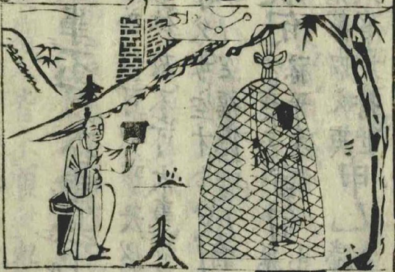
- 圖中：明月當空，林下一人彈冠，人在網中。一人割網，堠子在山頭出。
- 卦圖象解：
	- 一、明月當空：政清狀，入法庭，刑堂。
	- 二、林下一人：林姓人。
	- 三、人陷網中：不得脱身，受束縛。
	- 四、一人彈冠：求去之象，但求去為形，束縛為神，合則有表裡不一狀。
	- 五、一人割網：貴人解救，脱困狀。
	- 六、堠子在山頭：從新開始之課（候、猴 再出山）。

### 人间道——小过

- 上一卦[《风泽中孚》](#《风泽中孚》（游魂）巽上%20兑下#人间道——中孚)——下一卦[《水火既济》](#《水火既济》（三世）坎上%20离下#人间道——既济)

> [!引申] 
人之有信後必行，行則生過，故小過所以為中孚序也。此卦山上有雷，雷震於高處，其聲必過，故為小過。小過者，可說為小事過，亦可説為過之小也。

- 小過：
	- 亨，利，貞。
		- 過之意在過其正常也。如矯枉過正，此過為就正意。時不正，用過之道使正，此過之吉處，吾人須知過之道，知用過之時機方如是。
	- 可小事，不可大事，飛鳥遺之音，不宜上，宜下，大吉。
		- 用過之道，乃為求中正。其過之限，可用小事，於大事不可用過。故曰不宜上，宜下，順之則吉，乃過能順理，吉反更大也。
- 《彖》曰：
	- 小過，小者過而亨也。過以利貞，與時行也。
		- 小過之道，在過之小，有時當過，過而能致亨，過之能吉矣。但用過之道，須配合時機，乃意當過則過，此非真過矣，此為以過養正也。
	- 柔得中，是以小事吉也，剛失位而不中，是以不可大事也，有飛鳥之象焉。
		- 小過之道，處小事之過，可得吉。但不可做大事，因剛失位又不得中，故不可以用在大事上，故有飛鳥之象，鳥飛之事小，過而餘音，但無災也。
	- 飛鳥遺之音，不宜上宜下，大吉，上逆而下順也。
		- 事之有過，當從其宜。如人之過恭，過哀，過儉，其太過，則不可。其過當如飛鳥之遺音，其聲出，而身己過，事之過當如是，則吉宜。此順道之過，故也。
- 《象》曰：山上有雷，小過。君子以行過乎恭，喪過乎哀，用過乎儉。
	- 雷震於山上，其聲至，而雷已過，故為小過，君子觀象，知天下事，有時當過，但不可過甚。故為小過，當過而過，乃其宜也。
- 初六：飛鳥以凶。
	- 陰柔居下位，為小人之象，小人本躁易動，今逢小過時，乃得理不饒人，其行為之過。必速且遠，救之莫及也，故凶。
	- 《象》曰：飛鳥以凶，不可如何也。
		- 過之疾，如鳥之速，必救之不及，無有作為也。
- 六二：過其祖，遇其妣，不及其君，遇其臣，无咎。
	- 二與五爻位，其猶祖之象，今陰柔居其位，越過三，四位，直與五相應，有越位之戒，今逢該過之時，如過越位，仍不失臣道，亦可無咎。於其他之卦，越過本位凶，但今於小過，乃意當過之時，可過，無災，切忌失君臣之道，及過之太過，反凶。
	- 《象》曰：不及其君，臣不可過也。
		- 下臣遇须過之時，可過越其上位，但不可至君位，至君前，則太過，過一爻可無咎。
- 九三：弗過防之，從或戕（qiāng）之，凶。
	- 陽居正位，於小過之時，意味手下無能，又為陰之小人蒙蔽。此時須過防之。如不加強防範，必招害。君子防小人之道，以正己為先，堅守正道也。
	- 《象》曰：從或戕之，凶如何也。
		- 小人道盛，必害於君子。當防而不防，必傷矣。
- 九四：无咎，弗過遇之，往厲必戒，勿用永貞。
	- 剛居柔位，以剛而用柔，其剛必不過也。故無災咎。剛陽之道居小過時，須戒之隨宜，不可固守不變，故君子隨時順處，不固守其常也。
	- 《象》曰：弗過遇之，位不當也，往厲必戒，終不可長也。
		- 陽剛居柔位，不當位時，於當過之時，能不過剛反柔，乃得其宜，於自保可也，但終不可成長至盛，故往則有危，須戒之。
- 六五：密雲不雨，自我西郊，公弋取彼在穴。
	- 此陰柔居君位，居當過之時，乃不夠陽剛，故雖欲過，但不能成功。故猶如密雲而不成雨，其不成功，即令越過其位向二爻相應，三、四爻位不應，亦如同密雲集中，而無法成雨。
	- 《象》曰：密雲不雨，已上也。
		- 陽下陰上，合則成雨，今陰已在上，即令雲再密，無陽而不成雨，終無功也。
- 上六：弗遇過之，飛鳥離之，凶，是謂災眚。
	- 六居小過之極，居過之極，不顧正理，必違常道，遠矣，故凶，必招人為災害也，此於天理人事皆同。
	- 《象》曰：弗遇過之，已亢也。
		- 居過之終，失正理之甚，乃過至亢極，故招凶致。

## 《雷泽归妹》（ 归魂）震上 兑下

~~~
  伏 神        【本 卦】
              ▆▆▆   ▆▆▆     父母庚戌土   应
              ▆▆▆   ▆▆▆     兄弟庚申金
子孙丁亥水     ▆▆▆▆▆▆▆▆▆     官鬼庚午火
              ▆▆▆   ▆▆▆     父母丁丑土   世
              ▆▆▆▆▆▆▆▆▆     妻财丁卯木
              ▆▆▆▆▆▆▆▆▆     官鬼丁巳火
~~~
浮云蔽日之卦，阴阳不交之象。
判曰：归妹者，大也。归妹未吉，其道将穷。天地不交，闭塞不通。有殃有咎，无始无终。所作不顺。必见其凶。

### 卦象——此卦舜娶堯二女，卜得之，乃知卑幼不寧也。

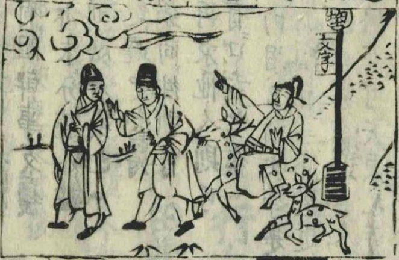
- 圖中：官人騎鹿指雲，小鹿子在後，望竿上有文字，人落刺中，一人拔出。
- 卦圖象解：
	- 一、官人騎鹿指雲：浮雲蔽日，乘亂而欲進。
	- 二、小鹿子在後：生意人，隨從狀。
	- 三、望竿上有文字：旦夕而亡，揭竿而起，正名也。
	- 四、人落刺中：如鲠在喉，去之不得。
	- 五、一人拔出：一人相救示寵狀。
	- 六、此卦問病凶，問財吉，問政凶。

### 人间道——归妹

- 上一卦[《风山渐》](#《风山渐》（归魂）巽上%20艮下#人间道——渐)——下一卦[《雷火丰》](#《雷火丰》（五世）震上%20离下#人间道——丰)

> [!引申] 
渐乃進也，人進必有所歸，所以歸妹次渐也，少女，人所悦也，雷為動，今如人之動以悦，此因悦而動，必有所不正，此卦澤上有雷，雷震而澤動，相從之象，男動在外而女從之在內，有女嫁歸男之象。人之動须以明，明而後動，方不失正。

- 歸妹，征凶，无攸利。
	- 此動之以悦，必有不當，如動反招凶，所往必不利。
- 《彖》曰：
	- 歸妹，天地之大義也。
		- 此言陰陽之道，男女之配，乃天地間之常理也。有男居上女在下，陰從陽動。
	- 天地不交而萬物不興，歸妹，人之終始也。
		- 天地如不交則萬物必不生，女之從男，為生生之道，人類從男女之交而生，其終必不窮。
	- 説以動，所歸妹也，征凶，位不當也。无攸利，柔乘剛也。
		- 此動之因喜悦對方為少女，人如只因悦而動，必失明之道，動必凶至。此不以正道，而以悦道，故位不當也。男女尊卑，夫唱婦隨，人之常理，如不以常道，惟私欲作與，柔勝於剛，所以凶也，往必不利矣。
- 《象》曰：澤上有雷，歸妹，君子以永終知敝。
	- 君子觀雷震於澤上，澤隨雷而動，猶男女相配，生生不息之象，其有永終之戒，因物久後必生敝壞，君子於始初乃知戒敝壞之理，故凡事之長久而吉，必於初始即生戒故謂永終之戒。
- 初九：歸妹以娣，跛能履，征吉。
	- 娣，有賢良正德之義，女之嫁歸能如此，又知處卑順，然因其位卑，即令有賢才亦只能助夫而已，獨善其身，猶跛之能行，必無法及遠，但往乃得吉。
	- 《象》曰：歸妹以娣，以恆也。跛能履吉，相承也。
		- 女嫁歸男，能自處卑順，且悦於內，持之以恆，即令跛者行路，亦可以有吉，其因乃其能相承相助也。
- 九二：眇能視，利幽人之貞。
	- 九二乃陽剛之賢居正位，於歸妹之時，乃意女之賢能所配不良之人，猶如目眇之人，其視必不能及遠，此時惟隱藏其賢，且堅心以正禮，可利也。
	- 《象》曰：利幽人之貞，未變常也。
		- 守其隱於內之才，堅心不變，此不失夫婦常久之道也。
- 六三：歸妹以須，反歸以娣。
	- 六三乃相位居陰柔之人，於歸妹時，以悦而求上應，不以正道，故必不得其歸，無所適從。必當反歸求處卑下，則可吉矣。
	- 《象》曰：歸妹以須，未當也。
		- 女歸嫁男，如求己之须，無法求外應合，必不當也。
- 九四：歸妹愆期，遲歸有時。
	- 四柔陽剛居之，即意處柔乃婦人之常道，但內有剛明之賢，處歸妹之時，因賢明又居高位，人所願娶，但卻有遲嫁之象，非不嫁也，乃待時而動，有佳配而後行也，此遲歸有時。
	- 《象》曰：愆期之志，有待而行也。
		- 此之延期所由皆己，不由他人，因己之有賢，故能如是。
- 六五：帝乙歸妹，其君之袂，不如其娣之袂良，月幾望，吉。
	- 六五居尊位之人，柔性象女，示女之高貴者，今居歸妹之期，雖為帝女，於歸時，乃得屈而謙降，故女之歸以能謙降為美德，但求於禮，不求於外飾，故猶月陰之盛，而不至於盈滿，此乃能為吉。女子尊貴之道即此。
	- 《象》曰：帝乙歸妹，不如其娣之袂良也，其位在中，以貴行也。
		- 此尚禮而不尚外飾，為帝乙歸妹之道，五為柔而居尊位，乃有尊貴而又知能行中道之人也。
- 上六：女承筐无實，士刲（kuī）羊无血，无攸利。
	- 女歸之終至極時，乃承繼祖先祭祀之職，但至極則無實可祭，猶士人之割取羊血以祭禮，如割羊無血無以祭，必不利繼往也。
	- 《象》曰：上六无實，承虛筐也。
		- 女歸嫁之極處，以柔居之，猶空筐之無實，必不可以承祭祀，女終不可承繼也，必主人人離絶也。

# 离宫八卦——属火

## 《离为火》（纯卦）离上 离下（六冲）

~~~
 【本卦】
▆▆▆▆▆▆▆▆▆     兄弟己巳火   世
▆▆▆   ▆▆▆     子孙己未土
▆▆▆▆▆▆▆▆▆     妻财己酉金
▆▆▆▆▆▆▆▆▆     官鬼己亥水   应
▆▆▆   ▆▆▆     子孙己丑土
▆▆▆▆▆▆▆▆▆     父母己卯木
~~~
飞禽遇网之卦，大明当天之象。
判曰：离者，丽也。光明美丽，不利出师。二鸟同飞，雄失其雌，婚姻未合，易起官非。口舌相尚，财散人离。

### 卦象——此卦朱買臣被妻棄時，卜得之，知身必貴也。

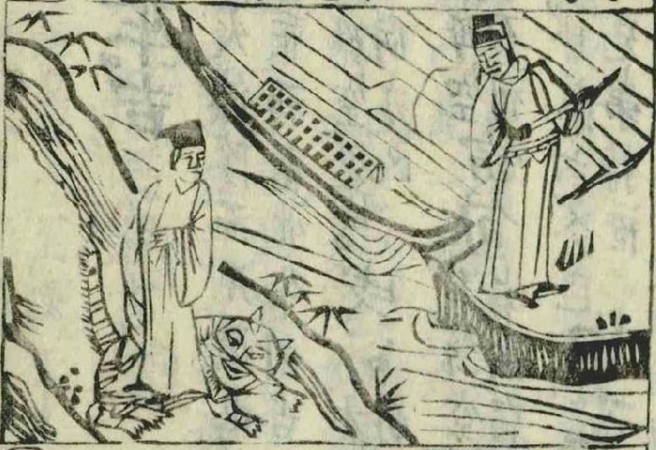
- 圖中：人在虎背上立，官人執箭在岸上立，水中有船，二人分立兩岸。
- 卦圖象解：
	- 一、人在虎背上立：行危不懼；難下也。
	- 二、一船在江心：口舌相爭，無所適從也。
	- 三、官人執箭岸上立：在位之人，欲殺之象。
	- 此卦夫妻破散成仇，兄弟分家各自為王之課。

### 人间道——离为火

- 上一卦[《坎为水》](#《坎为水》（纯卦）坎上%20坎下（六冲）#人间道——坎为水)——下一卦[《泽山咸》](#《泽山咸》（三世）兑上%20艮下#人间道——咸)

> [!引申] 
陷於險難之中，必有所附麗，理之自然，離者麗也。離為火，火體中虛而能明照，故能麗於物而明也。人之明，必經險難，大風大浪過後，其經驗之累積，而後能明，此猶可人。
今人雖歷災險，但仍不能明，吾人教授易經，其目的即希望世人，不須付出血的代價，亦能明，此中虛之廣義。

- 離：利貞，亨，畜牝牛，吉。
	- 天下萬物莫不有所麗，其形即麗。人之所麗，必得貞正，得正可以亨通，人能附麗於正，必能順於正道，從善如流為人之性，如牝牛之吉，牛之順道，由養而成，人之順德亦同，既附麗於正道，當有養以成其德也。
- 《彖》曰：
	- 離，麗也。日月麗乎天，百穀（gǔ）草木麗乎土。
		- 附麗狀，如日月麗於天，百穀草木麗於土，天下萬物必有所麗，無麗之物，人必視何麗方正，則能亨通也。
	- 重明以麗乎正，乃化成天下。柔麗乎中正，故亨。是以畜牝牛吉也。
		- 上下皆離故曰重明，乃意君臣皆有明之能，又處事中正，故可以教化天下成文明之俗也。人又能柔順於中正之明德如牝牛之順吉，乃更能將明德發乎光大，襯（chèn）托明德之麗。
- 《象》曰：明兩作離，大人以繼明照于四方。
	- 此卦若云兩離，則只見明，而不知繼明之德。君子觀離明相繼之象，知本身之明德能濟天下，為使以明德中正永傳後世，則須有進一步繼明之能，能明於選擇何人能承繼，乃繼明之義。如堯之擇舜，漢之蕭規曹隨等即是繼明之用。
- 初九：履錯然，敬之，无咎。
	- 初爻陽居之，乃言初進有陽剛之才而進又躁動，卻因動之非宜，已失居下位之分而得咎，但因為人才，只須知守義而戒慎之，則不至於有咎。
	- 《象》曰：履錯之敬，以辟咎也。
		- 能知履動之躁進為錯而敬慎之，因居下位，但求避之可也，不致有災。吾人有陽剛之才，仍須有明之能，能剛不能明，則因妄動生災也。
- 六二：黃離，元吉。
	- 以柔居中乃得正位，黃為中色，人能文明而中正，則美之至極也。又有六五文明之君以順其德，其能明如此，乃大善之吉也。
	- 《象》曰：黃離元吉，得中道也。
		- 能成文明乃由中之虛明，故元吉之因，是由其得中之道也。
- 九三：日昃（zè）之離，不鼓缶（fǒu）而歌，則大耋之嗟，凶。
	- 易有八純卦，唯離為火於人事之義陳述最細。今九三吾人居下卦之終乃意前明將盡，後明當繼之時，人之有始，必有其終，此常道也。智慮通達之人，以順理為樂且常持之，如不能如此，則有將盡之悲，而日夜恐於死亡，故君子樂天，小人終日恐懼，此處易論生死之道也。
	- 《象》曰：日昃之離，何可久也。
		- 日已倾，不可久也，能明之人，能求人以繼其事，知退而修其身，則可長久。
- 九四：突如、其來如、焚如、死如、棄如。
	- 九四位，乃言繼明之初，承繼之意，但陽爻居之，有剛躁但不失中正之意，此非善繼者，能知善繼之人，始繼必有謙讓之誠，知順承前賢之道。今突如其來，已失善繼，又剛勢凌主，氣焰高張故焚如，必招禍害致死，故死如，以眾所棄之，故果為棄如。
	- 《象》曰：突如其來如，无所容也。
		- 諸君試想，人之凌其君，而不順所承繼之前賢，必眾棄，天下不容也。
- 六五：出涕沱若，戚嗟若，吉。
	- 出涕戚嗟，皆形容人憂懼至深。君位以陰柔之才居之，又受於陽剛之在左右，此居尊位之明，能知憂且畏，故能吉。今若自持己才之不足，全然不知懼，必不能得其吉也。
	- 《象》曰：六五之士，離王公也。
		- 居上位之吉，乃在明察事理，且以畏懼憂慮之心以持之，可以為吉也。
- 上九：王用出征，有嘉。折首，獲匪其醜，无咎。
	- 陽剛之才居離之終，有剛明至極之狀。此方式乃適用之於君王出征時，明則足以察邪惡，剛則能斷事，施以威行，如此則能去天下之邪惡，此有功也。世上事至刑不足以阻時，必用征伐方法解決，此之時也。去天下之邪惡，如明斷之極，則必無所宽宥，此時必取其魁首，始作俑者方是，趕盡誅滅，必有暴殘之後悔也。
	- 《象》曰：王用出征，以正邦也。
		- 君王用此德，則能治其邦國，此剛明至上之道也。

## 《火山旅》（一世）离上 艮下

~~~
  伏 神        【本 卦】
              ▆▆▆▆▆▆▆▆▆     兄弟己巳火
              ▆▆▆   ▆▆▆     子孙己未土
              ▆▆▆▆▆▆▆▆▆     妻财己酉金   应
官鬼己亥水     ▆▆▆▆▆▆▆▆▆     妻财丙申金
              ▆▆▆   ▆▆▆     兄弟丙午火
父母己卯木     ▆▆▆   ▆▆▆     子孙丙辰土   世
~~~
如鸟焚巢之卦，乐极哀生之象。
判曰：旅者，客也。长途落落，羁旅凄凄，火行山上，逐草高低。如鸟焚巢，无枝可栖。虽然先笑，后有悲啼。

### 卦象——此卦陳後主得張麗華，卜得之，乃知先喜後悲。

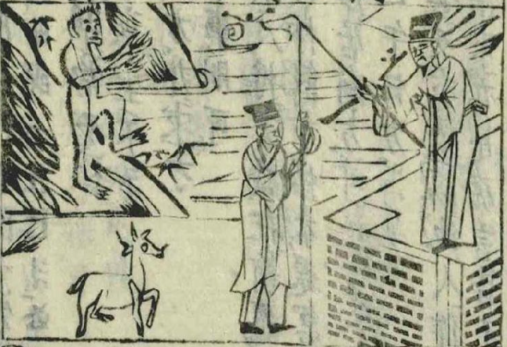
- 圖中：三星者，貴人台上垂釣牽水畔人，一猴一羊，大溪者。
- 卦圖象解：
	- 一、三星者：三台貴人，相位之人。
	- 二、貴人台上垂釣：君主相求，老闆相求人才。
	- 三、牽水畔人：賢能之人，離野入朝封候。或慕權勢而變志。
	- 四、一猴一羊：肖猴，肖羊，候、楊姓人，未申年應之。
	- 五、大溪：脱險也，港口也，水側也。

### 人间道——旅

- 上一卦[《雷火丰》](#《雷火丰》（五世）震上%20离下#人间道——丰)——下一卦[《巽为风》](#《巽为风》（纯卦）巽上%20巽下（六冲）#人间道——巽为风)

> [!引申] 
豐至極時，不知戒盛，乃失其居，故序卦為旅。此卦「離」上「艮」下乃外明內止之象，山為止而不動，火行而不居，有不與同流之意。故為旅象，又人之旅，必外麗，亦旅象。

- 旅：小亨、旅貞吉。
	- 旅之時，此因不同流而旅，故有小亨，且得之堅心，必吉。切不可假旅之道而有私欲其中。
- 《彖》曰：旅，小亨，柔得中乎外而順乎剛，止而麗乎明，是以小亨，旅貞吉也。旅之時義大矣哉！
	- 旅之時至而旅，乃有亨，人能知所進退，內有中道外又知順於剛，止之在能外麗而內明，是故有小亨，旅而堅貞其志，是故吉也。當旅不旅乃自求咎。故天下之事，當有時宜，因時而動，其義大也。
- 《象》曰：山上有火，旅。君子以明慎用刑，而不留獄。
	- 火在山高處，其明及遠，旅之道也。君子觀此明照之象，知明慎以用刑，絶不依持己之明，必有戒慎恐懼之心而施於用刑。因火行不留，故有不留獄之志，獄乃不得已而設，故不求留獄，此觀火之行而體悟之。
- 初六：旅瑣瑣，斯其所取災。
	- 陰柔無才之人，居卑下，居旅之時，因才質如此，故必畏畏瑣瑣，其必終自取其辱。
	- 《象》曰：旅瑣瑣，志窮災也。
		- 意志因困窮時，而生變，乃自取其災也。
- 六二：旅即次，懷其資，得童僕貞。
	- 六二乃得適位之將才居旅時，因知中正處不失當，必能懷蓄財資，又能得僕人之忠心，故吉。
	- 《象》曰：得童僕貞，終无尤也。
		- 旅行之人，所賴者為童僕，能得其忠心，必可無災。
- 九三：旅焚其次，喪其童僕，貞厲。
	- 旅之時，必以柔順謙下為吉，如今自處過剛，又居高，乃招致災困。必失僕人之忠，終有危厲來臨。
	- 《象》曰：旅焚其次，亦以傷矣，以旅與下，其義喪也。
		- 居旅時以過剛自高，手下必喪失忠心，危之至矣。
- 九四：旅于處，得其資斧，我心不快。
	- 陽剛又居柔位，有用柔之象。人居旅時，能柔，得旅之道，必吉。此法居旅時可得財货之資助，但不能伸其大志，其心必不快。
	- 《象》曰：旅于處，未得位也，得其資斧，必未快也。
		- 以剛居柔，合於旅之道，故旅時為善，但欲得行其志，卻不能也。心必不快。
- 六五：射雉，一矢亡，終以譽命。
	- 人於旅時，不可有錯，一但犯之，災禍立至。就如射雉，能一箭而中，不虛發即無過失，能如此，則於旅時，必可立名揚譽。
	- 《象》曰：終以譽命，上逮也。
		- 旅之時，能令上下皆應，則可吉。其因旅之時乃困而未得其安之時為旅。
- 上九：鳥焚其巢，旅人先笑後號咷，喪牛于易，凶。
	- 旅時以過陽剛自處以高，不知謙卑，就如鳥高飛而自焚其巢，故終居無所安處，自負過剛，居旅時，始則可快意盡情，故生笑。繼而失安無居所，故後號咷。牛為順性之物，但也易於喪失，只一疏忽而己。故凶。
	- 《象》曰：以旅在上，其義焚也。喪牛于易，終莫之聞也。
		- 旅時以居高自處，必不能保安，猶鳥之焚巢，喪失順德極易，待凶至，乃不知自聞知也。

## 《火风鼎》（二世）离上 巽下

~~~
  伏 神        【本 卦】
              ▆▆▆▆▆▆▆▆▆     兄弟己巳火
              ▆▆▆   ▆▆▆     子孙己未土   应
              ▆▆▆▆▆▆▆▆▆     妻财己酉金
              ▆▆▆▆▆▆▆▆▆     妻财辛酉金
              ▆▆▆▆▆▆▆▆▆     官鬼辛亥水   世
父母己卯木     ▆▆▆   ▆▆▆     子孙辛丑土
~~~
调和鼎鼐之卦，去旧取新之象。
判曰：鼎者，定也。鼎象九州，和羹之器，变生为熟，以成香味。鼎乃易溢，不宜争事，官鬼持世，求官最利。

### 卦象——此卦秦君卜得之，乃知得九鼎以象九州也。

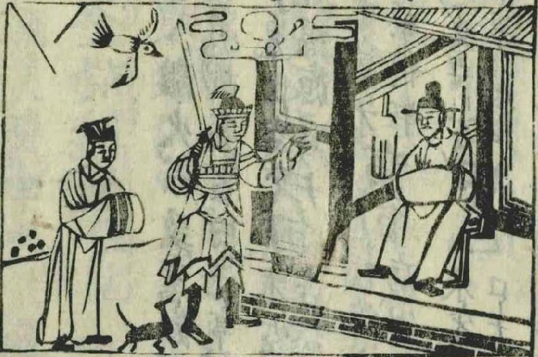
- 圖中：雲中月現，鵲南飛，一子裹席帽，一人執刀，貴人端坐無畏，一鼠。
- 卦圖象解：
	- 一、雲中月現：顯象，撥雲見月之象，清明也。
	- 二、鵲南飛：冬至來臨，北人執政。
	- 三、一子裹席帽，不明之人，無知之人。果喜也。
	- 四、一人執刀：武官也，護衛將軍。
	- 五、貴人端坐無畏：君王，老闆等人，至公無私。
	- 六、一鼠：子年，暗謀之人，內有陰謀，肖鼠人也。

### 人间道——鼎

- 上一卦[《泽火革》](#《泽火革》（四世）兑上%20离下#人间道——革)——下一卦[《震为雷》](#《震为雷》（纯卦）震上%20震下（六冲）#人间道——震为雷)

> [!引申] 
能使物分隔，為鼎，故鼎之用在能革物，能使水火不同之物相合，易生為熟，易堅為柔，使相合而不相害，此革物之功也，故鼎為革之序卦。此卦上火下風，乃木入火中，烹飪之象，鼎之象即此。為器之大用。

- 鼎：元吉、亨。
	- 鼎之道，能使不合之物相合，故必吉亨。
- 《彖》曰：
	- 鼎，象也。
		- 鼎之為器，法自象也。古人以方代表實且正之象。兩耳對峙在上，三足分峙於下，周圓內外，皆有法而正，成安重之象。
	- 以木巽火，烹飪也。聖人亨以享上帝，而大亨以養聖賢。
		- 用木就火，烹飪之象，鼎器人賴以生，故聖人以鼎享上帝，用大亨以享聖人。
	- 巽而耳目聰明，柔進而上行，得中而應乎剛，是以元亨。
		- 人能如卦才，外明內順，上之頭面能中虛為明，乃耳聰目明之象，柔乃在下之物，能進上位，以明居尊，得乎中道，而陽剛之道相應，此乃元亨之因也。
- 《象》曰：木上有火，鼎，君子以正位凝命。
	- 木之上有火，生火烹飪之象為鼎，君子觀象，知法象器，形體端正且安重，以正其位也。
- 初六：鼎顚趾，利出否。得妾以其子，无咎。
	- 初六乃最下之位，與四爻相應，今居鼎時，有如趾之向上，顛也。鼎覆則趾顛，此非順道，反道而行之理，利於天下敗壞之時，乃可為也。居卑下而從陽如妾，妾之從夫，則可無咎。
	- 《象》曰：鼎顚趾，未悖也。利出否，以從貴也。
		- 鼎顛覆趾在上時，背道而行，只利天下敗壞之際，棄惡而從貴也。
- 九二：鼎有實，我仇有疾，不我能即，吉。
	- 二位為中位，以剛居中，乃鼎中有物之實象，但於陰位，有能才而密比於陰之意，居此當求己之守正，不求於人，使之能求於我，則不正亦终就之，此吉也。
	- 《象》曰：鼎有實，慎所之也。我仇有疾，終无尤也。
		- 鼎之有實，猶人之有才，必慎擇趨向，如往之不慎，必有對立之事，於此能自求守正，則彼必不能影響我，亦可無過矣。
- 九三：鼎耳革，其行塞，雉膏不食，方雨虧悔，終吉。
	- 九三相位，陽剛居之，乃正位，然五位之柔君不能與合，不信用之，其行必阻塞，道必不行。有才而不能得君祿命任用之時，君子必內其德，守其正道，終必吉。
	- 《象》曰：鼎耳革，失其義也。
		- 有才居相位，與君之念不合，乃失其義也，但上能明時，下之才必有能用，故吉。
- 九四：鼎折足，覆公餗（sù），其形渥，凶。
	- 四為君側之位，與初下爻相應，乃示初陰柔之小人不可用；其不勝任而敗事，猶鼎足折也。居大臣之位，所用非人，至於覆敗，此不勝任，其凶可知。成因在於任不適之才，必來自私心作用。
	- 《象》曰：覆公餗，信如何也。
		- 當大臣之人，須成天下之治，如任人之不當，以招不信，乃誤也。
- 六五：鼎黃耳，金鉉，利貞。
	- 鼎之主在耳，執耳之意，有陽剛之體，又得其位，才必充實，乃能為大用，至善矣。
	- 《象》曰：鼎黃耳，中以爲實也。
		- 能執鼎耳之才，乃由其得中道也。
- 上九：鼎玉鉉，大吉，无不利。
	- 鼎之終，功成也，玉為剛而温，居成功之項，唯小心善處，剛柔適用，動靜不可過，乃生大吉。無所不利也。
	- 《象》曰：玉鉉在上，剛柔節也。
		- 鼎以能終為功成，致成功之地，以剛柔之並用，有法度之，無不利也。

## 《火水未济》（三世）离上 坎下

~~~
  伏 神        【本 卦】
              ▆▆▆▆▆▆▆▆▆     兄弟己巳火   应
              ▆▆▆   ▆▆▆     子孙己未土
              ▆▆▆▆▆▆▆▆▆     妻财己酉金
官鬼己亥水     ▆▆▆   ▆▆▆     兄弟戊午火   世
              ▆▆▆▆▆▆▆▆▆     子孙戊辰土
              ▆▆▆   ▆▆▆     父母戊寅木
~~~
竭海求珠之卦，忧中望喜之象。
判曰：未济者，失也。水火不交，刚柔失位，求事未成，多有壅滞。如狐渡水，必濡其尾。积小成大，谓之未济。

### 卦象——此卦孔子穿九曲明珠未徹，卜得之，乃遇二女方始得穿也。

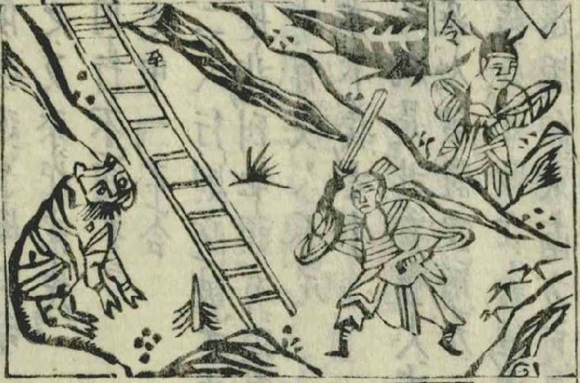
- 圖中：一人提刀斧，一虎坐，一旗卓在山上，一人取旗，梯子有至字。
- 卦圖象解：
	- 一、一人提刀斧：劉姓，武官，手有生殺之權。
	- 二、一虎坐：肖虎人，王姓，虎坐乃無威之象。
	- 三、一旗卓在山上：揭竿而起，正義之師。
	- 四、一人取旗：代替也，高姓，宋姓，其人取代之象。
	- 五、梯子有至字：無刀日至，桎梏受困象，
	- 六、（附註：峪：谷姓。旗揚：楊姓。)有谷、楊合乃招凶象。

### 人间道——未济

- 上一卦[《水火既济》](#《水火既济》（三世）坎上%20离下#人间道——既济)

> [!引申] 
物必不會終盡，故以未濟為易卦之終。既濟為物之終，易為變易而不盡，有生生之意，故未濟為其序。未濟為未窮盡也，此卦，上離下坎，火在水上，互不為用，為未濟之時義。

- 未濟：亨。小狐汔濟，濡其尾，无攸利。
	- 未濟之時，亦有亨通之道。假如小狐不知慎，逞其壯勇，渡河不知慎，其終必不能濟，故無所利矣。
- 《彖》曰：
	- 未濟亨，柔得中也。小狐汔濟，未出中也。
		- 未濟之時，能亨通，乃因其柔居中得其時，慎處之於未濟時，可以亨通也。如小狐之果敢於渡河，如不憂其尾濕，必不可脱險也。
	- 濡其尾，无攸利，不續終也。雖不當位，剛柔應也。
		- 其進雖勇，因尾濡而不能進，故不利往也。若能慎重處之，剛柔並濟則雖不當位，亦有可濟之理處。
- 《象》曰：火在水上，未濟，君子以愼辨物居方。
	- 火在水上，互不相交，此為未濟，君子觀象知，乃處不當之象，應慎處事物，辨其所當，各居其位，止於其所。
- 初六：濡其尾，吝。
	- 陰柔居下位，居未濟之時，求力進猶獸之渡河，必揭其尾，方可渡，此言人不度量其才而進，終必不濟，終招吝鄙也。
	- 《象》曰：濡其尾，亦不知極也。
		- 不度其才而力進，乃不知至極點也。
- 九二：曳其輪，貞吉。
	- 陽剛居將位，有欲動之象，今居未濟之時，有以剛凌柔水來勝火之象，故須知止，如曳車之輪使其止進，如此可吉。戒之在剛過，如此則犯上，其終必凶。
	- 《象》曰：九二貞吉，中以行正也。
		- 九二能吉，乃因其能得中道，行之正，不過剛，犯上，故也。
- 六三：未濟，征凶，利涉大川。
	- 居未濟之時，柔居相位，在下卦之上，有領導之象，但才不足濟，居險而無才足以出險，如此而行，其必招凶致。惟俟時至，俟上位之才相應，再涉險而出，乃可出險。
	- 《象》曰：未濟征凶，位不當也。
		- 陰柔無能之才居領導之相位，處未濟時，動必有凶，仍因其位不適。
- 九四：貞吉，悔亡，震用伐鬼方，三年有賞于大國。
	- 陽剛之賢才，居於君側，上為中虛明順之君，故能濟天下之艱困，能伐鬼方示其力之大，三年後乃有大功受國封賞。
	- 《象》曰：貞吉悔亡，志行也。
		- 賢相之才，能與時合，且貞固心志，必能吉而不慮悔亡也。
- 六五：貞吉，无悔，君子之光，有孚，吉。
	- 中虛而明之才居君之尊位，能虛其心任剛賢之相為輔佐，且信任之而不悔，此處之至善，即令己才不足，但亦由中心孚誠，終必大吉。
	- 《象》曰：君子之光，其暉吉也。
		- 君子之能如是，則其功之光必明且亮，其光盛而吉也。
- 上九：有孚于飲酒，无咎，濡其首，有孚失是。
	- 陽剛居極，在中虛卦之上，乃示其剛且明，能如此，則必不生燥，決之以明，明能洞察事理，剛能行事，然居未濟之時，因無可濟之理，故成樂天順命而已，可以無災。如過於禮法，濡其首，亂如是，其必不知反省，則示不安於所居也。
	- 《象》曰：飲酒濡首，亦不知節也。
		- 飲酒而至於弄濕其首，乃過樂也，必不能安於命，此不知命節制，必失其常理，人能安處劣勢，必能守其心志。此理之至然。

## 《山水蒙》（四世）艮上 坎下

~~~
  伏 神        【本 卦】
              ▆▆▆▆▆▆▆▆▆     父母丙寅木
              ▆▆▆   ▆▆▆     官鬼丙子水
妻财己酉金     ▆▆▆   ▆▆▆     子孙丙戌土   世
              ▆▆▆   ▆▆▆     兄弟戊午火
              ▆▆▆▆▆▆▆▆▆     子孙戊辰土
              ▆▆▆   ▆▆▆     父母戊寅木 应
~~~
人藏烟草之卦，万物始生之象。
判曰：蒙者，昧也。蒙以养正，山下有泉，回还反覆，迷闷相连。多忧过失，病患相缠，欲进欲追，疑惑不前。

### 卦象——此卦王莽篡漢社稷卜得知，乃知漢家必有中與之主。

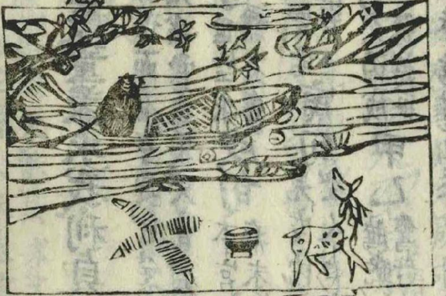
- 圖中：一鹿一堆錢，一合子，李樹一枝子折，二人江中撑船，珍寳填塞。
- 卦圖象解：
	- 一、滿船珍寳：暗示人圖財之象。
	- 二、船在水上：乃離國他去象。
	- 三、鹿在地上，示仍有小祿於內，鹿—祿也。
	- 四、兩串錢：乃憂心忡忡象，即意雖有祿，但仍令人憂心。
	- 五、圖中一碗：示此蒙蔽手段，必先成後破，因其乃不正之財，必不久遠也。
	- 六、李樹子折：示人李姓人氏，且有子夭折之象，則成格。
	- 蒙卦有示吾人去蒙之道。反觀之，如人以蒙蔽之法示人，勢必有所圖也。

### 人间道——蒙

- 上一卦[《水雷屯》](#《水雷屯》（二世）坎上%20震下#人间道——屯)——下一卦[《水天需》](#《水天需》（游魂）坎上%20乾下#人间道——需)

> [!引申] 
艮為山，為止，坎為水，為險。山下有險，遇險而止，莫知所之，蒙之象也。

- 蒙：亨，匪我求童蒙，童蒙求我。初筮告，再三瀆，瀆則不告，利貞。
	- 兒童之蒙，其未發蒙，而志則專一，此為童蒙，因有童蒙，則告之。因其童蒙，故必至誠一意以求必中。而發蒙之道，必以貞正方吉。
- 《彖》曰：
	- 蒙，山下有險，險而止，蒙。蒙亨，以亨行，時中也。“匪我求童蒙，童蒙求我”，志應也。
		- 此因剛賢之才居九二爻位，處於下位。六五之童蒙，處於君位。九二之賢臣，必以時中也。時之義，必待其至誠一心之童蒙求問，方以告之，乃中與。如賢能之人處下，而自求為進，主動告以君，則必無被信用之理。故如方法正確，非二求於王君位，實為五之志應於下二也。此為「時中」也。
	- 初筮告，以剛中也，再三瀆，漬則不告，瀆蒙也。
		- 此言，如誠一而來求決其蒙，當以剛中之道開發之，如煩數不能誠一，則乃瀆蒙，此時，不當告。因告之必不能信受，徒以煩瀆，無益矣。
	- 蒙以養正，聖功也。
		- 此申利貞之義，養蒙之法，必以正道，此時乃純一未發之童蒙時，故養正於蒙，乃學之至善也。現今人類皆「教而後禁」，故難以教勝，故時風日下。
- 《象》曰：山下出泉，蒙，君子以果行育德。
	- 此蒙之象也，如人蒙蔽，未知所適從狀。君子此時，必以果決其行，使通行無阻。如始生而方法不對，則以養育其明德為教法。
- 初六：發蒙，利用刑人，用説桎梏，以往吝。
	- 初六之爻屬最下位，此言，發下民之蒙，须明刑禁以示之，使之知懼，從而教之。是故為政之始，立法居先，治蒙之初，威以刑者，是以使民去其昏蒙之桎梏。不設法去其蒙之桎梏，即善教亦無法改變其蒙，故聖人使下民畏威以從，不敢任意其昏蒙之欲，然後才能漸知善道，此為移風易俗之唯一法門。但只有初爻之始可用之，如專用刑以為治，則蒙雖畏，終不能发。
	- 《象》曰：利用刑人，以正法也。
		- 此即用立法制刑，以教人之意，萬不可不教而誅。後世之論刑者，不復知教化孕其中，只一昧的論刑。
- 九二：包蒙吉，納婦吉，子克家。
	- 九二有剛明之才，與六五之君相對應，其志又一同，當其時，必廣其包容，老人婦孺之見，皆包容，則能啓天下之蒙，功大矣。今人專持其明，漫用自任，致凶之道。是故古之堯舜，其聖功天下莫及，尚能請教下民，取合理之言，天下之民歸之，就如兒子能治其家一樣。
	- 《象》曰：子克家，剛柔接也。
		- 兒子之能治家，其因父之信任專一也。是故九二能成啓蒙之功，乃由五之信任專一也。此剛柔相接之義也。
- 六三：勿用，取女見金夫，不有躬，无攸利。
	- 三爻之位陰居之，此時機正應上位不能遠從近見，九二為群蒙所蔽，居此之時，無所往則利矣。猶女之嫁夫，當由正禮，如見人多金，悦而相從，不可取也。
	- 《象》曰：勿用取女，行不順也。
		- 此女不可取，因行不順故也。
- 六四：困蒙，吝。
	- 因六四之陰爻，離剛賢最遠，無由來發其蒙，終困於昏蒙也，其永不足矣。
	- 《象》曰：困蒙之吝，獨遠實也。
		- 此義昏蒙之人，不能親賢以致困，終不得明矣。實，陽剛也。
- 六五：童蒙，吉。
	- 此示柔順之人居君位，下應於二，乃示柔中之德，任剛明之才，如此能治天下之蒙，吉也。為人君者，如至誠用賢，以成功惠於百姓，此功亦猶如己出一樣，何須顧忌手下，功高震主。
	- 《象》曰：童蒙之吉，順以巽也。
		- 從人之言，只要合理，都能接受，順也。降尊位下求，巽也。君能如此，天下治矣。
- 上九：擊蒙，不利爲寇，利禦寇。
	- 陽剛居蒙之極，爻之終，示吾人知，人之愚蒙至極，而為宼為亂者，當擊伐之，故戒不利為寇。
	- 《象》曰：利用禦寇，上下順也。
		- 禦寇之限度，上不過暴，下得撃去其蒙，則上下皆得順矣。

## 《风水涣》（五世）巽上 坎下

~~~
  伏 神        【本 卦】
              ▆▆▆▆▆▆▆▆▆     父母辛卯木
              ▆▆▆▆▆▆▆▆▆     兄弟辛巳火   世
妻财己酉金     ▆▆▆   ▆▆▆     子孙辛未土
官鬼己亥水     ▆▆▆   ▆▆▆     兄弟戊午火
              ▆▆▆▆▆▆▆▆▆     子孙戊辰土   应
              ▆▆▆   ▆▆▆     父母戊寅木
~~~
顺水行舟之卦，大风吹物之象。
判曰：涣者，散也。逐波随水，患难将消，恶事离身，狱讼出牢。利涉大川，舟楫遥遥，出入无滞，福德滔滔。

### 卦象——此卦漢武帝，卜得之，乃知李夫還魂也。

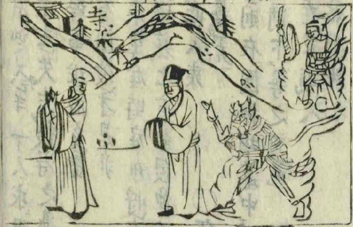
- 圖中：山上有寺，一僧，一人隨後，一鬼在後，金甲人。
- 卦圖象解：
	- 一、山上有寺：出家狀，對峙狀，寸土寸金象。
	- 二、僧：化外之人，光頭人，曾姓人。
	- 三、一人隨後：逃避，求助化外之人。
	- 四、一鬼在後：為禍追緝之象，內心有鬼，處事不明象。
	- 五、金甲人：正義之師，得民心也。
	- 六、寺，土頭人作對。等待時機也。

### 人间道——涣

- 上一卦[《兑为泽》](#《兑为泽》（纯卦）兑上%20兑下（六冲）#人间道——兑为泽)——下一卦[《水泽节》](#《水泽节》（一世）坎上%20兑下（六合）#人间道——节)

> [!引申] 
兌，悦也，人悦時，則必舒散，渙、散也，故渙為兌之序。人之性憂則結聚，悦則舒散。此卦上巽下水，乃風行水上，水遇風則渙散，故渙為散也。

- 渙：亨。王假有廟，利涉大川，利貞。
	- 渙，散也。人會離散，本於中心一念，心離則散矣。故能治散，必從中入手，有能收拾人心，散可聚矣，故散之道論如何用散，故可以亨。君王能知立宗廟收人心，則必可前進無阻，故須堅心到底。
- 《彖》曰：
	- 渙，亨。剛來而不窮，柔得位乎外而上同。
		- 渙之道所以可致亨，以卦來言，用陽剛之法，不可致極剛，以居下位，又得中道，柔位而得五君位之相應，故居渙時，能守其中，必不至於離散，所以能亨。
	- 王假有廟，王乃在中也。利涉大川，乘木有功也。
		- 君王能利用宗廟收拾人心，乃知用中道之妙，能如此可往天下，無處不阻也，自古以來，能得民者，必得其心，方可謂得民矣。
- 《象》曰：風行水上，渙。先王以享于帝立廟。
	- 風行水上，渙散之象。先王觀渙之象知，救天下之散，惟有祭祀宗廟，收合人心，合心之道，莫大於此。
- 初六：用拯馬壯，吉。
	- 初爻，為渙之始，陰柔居不正，又處卑下，故於始時即察知而拯，只須託於陽剛之人，即可整渙，故吉。
	- 《象》曰：初六之吉，順也。
		- 初六之能吉，乃因於渙始即察知，始而拯，此得時也故吉。
- 九二：渙奔其機，悔亡。
	- 外飾順，內實險憂，心已散。九二居坎險中位，乃意於渙散時，又居險中，其險可知，如能知機而奔往不猶豫，方可不慮亡也。
	- 《象》曰：渙本汁其機，得願也。
		- 渙之時居險，必以知機而親近之，乃可得願矣。
- 六三：渙其躬，无悔。
	- 六三相位，今才為陰質，不適居位，於渙散之時，必無法拯救他人，只能止於其身，可以無悔矣。
	- 《象》曰：渙其躬，志在外也。
		- 渙時，以躬順求上同。可免己之災。
- 六四：渙其群，元吉。渙有丘，匪夷所思。
	- 六四乃大臣之位，今有九五君來同應，有君臣合力，以濟天下之渙散，能如此則有大功。方渙散之時，用剛則必不能使之懷附，用柔又不足使其依歸，故如能使大聚，此事必難，用必非常法，能成此大功，非聖賢何能如是乎？
	- 《象》曰：渙其群，元吉，光大也。
		- 元吉謂大功德也，君臣合力於渙時，能群聚民眾，其功可光大也。
- 九五：渙汗其大號，渙王居，无咎。
	- 九五君位，居渙之時，以陽剛正德又得巽之外順，此深得處渙之道，必能號令人民，民心信服而從矣，如汗之於體外，息息相關，民與君之關係能如此，則必能居王位而無咎。
	- 《象》曰：王居无咎，正位也。
		- 君位尊，而其才德又適其位，稱王可無咎，因合於正位。
- 上九：渙其血，去逖（tì）出，无咎。
	- 渙至極時，仍能守巽順之道，即令有傷，亦仍可出險，遠離災害而無災矣。
	- 《象》曰：渙其血，遠害也。
		- 渙散至極，即令血出傷害。以堅守巽順之道，必遠離禍害也。

## 《天水讼》（游魂）乾上 坎下

~~~
  伏 神        【本 卦】
              ▆▆▆▆▆▆▆▆▆     子孙壬戌土
              ▆▆▆▆▆▆▆▆▆     妻财壬申金
              ▆▆▆▆▆▆▆▆▆     兄弟壬午火   世
官鬼己亥水     ▆▆▆   ▆▆▆     兄弟戊午火
              ▆▆▆▆▆▆▆▆▆     子孙戊辰土
              ▆▆▆   ▆▆▆     父母戊寅木   应
~~~
纵鹰逐兔之卦，天水相违之象。
判曰：讼者，论也。天道西往，水脉东流。求事未遂，心常怀忧。争讼宜止，可用和休。

### 卦象——此卦漢高祖斬丁公，疑惑，卜得之後，果遭戮也。

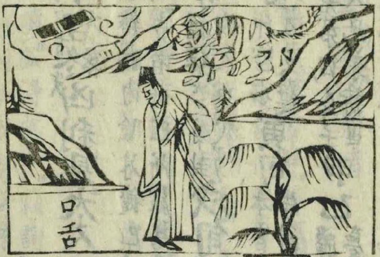
- 圖中：口舌二字，山下有睡虎，文書在雲中，人立虎下，望口舌，柳樹在旁。
- 卦圖象解
	- 一、口舌二字：官司，糾紛，災也。
	- 二、山下有睡虎：入危地而不知象。
	- 三、虎：王姓，肖虎之人。
	- 四、文書在雲中：心想事不成，幻想也。
	- 五、人立虎下：近險也，近險為脱險之道。
	- 六、柳樹：隨風而動，雖大風而不斷，此柳之性也。〔韓信之辱，即柳性〕

### 人间道——讼

- 上一卦[《水天需》](#《水天需》（游魂）坎上%20乾下#人间道——需)——下一卦[《地水师》](#《地水师》（归魂）坤上%20坎下#人间道——师)

> [!引申] 
人之所需飲食也，因有所須，爭訟之所由起。天陽上行，水性就下，其行相違，所以成訟也。卦義：外健內險之象，必有訟。​ 

- 訟：
	- 有孚，窒惕，中吉，終凶。
		- 訟之道，必中實，如中無有實，乃誣妄，凶之道也。訟，乃與人爭辩，而待決於他人，雖有孚，仍會窒塞。故有得中實則吉，但終極其事則凶也。
	- 利見大人，不利涉大川。
		- 因訟者求辩曲直，故利見大人，如大人能以剛明中正決其訟，吉。因訟非吉事，須擇安地而居，不可陷於險難，故不利涉大川也。
- 《彖》曰：
	- 訟，上剛下險，險而健，訟。
		- 此內險外健，訟之所起。若健而不險，不生訟也。險而不健，不能訟也。猶如一人，只重外飾，內無真實材料，此為訟之源也。
	- 訟，有孚，窒惕，中吉，剛來而得中也。
		- 訟之，有中實剛健，但處訟之時，雖有中實，仍有阻礙而須惕懼，則吉。
	- 終凶，訟不可成也。
		- 因訟本非善事，乃不得已也，終極其事，則凶矣。
	- 利見大人，尚中正也。不利涉大川，入于淵也。
		- 如見中正之大人，吉。與人訟必先居於平安之地，任意行險，則身陷。
- 《象》曰：天與水違行，訟，君子以作事謀始。
	- 此因天上水下，二卦體相違，訟之由也。君子觀象，知人有爭訟之道，故行事必「慎始」，絶訟端於事之始，則訟不生矣。
- 初六：不永所事，小有言，終吉。
	- 此陰柔居下位，必不可終極其訟也。若不終極其訟，雖小有言傷，而終得吉。
	- 《象》曰：不永所事，訟不可長也。雖小有言，其辯明也。
		- 此即於訟之初，即戒訟，因柔弱而居下，不可長久。因既訟，必有小災，應辩理之明，終得其吉。
- 九二：不克訟，歸而逋，其邑人三百户，无眚（shěng）。
	- 二爻與五爻為相應之地，九二乃將位，以剛處險，與五之君位為敵，知不可敵，歸而避之，儉樸自處，則無過矣。三百户，乃邑之至小者，如處強大，此競也，則必過也。
	- 《象》曰：不克訟，歸逋竄（cuàn）也。自下訟上，患至掇（duō）也。
		- 因義不敵，故不能訟，須避去其所。自下訟上，義不正，且氣勢不足，此招禍患之至易也。
- 六三：食舊（jiù）德，貞厲終吉。或從王事，无成。
	- 陰爻居三陽剛位，乃陰柔居二剛之間，须知雖處危地，能知危懼，終必獲吉。守原之本分而無所求，則不生訟矣。或從上而成，因從王事，故不在己也。訟乃剛健之事，故始則不永，三則從之，皆可使善也。
	- 《象》曰：食舊德，從上吉也。
		- 守其本分，順從上之所為，非由己意，終也吉。
- 九四：不克訟，復即命，渝安貞，吉。
	- 此陽剛居乾下，因不得中正，本必訟。故四爻剛位陽居之，雖剛健欲訟，而無與對敵，則訟無由而興。此即若能克制剛忿欲訟之心，就於命，革其心，平其氣，而變為安貞，吉矣。孟子云：「方命虐民，夫剛健而不中正，則躁動，故不安，處非中正，故不貞，不安貞，所以好訟也。」方，不順也。
	- 《象》曰：復即命，渝安貞，不失也。
		- 能如上，則無失，吉也。
- 九五：訟，元吉。
	- 九五居尊位，治訟得中正，則大吉而盡善。
	- 《象》曰：訟元吉，以中正也。
		- 此云中正之道，施必吉也。
- 上九：或錫（xī 緆）之鞶（pán）帶，終朝三褫（chǐ）之。
	- 剛健之極，處訟之終極，人因其剛強，窮極於訟，取禍喪身，即使善訟能勝，即賞，亦來自與人仇爭所得，其能保乎。終一日而見三次褫奪也。
	- 《象》曰：以訟受服，亦不足敬也。
		- 窮極訟事，即有受命之寵，亦不足以敬，而可賤惡，禍患隨至也。

## 《天火同人》（归魂）乾上 离下

~~~
 【本卦】
▆▆▆▆▆▆▆▆▆     子孙壬戌土   应
▆▆▆▆▆▆▆▆▆     妻财壬申金
▆▆▆▆▆▆▆▆▆     兄弟壬午火
▆▆▆▆▆▆▆▆▆     官鬼己亥水   世
▆▆▆   ▆▆▆     子孙己丑土
▆▆▆▆▆▆▆▆▆     父母己卯木
~~~
游鱼从水之卦，管鲍分金之象。
判曰：同人者，亲也。同心之言，其臭如兰。二人同心，其利断金。所求皆得，无不称心。

### 卦象——此卦劉文龍在外求官，卜得之，果衣錦還鄉。

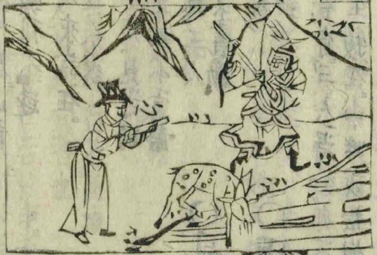
- 圖中：人捧文書上有心字，人張弓，射山上，一鹿飲水，一溪。
- 卦圖象解：
	- 一、人捧文書上有心字：得民心之象，同心協力之象。寧姓。
	- 二、人張弓射山上：高中金榜。張姓人氏。
	- 三、一鹿飲水：财祿滾滾而來。亦在野之賢人。
	- 四、一溪：平和安靜狀。
	- 五、鹿之性，動則敏，靜則順，此剛健人之性，世間但聞虎食人，未聞鹿食人。

### 人间道——同人

- 上一卦[《天地否》](#《天地否》（三合）乾上%20坤下（%20六合）#人间道——否)——下一卦[《火天大有》](#《火天大有》（归魂）离上%20乾下#人间道——大有)

> [!引申] 
天地不交則否，上下相同則同。遇否之世，必與人同力方能渡過。故次否也。以象言，天之性在上，火之性炎上與天同，故為同人。以卦體言，五為君位乾主，二為離位，陰柔居二爻。上下相同之義，天性剛健，火性明耀，即外健內明之象，吾人外剛健，內明道，則成天火同人，此為大同之道。

- 同人：于野，亨。利涉大川，利君子貞。
	- 野即遠與外之意，以天下大同之道，聖賢大公之心，使之無遠不同。常人之同，以私意所合，此暱親之情。故必于野，方可謂大同。天下皆同時，何險阻能阻礙？何艱困能致危？故利涉大川，君子須堅心於此。小人唯用私意，所親比者亦為小人，朋黨（dǎng）之始，其心不正也。
- 《彖》曰：
	- 同人，柔得位，得中而應乎乾，曰同人。
		- 二爻以陰居陰位，此為正位，得中正之德，應乎乾上，五為君位，以剛健中正，二以柔順對應，上下同心同德，故曰：同人。
	- 同人于野，亨，利涉大川，乾行也。
		- 乾之行，必至誠無私，故可以涉險難，而吉。無私，天德也。
	- 文明以健，中正而應，君子正也。唯君子爲能通天下之志。
		- 下體為有文明之德，上卦為剛健之性，此君子之正道。天下之志萬殊且異，但理則一也。君子因明理，故能通天下之志。聖人視億萬人之心為一心，因只一理而已。文明能使人更明理，故能明大同之真義，剛健必能克已，則必能致大同之道。
- 《象》曰：天與火，同人，君子以類族辨物。
	- 天在上，火之性炎上，此為同人，君子觀同人之象，以分類群族各以其性同來區分，如君子小人，善惡是非，物之外形固異，但事理皆同，君子能辨明。
- 初九：同人于門，无咎。
	- 初進為剛健，此因無所偏私，出門在外因無私，而無咎也。
	- 《象》曰：出門同人，又誰咎也。
		- 出門在外，因同人之道而無私，同此道之人又廣，無厚此薄彼之異，則無人歸咎也。、
- 六二：同人于宗，吝！
	- 宗為宗黨也，同於所派系，此有所偏，故可吝。故只用宗黨之人則有偏私，此為鄙吝之人。
	- 《象》曰：同人于宗，吝道也。
		- 同人之道用於宗親，乃有所私，因私比，非人君之道，故此為吝道。今人皆如是，莫若太宗之用人。
- 九三：伏戎于莽，升其高陵，三歲不興。
	- 二以中正之道與君五位相同志，三以剛暴之人居二五之間，欲奪，然理不直，義不勝，不敢發動，故只能藏兵戎於莽林間，時升高陵顧望，至三年之久，仍無機可乘，此小人之情狀。
	- 《象》曰：伏戎于莽，敵剛也；三歲不興，安行也。
		- 因三爻乃剛暴之人，其五君位為剛且正，故畏忌而不敢與，即三年亦不與。
- 九四：乘其墉，弗克攻，吉。
	- 九四乃陰位，陽剛居之，故以剛居柔位，其近君位，知義不直而能復返正道，亦吉也。三以剛居剛，故終其強而不可能反。此示人畏義能改則終吉。
	- 《象》曰：乘其墉，義弗克也；其吉，則困而反則也。
		- 因同人乃一陰，而眾陽所同欲也。今獨三四爻有爭奪之意，乃邪不勝義，其困窮乃因反於法則，故吉。
- 九五：同人，先號咷而後笑，大師克相遇。
	- 人君當與天下大同，如獨私一人，則非君道也。其同志為二爻，間隔有三四之剛，故未遇之前憤怒而號咷，即遇則大笑，故二人同心，其利斷金，中誠所同，無所不同，天下莫能離間，則無所不入，故聖人赞之曰：『同心之言，其臭如蘭』。
	- 《象》曰：同人之先，以中直也；大師相遇，言相克也。
		- 同人之先以中誠理直，故同心之力大，雖敵剛強，如大師相遇，由其義直理勝，終能克之也。
- 上九：同人于郊，无悔。
	- 求大同之道，必相親相與，即在外又遠之地不同，但亦永無悔矣。
	- 《象》曰：同人于郊，志未得也。
		- 此申明同人之道，在外及遠之地求同之志不成，即無悔，但非最善之道。

# 震宫八卦——属木

## 《震为雷》（纯卦）震上 震下（六冲）

~~~
 【本卦】
▆▆▆   ▆▆▆     妻财庚戌土   世
▆▆▆   ▆▆▆     官鬼庚申金
▆▆▆▆▆▆▆▆▆     子孙庚午火
▆▆▆   ▆▆▆     妻财庚辰土   应
▆▆▆   ▆▆▆     兄弟庚寅木
▆▆▆▆▆▆▆▆▆     父母庚子水
~~~
震惊百里之卦，有声无形之象。
判曰：震者，动也。重雷发响，百里飞声，无事之者，愕然而惊。求谋和遂，官爵难成。空闻其响，不见其形。

### 卦象——此卦是李靜天師遇龍母借宿，替龍行雨，卜得之，官至僕射。

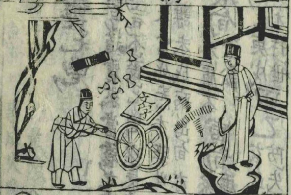
- 圖中：人在岩上立，一樹開花，一文書，一人推車上有文字，一堆錢財者。
- 卦圖象解：
	- 一、人立岩上：特立獨行，摇摇欲墜也。危險也。
	- 二、一樹開花：有果也，惜乎過於短暫，少部份之人。
	- 三、一文書：消息至，公文至。
	- 四、一人推車：轉變之象，執行命令象。
	- 五、上有文字：得官令也。
	- 六、一堆錢財者：錢財散於地狀，憂心也，喪事也，求財不利，占疾病凶。

### 人间道——震为雷

- 上一卦[《火风鼎》](#《火风鼎》（二世）离上%20巽下#人间道——鼎)——下一卦[《艮为山》](#《艮为山》（纯卦）艮上%20艮下（六冲）#人间道——艮为山)

> [!引申] 
鼎，器也，能主器者，必賴長子，震為長男，取其主器之義，故次鼎為震也，此卦二震相重，有奮發震驚之象，二雷相繼，重雷也。長子繼位為君也。

- 震：亨。震來虩虩（xì），笑言啞啞。震驚百里，不喪匕鬯（chàng）。
	- 震之道，能奮發，動而進，知懼而進修，皆足以亨。當震動之來，恐懼不寧不安狀，知所戒懼，則可保安，故笑言和適貌。震聲遠及百里，人無不懼而喪失，唯執宗廟祭祀之器者，不喪失不懼也。人間之至誠，莫如於祭祀時之堅心守正。
- 《彖》曰：
	- 震亨，震來虩虩，恐致福也。笑言啞啞，後有則也。
		- 震來時能知恐懼，則無患而能亨矣。此因能有戒懼反為福也，必恐而知自修，不敢違於常理法規，因震而生法度，必能致福安，故可笑言無憂。
	- 震驚百里，驚遠而懼邇（ěr）也。出可以守宗廟社稷，以爲祭主也。
		- 雷之嚮震百里，遠受驚而近受懼，人能知戒懼不妄為，則出可以長守宗廟社稷，能如是，則必可守承國家。
- 《象》曰：洊（jiàn）雷，震。君子以恐懼修省。
	- 洊為重意，上下同卦故為洊雷，形容威震之大也，君子觀之乃知恐懼自修，畏天威省思己過而改之，唯君子能如是。
- 初九：震來虩虩（xì），後笑言啞啞，吉。
	- 初九：居震之始，知震之來，能於始即知戒懼恐慎，不敢掉以輕心，終必安吉。
	- 《象》曰：震來虩虩，恐致福也，笑言啞啞，後有則也。
		- 雷震之來知懼進修，此因知恐而終有福吉。不違於常法，則可保平安也。
- 六二：震來厲，億喪貝，躋于九陵，勿逐，七日得。
	- 六二乃柔居正位，善處震時之道也，雷震乃剛動而上，無人能禦其威猛，度量知其必喪全數之資，故能遠避以自守其中正，以不追隨而得，雖不能立，即防禦，但時過後，必可得。
	- 《象》曰：震來厲，乘剛也。
		- 震之至剛而來，如欲駕乘，乃自招危厄。
- 六三：震蘇蘇，震行无眚。
	- 三位為陽位，陰居之，乃不正位也。不正位之人於平日，尚且不安，更何況處於震時居此如能知己力之不足而求去，亦可無咎。
	- 《象》曰：震蘇蘇，位不當也。
		- 處不當位，即震來而不知戒，不知恐懼也。
- 九四：震遂泥。
	- 以剛居柔，不適位而失去剛健之道，無法震奮也，如泥之滯也。
	- 《象》曰：震遂泥，未光也。
		- 震之動必以剛為本，今動如滯泥，已失剛道，震之義，必無法光大也。
- 六五：震往來厲，億无喪有事。
	- 君位之人居震動之時，必不失中道，即令危亦不為凶矣。中道勝於正道，有中道之人必不違於正道，正道卻不必一定為中道。此其差異所在也。
	- 《象》曰：震往來厲，危行也，其事在中，大无喪也。
		- 震之動不以中，往来皆有危，其危之生，乃因失中之道，居此時，以無喪失為至善。
- 上六：震索索，視矍矍（jué），征凶。震不于其躬，于其鄰，无咎，婚媾有言。
	- 陰柔之人居震之極，驚懼至甚，無志抖索狀，其視瞻亦不能安定而明，其於此時，若動，必招凶。乃不明而動之戒。震之戒在不及身而及於鄰時己生戒心，則終無咎，如婚事之初有爭言，則己生戒心，莫俟及於身，已不及矣。
	- 《象》曰：震索索，中未得也。虽凶无咎，畏邻戒也。
		- 因上六爻其位不正，故震之動而不前。震之戒在近邻所受震动时而预先戒备，虽有凶险却不致受害，故而防患于未然。今君子持中正谨慎之道，在他人之惧预先戒备，亦将无咎。

## 《雷地豫》（一世）震上 坤下（六合）

~~~
  伏 神        【本 卦】
              ▆▆▆   ▆▆▆     妻财庚戌土
              ▆▆▆   ▆▆▆     官鬼庚申金
              ▆▆▆▆▆▆▆▆▆     子孙庚午火   应
              ▆▆▆   ▆▆▆     兄弟乙卯木
              ▆▆▆   ▆▆▆     子孙乙巳火
父母庚子水     ▆▆▆   ▆▆▆     妻财乙未土   世
~~~
鸾凤生雏之卦，万物发荣之象。
判曰：豫者，悦也。雷出于地，开鼓翼，天地顺动。日时不忒。先王制礼，殷荐崇德。凡事无疑，上下悦怿。

### 卦象——此卦諸葛孔明討南蠻，卜得之，便知必勝。

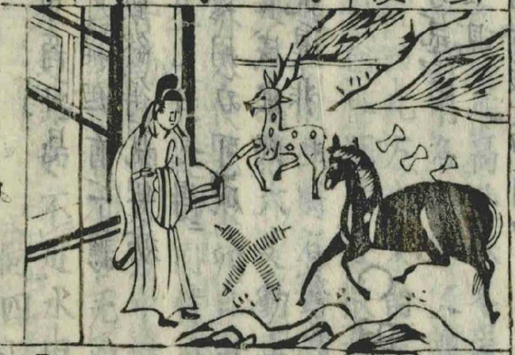
- 圖中：兩重山，一官人，一祿一馬，金銀數錠，錢一堆者。
- 卦圖象解：
	- 一、兩重山：出象，千里阻隔也。
	- 二、官人在中：外出不任官象；丈夫外出從商。
	- 三、一祿一馬：從商之人，財祿豐盛。
	- 四、金銀數錠：紙錢錠，主喪服。
	- 五、錢一堆者：內有憂心忡忡象。
	- 全卦：此卦內有憂，外有阻，乃順勢而動，祿馬來會，可去官從商矣。

### 人间道——豫

- 上一卦[《地山谦》](#《地山谦》（五世）坤上%20艮下#人间道——谦)——下一卦[《泽雷随》](#《泽雷随》（归魂）兑上%20震下#人间道——随)

> [!引申] 
人有大量而又能謙，必豫，豫者悦也，豫卦承大有及謙之序也。上動而下又順，以象言，陽之始，潛伏地下，及出於地，乃因動，即為雷，故雷出地上，有通暢和順象。

- 豫：利建侯，行師。
	- 聖人體豫悦之道，知兵師之興，諸侯之封，必眾心和悦方成，故能君臨萬邦，能群聚大眾，唯和悦可也，此豫之時也。
- 《彖》曰：
	- 豫，剛應而志行，順以動，豫。
		- 動之順理，眾順而回應，其志乃行，故豫乃動而眾順。
	- 豫順以動，故天地如之，而況建侯行師乎。
		- 順理而動，天地之道亦如是，更何況立建諸侯，興兵之師。
	- 天地以順動，故日月不爲過，而四時不忒；聖人以順動，則刑罰清，而民服。
		- 天地之順而動，吾人可視四季之行，日月運轉永不為過，聖人稟此，而知因正而民相爭於行善，刑清罰簡，萬民皆服。
	- 豫之時義大矣哉。
		- 聖人知豫而體用豫之道，故於時機之掌握大矣，此卦之下有十一卦，豫、遯、姤、旅，皆言時之義。坎、睽、蹇，皆言時之用。頤、大過、解、革，皆言時之大也。
- 《象》曰：雷出地奮，豫。先王以作樂崇德，殷薦之上帝，以配祖考。
	- 雷動出於地而奮震，悦之象也。先王作聲樂以褒揚功德，歸之上帝、祖先，此言，豫之道，能知，能體，則盛而至大也。
- 初六：鳴豫，凶。
	- 初六乃下位，陰柔處之，是意不中正之小人，處豫時，為上所寵，志得意滿，乃至於發聲，小人之輕淺如是，必至凶也。
	- 《象》曰：初六鳴豫，志窮凶也。
		- 初六處下而驕鳴，雖外飾喜悦，實乃窮極而凶。
- 六二：介于石，不終日，貞吉。
	- 豫悦之道，易流放縱，過則失正道，乃不合於時。此六二本陰位，今陰爻居位，乃處中正，為自守之象，君子處豫之時，獨其能以中正自守，示出其節介如石之堅也，故吉。能見事於幾微者，謂之神妙。君子之人上交不諂，下交不瀆，因能知微，吉凶之始，可先見於此也。守堅如石，則能不惑而明。
	- 《象》曰：不終日貞吉，以中正也。
		- 人能中正，且守堅，故能辨之於早，此君子處豫之道。
- 六三：盱豫，悔。遲有悔。
	- 六三乃以陰而居陽位，為不中不正之人居相位也。如此動則有悔，盱為上視也，其動竟上視君側之人，故不中不正，悔之始也。是故君子明處身不正，進退皆有悔矣。處已之道，在正本身而已，以禮制心，即處豫卻不失中正，則無悔矣。
	- 《象》曰：盱豫有悔，位不當也。
		- 因自處不當，失卻中正，造成進退有悔，處不當位也。
- 九四：由豫，大有得，勿疑，朋盍（hé）簪。
	- 九四乃君側之位，動則眾陰悦順，此豫之義。豫悦之由，以陽剛而任此位，大行其志，而天下皆悦。人能盡誠則無疑，上下因至誠而信，合而聚之，簪，乃聚髪之物。
	- 《象》曰：由豫，大有得，志大行也。
		- 志得大行於天下，乃皆由聚所悦也。
- 六五：貞疾，恆不死。
	- 六五為君位，當豫悦之時，陰柔有沉溺之象，故乃柔弱不能自立且耽於酒色之豫道，受制於專權之臣，因受制於下，故有疾苦，古今人君致危之道很多，但以縱情於樂居多，豈有不死乎？
	- 《象》曰：六五貞疾，乘剛也；恆不死，中未亡也。
		- 君位有疾，乃因側位專權之人壓制也，如能不死，乃因側位之剛為中正，方不致於亡。
- 上六：冥豫，成有渝，无咎。
	- 豫之極，而以陰柔居之，乃聖人示意，凡人之失，苟能自變，則亦可以无咎，此乃為君子。如昏迷不知反省，必招凶。
	- 《象》曰：冥豫在上，何可長也。
		- 昏冥於豫悦，乃至於終極，災難至矣，不可長久，君子當速變。

## 《雷水解》（二世）震上 坎下

~~~
  伏 神        【本 卦】
              ▆▆▆   ▆▆▆     妻财庚戌土
              ▆▆▆   ▆▆▆     官鬼庚申金   应
              ▆▆▆▆▆▆▆▆▆     子孙庚午火
              ▆▆▆   ▆▆▆     子孙戊午火
              ▆▆▆▆▆▆▆▆▆     妻财戊辰土   世
父母庚子水     ▆▆▆   ▆▆▆     兄弟戊寅木
~~~
春雷行雨之卦，忧散喜生之象。
判曰：解者，散也。出于险难，恶事消散，狱讼可释，共相歌赞。婚不和谐，人如隔面。久患在床，今当冰泮。

### 卦象——此卦項羽受困垓下，卜得之，後果士卒潰散也。

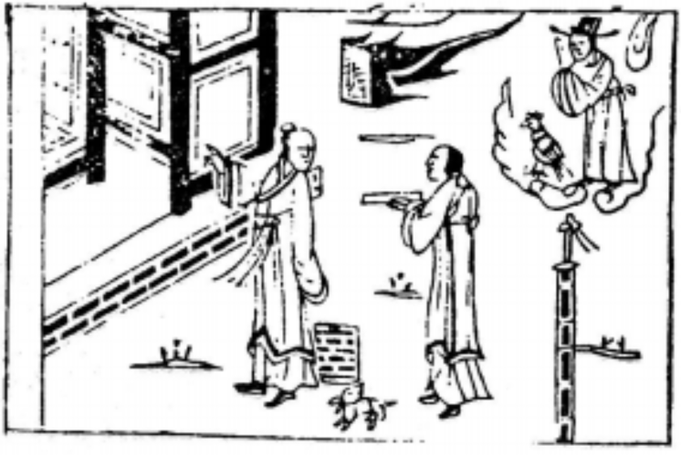
- 圖中：旗上提字，一刀插地，一兔走，貴人雲中，一雞在邊鳴，道士手指門，道人獻書，小堠在側。
- 卦圖象解：
	- 一、旗上提字：指名提凶，不利。有遠走他鄉之象。
	- 二、一刀插地：求快也，劉姓之人也。
	- 三、一兔走：卯年，劉姓。
	- 四、一雞在邊鳴：有競爭象，酉年適逢貴人救。
	- 五、貴人雲中：不及救也。
	- 六、道士手指門：入空門也，逃亡方向，出家也。
	- 七、道人獻書：裝飾外表，示誠象。

### 人间道——解

- 上一卦[《水山蹇》](#《水山蹇》（四世）坎上%20艮下#人间道——蹇)——下一卦[《山泽损》](#《山泽损》（三世）艮上%20兑下#人间道——损)

> [!引申] 
解者散也，萬物無終難之理，難至極而散，故解為蹇之序。此卦震上坎下，外動內險，即動於險外，有出險之象，故為患難解散之時也。

- 解：利西南，無所往，其來復吉，有攸往，夙吉。
	- 西南即坤方，坤之体本含弘光大，於天下之難方解時，人始離困苦，當以宽大簡易之法待之，切不可使煩於苛政，人心必安，再求重修冶道，立綱紀，建法治，且宜早動，如俟（sì）難復則不及矣。
- 《象》曰：
	- 解，險以動，動而免乎險，解。
		- 險則示難也，不險必不難，遇解時，如不動必不能出險，故此動是免於招險也。
	- 解利西南，往得眾也。
		- 此即解難之道，须廣大且平易之法以待民，則民心必歸。
	- 其來復吉，乃得中也。
		- 治世之道，必待解之時來臨方可往用，此為得宜。
	- 有攸往夙吉，往有功也。
		- 欲動而往，則必利速，愈早前往，功愈大，遲則害已生矣。
	- 天地解而雷雨作，雷雨作而百果草木皆甲坼（chè），解之時大矣哉！
		- 天地之氣開而和暢生雷雨，雷雨生而萬物甲坼，故解能成天地之功，故聖人知解之時，大也。讀易須体時之義，方成得易之道。易之道與天地合而同德。
- 《象》曰：雷雨作，解；君子以赦過宥罪。
	- 天地解散而生雷雨，君子觀雷雨之象，体會發育之功，而知施恩仁，行宽法也。
- 初六：无咎。
	- 初解之時，柔居陽剛，乃柔而能剛象，知剛柔之合宜，使患難解散。
	- 《象》曰：剛柔之際，義无咎也。
		- 剛柔相接又得其時宜，必無災也。
- 九二：田獲三狐，得黃矢，貞吉。
	- 二與五陰位相應，此言陰柔之君在上，陽剛之臣在之時也，古來如君柔則小人易蔽，威必受損，又不果斷且易受小人之惑，小人一近則心動矣，處此時又逢災難初解，聖人必以能去小人來正君之心，行其剛中之道，方可吉，狐為邪媚之獸，黄乃直中也。
	- 《象》曰：九二貞吉，得中道也。
		- 能得中正之道，除去邪惡乃正且吉也。
- 六三：負且乘，致寇至，貞吝。
	- 小人本非在上之物，今居下之上位，猶負重而乘車，乃招寇至，終必悔矣。
	- 《象》曰：負且乘，亦可醜也。自我致戎，又誰咎也。
		- 負重乘車，招寇致其之醜乃咎由自取，又可怪誰呢。小人不量力勉居君子之位處上，必終自招盜而奪之，自取其辱也。
- 九四：解而姆，朋至斯孚。
	- 陽剛之人居陰柔君之側時，如居上位親近小人，必使賢士遠矣，須斥去小人則君子必進，能得人之信孚。
	- 《象》曰：解而姆，未當位也。
		- 如與君子至誠以交，則必無擋，故小人如能介乎中，則示人其交必不誠至也。
- 六五：君子維有解，吉，有孚于小人。
	- 君主之人必去小人，則君子必進，正道乃行，如不去小人，則天下不治，此可反看，即天下不治，乃小人不去也。
	- 《象》曰：君子有解，小人退也。
		- 君子能解退小人，則君子之道方行，故能行君子之道，乃因能去小人也。
- 上六：公用射隼于高墉之上，獲之无不利。
	- 解之至極如仍未解，必有堅強之害也，故於此時可強用弓矢如射鷹隼於高處，時至而發，如無良器又動不以時，射未成，必反生害，故此言器之重要與動之時機，獲之必吉，不成反招凶。
	- 《象》曰：公用射隼以解悖也
		- 至解之終仍未解，必害之大且堅，故須強硬如射隼以解悖亂，天下可治也。

## 《雷风恒》（三世）震上 巽下

~~~
  伏 神        【本 卦】
              ▆▆▆   ▆▆▆     妻财庚戌土   应
              ▆▆▆   ▆▆▆     官鬼庚申金
              ▆▆▆▆▆▆▆▆▆     子孙庚午火
              ▆▆▆▆▆▆▆▆▆     官鬼辛酉金   世
兄弟庚寅木     ▆▆▆▆▆▆▆▆▆     父母辛亥水
              ▆▆▆   ▆▆▆     妻财辛丑土
~~~
日月长明之卦，四时不忒之象。
判曰：恒者，久也。长久安静，不动为良，四时变化，天道无常。日月运转，普照其光。君子以立，不易其方。

### 卦象——此卦宋王奪韓朋妻，卜，得之也。

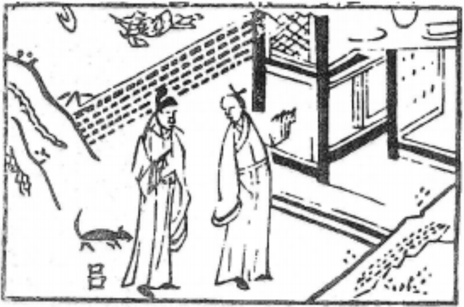
- 圖中：日在雲，鳳啣書，官人行路，道士手指門，鼠下兩口，牆擋路。
- 卦圖象解：
	- 一、日在雲中：昏暗之象，君主不明象。
	- 二、鳳啣書：喜訊至，金榜题名也。
	- 三、官人行路：將至也，貴人至。官人，倌人，丈夫也，人傍為倌也。
	- 四、道士手指鬥：入空門也，閃也。
	- 五、鼠下兩口：陰謀在後之象；兩口，回也，呂姓也。
	- 六、時機：在春末，日為春之末尾也。
	- 此即持之以恆，則有撥雲見日之喜也。

### 人间道——恒

- 上一卦[《泽山咸》](#《泽山咸》（三世）兑上%20艮下#人间道——咸)——下一卦[《天山遁》](#《天山遁》（二世）乾上%20艮下#人间道——遁)

> [!引申] 
恆，乃論夫妻之道，終身不變者，前『咸』為少女少男之感，今『恆』乃長男長女之往，男尊在上，女卑在下，此夫婦居室之道，男動於外，女順於內，此人倫之常，此恆久之道。

- 恆：亨，无咎，利貞，利有攸往。
	- 恆為常久之道，人能恆之於善，此道可恆，君子之道。小人之道，乃恆於惡，已失可恆之道，故恆之道能常久，乃因所恆為正，恆不正，招凶也。
- 《彖》曰：
	- 恆，久也。剛上而柔下，雷風相與，巽而動，剛柔皆應，恆。
		- 恆久之道，在於上剛下柔，君剛臣柔，夫剛婦柔，雷震風興，風中有雷，相互交應，助長其勢，天地之間能恆久不已，乃因能知順動而已。
		- 恆，亨，无咎，利貞，久於其道也。
		- 恆之道，可以令亨通，且無災，但須注意所恆為正，吉也，所恆不正，則反招辱。
	- 天地之道，恆久而不已也。
		- 人如能恆持可恆之道，則合於天地之理。必可長久。
	- 利有攸往，終則有始也。
		- 萬物之動，必有始終，今動而能恆，其間變化必多，能知隨時變易其外，神在內不變，此得易之神也。
	- 日月得天而能久照，四時變化而能久成，聖人久於其道而天下化成，觀其所恆，而天地萬物之情可見矣。
		- 日月得天之道，能久照不已，四時往来生成萬物，也因得天，故常久不已，聖人用恆之道，行之不已，能化成天下，成其美俗。觀天地之恆常，得天下常久之理，此聖人之道所以能常久也。常人孰能知。
- 《象》曰：雷風，恆；君子以立不易方。
	- 人才君子觀恆之象，以恆久之德性，持立於中道，永不易其立足之道。
- 初六：浚恆，貞凶，无攸利。
	- 初六以柔暗之人初進，只知守常卻不度勢而為，但求上之眷顧，又堅守此向，致凶之道也。因其心志在求上眷顧，必不能安居其位，故凶也。
	- 《象》曰：浚恆之凶，始求深也。
		- 但求上之眷顧，不知度勢而行，安居其位，失恆之道於始也。
- 九二：悔亡。
	- 恆能居其正位，常道也。今陽居陰位，處非其位，雖中正之才，不知輕重之勢，造成有悔。人能知所輕重，易之義即此。
	- 《象》曰：九二悔亡，能久中也。
		- 人能知恆久於中道，知所輕重，必可常久。
- 九三：不恆其德，或承之羞，貞吝。
	- 得位乃可久，但於須持久時不知持之以恆，朝令夕改，人無所適從，反招羞辱矣。
	- 《象》曰：不恆其德，无所容也。
		- 不知恆之道的人，終至無處容身也。
- 九四：田无禽。
	- 田獵又無獲禽，徙勞無功也，九四陰位而陽居之，處非其所，恆又何益？人之動必有道，持之以恆則有功，不得道，即久亦無功也。
	- 《象》曰：久非其位，安得禽也。
		- 處不適位，雖久何益，猶徙獵而無功。
- 六五：恆其德，貞，婦人吉，夫子凶。
	- 柔居剛位，又得九二之陽剛助應，此即居中正又有應乎中正，恆此以久，吉之道。婦人之道以順從為恆，此順從於婦人則吉，丈夫為剛陽，如以順從之道持恆，反致凶也。更何沉人君之道，君道切不以柔順為恆也。
	- 《象》曰：婦人貞吉，從一而終也，夫子制義，從婦凶也。
		- 柔而順從於婦人則吉，乃從一而終也，君王之義，從婦人之順從，招凶。
- 上六：振恆，凶。
	- 此恆之極位，乃振恆，即守之不常也，居上而動無節宜，再以此為恆，凶至也。故吾人動之必以正理，不逾矩，動如失正，又不及復，反持恆下去，果致凶矣。
	- 《象》曰：振恆在上，大无功也。
		- 居上之道，躁動不安，必無所成，此言持恆，知恆，用恆之重要性，人不知此即，令再大之勞亦無功也。

## 《地风升》（四世）坤上 巽下

~~~
  伏 神        【本 卦】
              ▆▆▆   ▆▆▆     官鬼癸酉金
              ▆▆▆   ▆▆▆     父母癸亥水
子孙庚午火     ▆▆▆   ▆▆▆     妻财癸丑土   世
              ▆▆▆▆▆▆▆▆▆     官鬼辛酉金
兄弟庚寅木     ▆▆▆▆▆▆▆▆▆     父母辛亥水
              ▆▆▆   ▆▆▆     妻财辛丑土   应
~~~
灵鸟翱翔之卦，显达光明之象。
判曰：升者，进也。木生于土，萌芽渐长，积小成大，升进而上，宜见王公，褒嘉欢赏。出暗向明，亨通之象。

### 卦象——此卦房玄齡去蓬萊採葯未回，卜得知，主不在也。

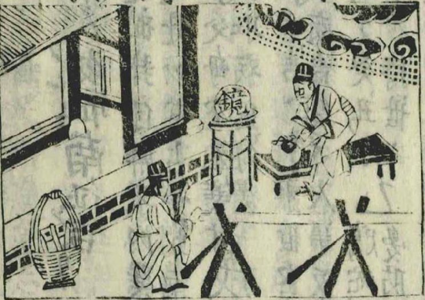
- 圖中：雲中雨點下，木匠下墨解木，一人磨鏡，一架子有鏡
- 卦圖象解：
	- 一、雲中雨點下：沾衣恩澤之象，昏暗之時將過也。
	- 二、木匠下墨解木：有尺度法則，有依據之象。匠—將也。以武力去災也有改朝換代之象也。
	- 三、一人磨鏡：可成始得之象。
	- 四、一架子負大木：有不小之財也。
	- 五、有鏡：指明鏡高懸，於商事指有競爭也。
	- 六、藍：難也，百廢待與之象。

### 人间道——升

- 上一卦[《泽地萃》](#《泽地萃》（二世）兑上%20坤下#人间道——萃)——下一卦[《泽水困》](#《泽水困》（一世）兑上%20坎下（六合）#人间道——困)

> [!引申] 
萃者聚也，聚之後能上，即升也，萬物咸因能聚方可升高，故升次萃也。此卦坤上巽下，乃木在地下生於地中，長而愈高此升之象也。

- 升：元亨，用見大人，勿恤，南征吉。
	- 升之道，在於亨通，用此道来見大人，不靠体恤而能進，必吉。
- 《彖》曰：
	- 柔以時升，巽而順，剛中而應，是以大亨。
		- 柔即順也，順時而升，以柔而進，此升之得時矣，二剛陽之位，得五柔順之君應則能大亨也。
	- 用見大人，勿恤，有慶也。南征吉，志行也。
		- 用巽順剛陽中正之道來見大人，必遂心志得升，從不去憂升之不遂，此吉慶也，前進則必升，必能遂行其志也。
- 《象》曰：地中生木，升；君子以順德，積小以高大。
	- 地中生木，木長而高，此升也。君子觀升象，乃知修身之德，由積累微小，乃至高大，故積不善，則不足以成名，凡學問道德之高，皆由累積而成，升之義也。
- 初六：允升，大吉。
	- 初進時柔順於九二之剛，因得信而升，此升吉也。
	- 《象》曰：允升大吉，上合志也。
		- 與上位之志合，得信而升，此因信於剛中之賢而能大吉也。
- 九二：孚乃利用禴（yuè），无咎。
	- 九二陽剛之臣，處升之時，因上位君柔，絶不可矯求外飾，必求以中心之至誠來感通於上，如此則可無咎。
	- 《象》曰：九二之孚，有喜也。
		- 君臣之道，臣之事君能中心至誠，不但為臣無禍，又可遂行其大志，此可喜也。
- 九三：升虛邑。
	- 九三陽剛之相，能正而順上，如此而升，就如入無人之巿，無人抵禦。
	- 《象》曰：升虛邑，无所疑也。
		- 升而如入無人之邑，則此進，必無可疑慮也。
- 六四：王用享于岐山，吉，无咎。
	- 居諸候之位，能上柔順於君王，下又順天下之賢，舉之升進，於已則柔順謙恭，不求離本位，有德如是，必吉，且無災矣。人之戒，切記在不可無事而升，升又必量力而進，方合君子之道。今人已不復如此，無功而升，比比皆是，升之道，如出私欲，必令國致窮困矣。
	- 《象》曰：王用享于岐山，順事也。
		- 居君側之人，因知順時順事，能順處之，得坤之性，可以無咎也。
- 六五：貞，吉，升階。
	- 君位之人性柔，必得貞正且固守之德，則人皆信而賢至，能知人善用，必因用賢而能再升，澤及天下也。
	- 《象》曰：貞吉升階，大得志也。
		- 君能任用賢才，如此可致天下大治，故君王升之道在能用賢耳，必遂其志。
- 上六：冥升，利于不息之貞。
	- 升之極乃致昏昧於升，只知進不知止，此為不明，君子之人終日乾乾，無時不警惕自己，知所進退。小人貪求私慾之心盛，乃生不知進退之行為，凶也。
	- 《象》曰：冥升在上，消不富也。
		- 昏昧之人已至極上，猶求升之不已，其果唯消亡而已，無復增益也。

## 《水风井》（五世）坎上 巽下

~~~
  伏 神        【本 卦】
              ▆▆▆   ▆▆▆     父母戊子水
              ▆▆▆▆▆▆▆▆▆     妻财戊戌土   世
子孙庚午火     ▆▆▆   ▆▆▆     官鬼戊申金
              ▆▆▆▆▆▆▆▆▆     官鬼辛酉金
兄弟庚寅木     ▆▆▆▆▆▆▆▆▆     父母辛亥水   应
              ▆▆▆   ▆▆▆     妻财辛丑土
~~~
珠藏深渊之卦，守静安常之象。
判曰：井者，静也。邑乃可改，并不可移，安身勿动，守道无亏。所作于人，且宜修之。逃亡难得，应没还期。

### 卦象——此卦楊貴妃，私與安祿山為事，卜得之，反受其害也。

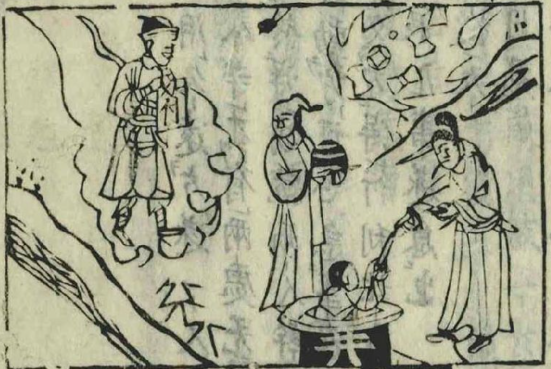
- 圖中：金甲神執符，女子抱合，錢寶有光起，人落井中，官人用繩引出。
- 卦圖象解：
	- 一、金甲神執符：貴人在空中，祥瑞之兆也。
	- 二、女子抱合：好也，但先成後破。
	- 三、錢寶有光起：財不失，不露之象，不久有喪也。
	- 四、人落井中：病重象，官司沈陷象，招陷害也。
	- 五、官人用繩引出：貴人為官人，欲相救也。
	- 六、符：符乃策略有傍人作對。

### 人间道——井

- 上一卦[《泽水困》](#《泽水困》（一世）兑上%20坎下（六合）#人间道——困)——下一卦[《泽火革》](#《泽火革》（四世）兑上%20离下#人间道——革)

> [!引申] 
困之後，如至極，則纏身動彈不得，猶陷井中，故困之後為井。物之居下者，莫如井，此卦坎上巽下，坎為水，巽為木，木在水下，必上乎水，故有汲井之象。

- 井：
	- 改邑不改井，无喪无得，往來井井。
		- 井，為不常改之處，常見都巿已改，但井無法遷動，井之性，汲之不竭，存之不盈，故曰無喪無得，凡人至井側，皆受其用，此不變之常德也，此為井之道。
	- 汔至，亦未繘（jú）井，贏其瓶，凶。
		- 井之道在乎供人用為善，如人至而未用井，仍飲泉，則有亦若無。君子之道，以有成為貴，如道即令正，但不為所用，亦等於無也。徒自招凶。
- 《彖》曰：
	- 巽乎水而上水，井，井養而不窮也，改邑不改井，乃以剛中也。
		- 木入水中，而又上於水，此井也，井能養物，不盡不竭，此井德之常也。城巿可改，而井不能遷，猶君子剛中之德，即令再艱險，卻永不改變其志。
	  - 汔至亦未繘井，未有功也，羸其瓶，是以凶也。
		- 井以供人使用為功，今人至井側，而不用井，則有井亦同於無井，無法發揮井之功用。瓶須盛水，今破壞，是以無用而致凶也。
- 《象》曰：木上有水，井，君子以勞民勸相。
	- 君子觀井象，效法井之性，為助民而任勞，且教其互助之功，此效法井之佈施無私也。
- 初六：井泥不食，舊井无禽。
	- 井之道，始為井之時，仍不適用也，井內初無水，其底為泥，不可食，井之德能養人，乃其有水也。今若為廢棄之舊井，其無水，故必無禽至，猶人之無才無法濟物，必為時代淘汰。今之師即須有舊井之戒，故孟子曰：人之患，莫過於為師，即有舊井之戒。
	- 《象》曰：井泥不食，下也，舊井无禽，時舍也。
		- 初為陰柔，而居井之底，乃泥象，無水之泥，人必不食，無水之井亦無禽聚，此必為時所捨之也。
- 九二：井谷射鮒，甕（wèng）敝漏。
	- 陽剛居將位，居井之時，上不對應，因而趨下，失井之道，降下而趨泥，而成微不足道之物，如破漏之甕也，終必無功。
	- 《象》曰：井谷射鮒，无與也。
		- 井，能出水助人為功用，故以能出為成功，今陽剛之才，本可濟用於世，因上不用故成無用。
- 九三：井渫（xiè）不食，爲我心惻，可用汲，王明並受其福。
	- 九三之才居相位，陽剛又居高位，才必能濟世，如井之清水升而上，可助人之力大也，今不見人食，乃謂君明其賢不用其才，賢才之心必憂，如君能用其才，使其才能濟民，乃上下之共福也。
	- 《象》曰：井渫不食，行惻也，求王明，受福也。
		- 井中水清澈而不食用，乃有才智之人，不見用，其無法遂行其志而憂懷，但求得遇明君而天下受其福澤。
- 六四：井甃（zhòu），无咎。
	- 陰柔之人居君王身側，才不足而任其位，若但求修治井口之磚砌，自守之，亦可無咎。
	- 《象》曰：井甃無咎，脩井也。
		- 修治井口，即令無功於天下，亦因其能守而不致招廢棄，亦可為功矣。
- 九五：井洌（liè），寒泉食。
	- 九五君位之人，能如井中之泉，甘寒潔（jié）淨，為民所喜用，此井道之至善也。
	- 《象》曰：寒泉之食，中正也。
		- 寒洌甘潔之泉水受人喜用，乃中正之道得用亦同。
- 上六：井收勿幕，有孚元吉。
	- 井以水能上出為人所用為居功，使人汲取而不竭，其利必無窮無盡，其間之性為常此不變，始終如一，廣施其德於萬民，此乃井道之成也。
	- 《象》曰：元吉在上，大成也。
		- 能以至善而居卦終，乃大成也。

## 《泽风大过》（游魂）兑上 巽下

~~~
  伏 神        【本 卦】
              ▆▆▆   ▆▆▆     妻财丁未土
              ▆▆▆▆▆▆▆▆▆     官鬼丁酉金
子孙庚午火     ▆▆▆▆▆▆▆▆▆     父母丁亥水   世
              ▆▆▆▆▆▆▆▆▆     官鬼辛酉金
兄弟庚寅木     ▆▆▆▆▆▆▆▆▆     父母辛亥水
              ▆▆▆   ▆▆▆     妻财辛丑土   应
~~~
寒木生花之卦，本末俱弱之象。
判曰：大过者，祸也。四阳过盛，上下不胜，栋桡之象，事卒难明。两刑两克，所求不成。枯杨借生，自灭之征。

### 卦象——此卦姜太公釣渭水，卜之，至八十方遇文王。

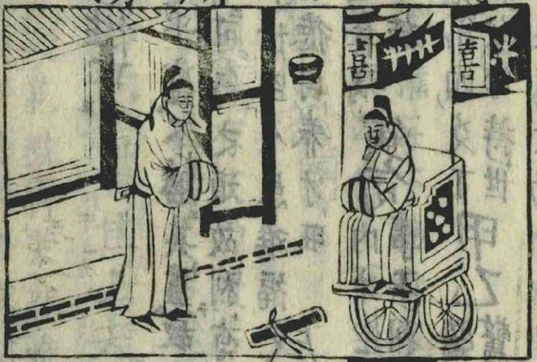
- 圖中：官人乘車上，插兩旗，旗上有喜字，入朱門，門外貴人立，文書在地，一合子。
- 卦圖象解：
	- 一、官人乘車上插兩旗：車至官來，必有官司訴訟，軍人象。
	- 二、旗上有喜字且分開，乃喜有破損象，捨去婚姻象。
	- 三、入朱鬥：乃豪門世家相請，或朱姓人。
	- 四、門外貴人立：被棄於外象。
	- 五、文書在地：合約，契約，不成之象。
	- 六、一合子：先成後破之象。

### 人间道——大过

- 上一卦[《山雷颐》](#《山雷颐》（游魂）良上%20震下#人间道——颐)——下一卦[《坎为水》](#《坎为水》（纯卦）坎上%20坎下（六冲）#人间道——坎为水)

> [!引申] 
頤者，養也，萬物養而後能成，成而後動，動則有過，故大過次頤也。大過乃論過失之大與過人之大事也。舉凡世間事之大過於常者，皆是也，古聖人盡人道非過於理之正，如今之行過乎恭，喪過乎哀，用過乎儉，皆過之也。過人之大事，本不常見，故非常人能為之，如堯舜之襌讓，湯武之放伐，即立不世之功，乃過人之大事。

- 大過：棟（dòng）橈（ráo），利有攸往，亨。
	- 小過與大過之分，乃小過為陰過於上下，大過乃陽過於中，上下皆弱，故有棟橈之象。此卦四陽居中，乃棟象，能任重也。即君子盛而小人衰，故利有攸往可亨。
- 《彖》曰：
	- 大過，大者過也。
		- 犯過之大與成大過於人之事。
	- 棟橈，本末弱也。
		- 本末為陰而中為重陽，故為楝橈。
	- 剛過而中，巽而説行，利有攸往，乃亨。
		- 雖因陽剛有過，但處不失中道，巽順和悦，無以私心，必利攸往，所以亨。
	- 大過之時大矣哉！
		- 人能立非常之大事，立不世之大功，乃真大過，處之時得宜乃大哉。
- 《象》曰：澤滅木，大過。君子以獨立不懼，遯世无悶。
	- 澤本潤養於木，今至滅沒於木，此過之甚矣，為天地之象。君子（人才）觀大過之象，以立其大過於人之行，其所以能大過於人者，乃其能獨立不懼，天下誹之亦無動其心，舉世不見知而不悔，隱世而不憂悶，如此方能自守，此為其能大過於人也。
- 初六：藉用白茅，无咎。
	- 此以陰柔而處卑下，易藉用茅為至薄之物，但用之亦很慎重，此為敬慎之至也，故可以無災。
	- 《象》曰：藉用白茅，柔在下也。
		- 此示意陰柔而居卑下，過於敬慎之意，此至慎之道。
- 九二：枯陽生稊，老夫得其女妻，无不利。
	- 二為柔位，陽剛居柔，是過剛之人而能以中自處，與柔相濟，其功如老夫之得女妻，則亦能成生育之功。
	- 《象》曰：老夫女妻，過以相與也。
		- 老夫少妻之配，雖過於常份，但老夫能悦少女，而少女能順老夫，亦無災。
- 九三：棟橈，凶。
	- 九三以太過之陽剛自居，又不得中道，此剛過之甚，其動必違和於中，拂逆眾心，故即以棟樑之才，而無人自輔，安能當大過之任乎？故凶。君子居大過之時，立大過之功，非剛柔適中，得人之輔，則不能也。
	- 《象》曰：棟橈之凶，不可以有輔也。
		- 此即剛強之過，必不能取於人，人亦無法輔之，此其凶也。
- 九四：棟隆，吉，有它吝。
	- 此近君之位，又當大過之任，以剛處柔則能相濟，是吉也。但如有異志，則剛必失中，此加累於陽剛，雖不致有大害，但亦可吝也。
	- 《象》曰：棟隆之吉，不橈乎下也。
		- 棟能隆起則吉，不可曲橈就下。
- 九五：枯楊生華，老婦得其士夫，无咎无譽。
	- 君位處大過之時，下無助援，就如枯楊不生根而生外表，其表秀雖可見，但卻無益於枯也。猶如老婦之與士夫，此雖无咎，但非美也，其可醜乎。
	- 《象》曰：枯楊生華，何可久也？老婦士夫，亦可醜也。
		- 枯陽不生根而生華秀之外表，必不能長久。老婦得士夫，必不能成生育之功也。
- 上六：過涉滅頂，凶，无咎。
	- 此陰柔又處過之極者，乃小人過之極也，小人之大過，並非能做大過於人之事也，而是過越常理，不體恤危亡，犯險闖禍而已，如涉水而至滅頂，必凶。此自取其辱，无所怨尤。
	- 《象》曰：過涉之凶，不可咎也。
		- 過涉水以至於溺水，皆咎由自取，無可抱怨也。

## 《泽雷随》（归魂）兑上 震下

~~~
  伏 神        【本 卦】
              ▆▆▆   ▆▆▆     妻财丁未土   应
              ▆▆▆▆▆▆▆▆▆     官鬼丁酉金
子孙庚午火     ▆▆▆▆▆▆▆▆▆     父母丁亥水
              ▆▆▆   ▆▆▆     妻财庚辰土   世
              ▆▆▆   ▆▆▆     兄弟庚寅木
              ▆▆▆▆▆▆▆▆▆     父母庚子水
~~~
良工琢玉之卦，如水推车之象。
判曰：随者，顺也。上刚下柔，随时之义。改故鼎新，众美俱至。士子得官，宜增禄位。百事遂意，吉无不利。

### 卦象——此卦孫臏破秦，卜得之，便知必勝也。

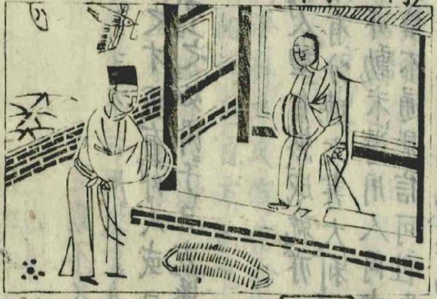
- 圖中：雲中雁傳書，一堆錢，朱門內有人坐，一人在門外立，地上一堆珠。
- 卦圖象解：
	- 一、雲中雁傳書：飛來喜訊象。
	- 二、一堆錢：財聚也。
	- 三、朱門內有人坐：君王之象，必見君面也。
	- 四、一人在鬥外立地：乃士人求仕，受尊重之象。
	- 五、串錢在地：有用利不行之象。
	- 六、亂珠聚盆：先聚後散之象。
	- 全卦：禮儀得體，有見速喜之象。

### 人间道——随

- 上一卦[《雷地豫》](#《雷地豫》（一世）震上%20坤下（六合）#人间道——豫)——下一卦[《山风蛊》](#《山风蛊》（归魂）艮上%20巽下#人间道——蛊)

> [!引申] 
豫悦之道，人必皆隨之，故豫之後有隨。震為雷，兌為澤，雷震於澤中，澤隨雷而動，此隨之義。以陽而下陰，陰乃隨陽，此陰陽不易之理。『外悦內動象』『下動上悦象』。

- 隨：元，亨，利，貞，无咎。
	- 隨之道，可以致大亨通。君子之道，眾人所隨，又遇事擇所隨，隨能得道，必致大亨。今人君之從民意，臣下之從君意，人人隨從義，利在堅守隨義，隨因能正，其道必亨。小人群聚，此隨失正，豈不招凶乎。
- 《彖》曰：
	- 隨，剛來而下柔，動而説，隨。大亨，貞，无咎，而天下隨時。
		- 雷為剛今居柔下，是以尊貴而對下隨，為隨之義。臣君關係，以上悦下動，以動可悦，為隨之道，如是則亨通而無災。
	- 隨時之義大矣哉。
		- 君子之道，隨時而變，因時制宜。今世昏蒙不明，凡事皆表明裡暗，是故民之所隨，未能適中，常受謡言、外飾所惑，隨而必枉，受奸人利用。
- 《象》曰：澤中有雷，隨，君子以嚮晦入宴息。
	- 澤隨雷震而動，君子晝（zhòu）則自強不息，夜則入居內安其身，起居作息隨天時，乃宜也。禮云：君子晝（zhòu）不居內，夜不居外，此隨時之道。
- 初九：官有渝，貞吉，出門交有功。
	- 官為守也，因所從隨為正，故吉。出門交往多所親愛者，因人心所從隨也。常人之情，愛之所見皆對，惡之所見皆非，小人皆以私情而隨從之，不合正理，君子出鬥交不以私，故所隨皆有功也。
	- 《象》曰：官有渝，從正吉也。出門交有功，不失也。
		- 所隨從之道，須從正則吉。隨從不正，招悔咎也。因交非因本身之私，其交必正，故不失。
- 六二：係小子，失丈夫。
	- 六二為陰柔位，陰乃順從，柔順之意，但如順隨的對象為小人，則必失卻君子之人，此因不能固守，聖人戒之。
	- 《象》曰：係小子，弗兼與也。
		- 人因所順隨為正道，邪惡必遠也，但須戒，人若從於正，須專一，不可兼與。
- 六三：係丈夫，失小子，隨有求得，利居貞。
	- 六三居相位，所固守本身之正，求上之隨，有求必得，乃上上隨也。如背是求非，舍君子從小人，為下下之隨也。故君子之隨，首先固守本身之正。
	- 《象》曰：係丈夫，志舍下也。
		- 隨之至善即在此，舍小人而從君子，人人如此，小人無所遁也，常自省而人之性乃從善如流，故將無小人矣。
- 九四：隨有獲，貞凶，有孚在道以明，何咎？
	- 因四位乃臣之極位，如隨而有獲，即正亦易招凶，皆因天下之心隨於己。為臣之道，應使恩威出於上，眾心能隨於君，如讓人心從己，致凶之道。故君子居此，唯誠正於心，所動皆合於道，則可無悔。小人位極，用君王權，遂行其志，得民心又不歸功於上，位極而逼上，勢強而專權，隨之過大矣。君子雖功大震主，但由於其正而心誠，故主隨從而信之，何有災？
	- 《象》曰：隨有獲，其義凶也，有孚在道，明功也。
		- 近君之位，因追隨而有得，雖有凶戒，但有中正之誠，則無災，明哲保身也。
- 九五：孚於嘉，吉。
	- 此君位之人，得中正而固守，動隨於善，大吉也。故此，從人君到平民，隨道之吉，唯隨善耳。
	- 《象》曰：孚于嘉，吉，位正中也。
		- 處中正之位，又中誠所隨，必吉矣。
- 上六：拘係之，乃從維之，王用亨于西山。
	- 此柔順而居隨之極也，柔順之隨至極雖有過之失，但如人心皆隨，因有得民之隨，仍有王道王業之成也，故能得民心者，得天下也。
	- 《象》曰：拘係之，上窮也。
		- 隨之道至此，乃窮盡也。

# 巽宫八卦——属木

## 《巽为风》（纯卦）巽上 巽下（六冲）

~~~
 【本卦】
▆▆▆▆▆▆▆▆▆     兄弟辛卯木   世
▆▆▆▆▆▆▆▆▆     子孙辛巳火
▆▆▆   ▆▆▆     妻财辛未土
▆▆▆▆▆▆▆▆▆     官鬼辛酉金   应
▆▆▆▆▆▆▆▆▆     父母辛亥水
▆▆▆   ▆▆▆     妻财辛丑土
~~~
风行草偃之卦，上行下效之象。
判曰：巽者，顺也。乃顺成天，动用相尚，消息交通，无诸蔽障。恶事不同，风飘其响。所作随顺，进达之象。

### 卦象——此卦范蠡辭官入湖，卜得之，乃知越國不久也。

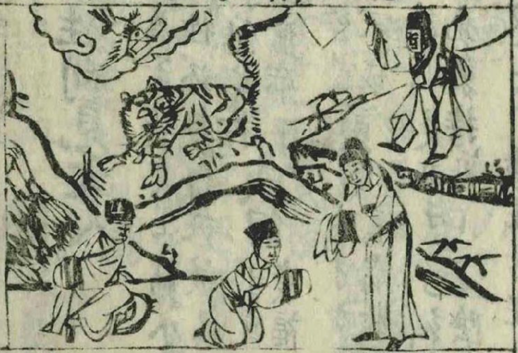
- 圖中：貴人賜衣，一人跪受，雲中雁傳書，人在虎下坐。一人射虎中箭，虎走。
- 卦圖象解：
	- 一、貴人賜衣：先破後成象。
	- 二、一人跪受：貴綬也。如占疾病，則主壽衣，凶象。
	- 三、雲中雁傳書：意外喜訊。
	- 四、人在虎下坐：身處險而不知。
	- 五、一人射虎中箭：貴人相救。
	- 六、虎走：脱險，寅年也。
	- 又虎乃有威望之人，利武官，主人在虎邊進退不得之時。亦言虎將須知功成身退，否則暗箭難防，以明哲保身為吉。

### 人间道——巽为风

- 上一卦[《火山旅》](#《火山旅》（一世）离上%20艮下#人间道——旅)——下一卦[《兑为泽》](#《兑为泽》（纯卦）兑上%20兑下（六冲）#人间道——兑为泽)

> [!引申] 
巽者，入也。處旅時，親人不在，惟能巽順，方可平安，無所不入。故巽次旅也。此卦一陰居二陽之下，乃有陰順於陽象。

- 巽：小亨。利有攸往，利見大人。
	- 巽順之道，得之可以小亨。故論柔之順性，能如此，利往進，可見貴人，必助。
- 《彖》曰：重巽以申命。剛巽乎中正而志行，柔皆順乎剛，是以小亨。利有攸往，利見大人。
	- 巽之重卦，有上順下亦順象，苟能上順中道以出命，下順命而服從，則必吉。故君子申復命令，乃知巽也。能知順乎剛且中正，即令才不足亦可以小亨。能得巽順之道，必無往不入可出世見大人也。
- 《象》曰：隨風，巽。君子以申命行事。
	- 物之隨風而動，巽之道也，君子觀巽象，乃知重復申令之重要，能有政令，上隨下以順服，上下皆順，即重巽之象，為始切實，故重申命令。
- 初六：進退，利武人之貞。
	- 居巽順之時，又處卑下，以陰柔之質，必畏而不安，無所適從，故此時惟利於武官，從武職之人，其巽赈必吉也。
	- 《象》曰：進退志疑也，利武人之貞，志治也。
		- 進退不知所安，其志必疑且懼，故堅心服從，利於武職之人，不生貳心。
- 九二：巽在床下，用史巫紛若，吉，无咎。
	- 九二乃示剛居陰位，外又有巽順之象，意即人有過於卑順之時，不是恐懼就是諂媚，皆非正也。但其雖非正禮，亦可遠恥辱，去怨隙，亦可為吉，就如同用誠意來通於神明之史巫，其誠意能通，亦可無過。
	- 《象》曰：紛若之吉，得中也。
		- 人能得中道，亦以至誠，則人必信之，吉而無咎。
- 九三：頻巽，吝。
	- 九三為下卦之上極，剛居之，有剛亢之質，居巽順之時，非真能順，乃出於勉強為之，必有所失，失後又頻順，頻順又再失，亦可卑吝也。
	- 《象》曰：頻巽之吝，志窮也。
		- 陽剛之才，本非能順巽，今處重巽之時，因勢不能遂志，又必須以順，故必有所失，其志必困窮。
- 六四：悔亡，田獲三品。
	- 六四僅乃陰柔居陰，此位居下之上，乃居上位而知順下，人能如此善處，必可不慮亡。猶田之收獲能遍及上下，能如此，何慮悔亡更且有功。
	- 《象》曰：田獲三品，有功也。
		- 巽能通於上下，如田之獲，上下受惠，此巽順之功。
- 九五：貞吉，悔亡无不利，无初有終，先庚三日，後庚三日，吉。
	- 陽居陽位又處君位，此為巽之主，其命令，必合於中正之道，天下黎民莫不順從。能始終如此，必無往不利，如命令之出，有須變更時，改始之不善，成終之善，則可變更，其中道，必始終如一方可。
	- 《象》曰：九五之吉，位正中也。
		- 九五之尊，能處之吉，乃因能得中正之道，過與不及皆不善。
- 上九：巽在床下，喪其資斧，貞凶。
	- 床，人之所安處也。今在床下，有過於安之義，九為巽極，乃過於柔順，乃喪失剛斷，必失居所，乃自失也，對正道而言為凶。
	- 《象》曰：巽在床下，上窮也，喪其資斧，正乎凶也。
		- 居上之極本為陽剛，今卻過於巽順，必失正道，為凶道。

## 《风天小畜》（一世）巽上 乾下

~~~
  伏 神        【本 卦】
              ▆▆▆▆▆▆▆▆▆     兄弟辛卯木
              ▆▆▆▆▆▆▆▆▆     子孙辛巳火
              ▆▆▆   ▆▆▆     妻财辛未土   应
官鬼辛酉金     ▆▆▆▆▆▆▆▆▆     妻财甲辰土
              ▆▆▆▆▆▆▆▆▆     兄弟甲寅木
              ▆▆▆▆▆▆▆▆▆     父母甲子水   世
~~~
匣藏宝剑之卦，密云不雨之象。
判曰：小畜者，塞也。密云不雨，夫妇反覆。信息不通，出行却伏，求事不成，迟而未速。

### 卦象——此卦韓信擊取散關不破，卜得之後，再撃之果破也。

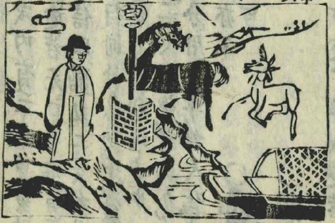
- 圖中：兩重山，一人在山頂，舟横岸上，望竿在草中，羊馬過河。
- 卦圖象解：
	- 一、兩重山：知有險阻於前，不妄動之象。亦為出字象。
	- 二、一人山頂：孤立獨行象。已至顛峰，將走下坡之意。
	- 三、舟横岸上：準備出發，水未至而不行也。
	- 四、望竿在草裡：等待訊息象。草頭姓人為貴人。望，亡也。
	- 五、上有羊馬：馬引羊過河，馬為貴人，肖馬人，姓馬人也，馬亦為午時。
	- 全卦：一人在頂顛，但有疑，前有二山所阻，只有等待消息，午年或午月、午日、午時或馬人引羊至，不由水路而來也。

### 人间道——小畜

- 上一卦[《水地比》](#《水地比》（归魂）坎上%20下坤#人间道——比)——下一卦[《天泽履》](#《天泽履》（五世）乾上%20兑下#人间道——履)

> [!引申] 
比乃親和，親和之後必有所畜，因物相比親則附於一處，為畜，此畜者，聚之來源也。同相親和之人，其志必同畜。畜亦止也，止然後有聚。此體本乾為天，乃在上之體，今居風之下，示意吾人如要聚止剛健之人，唯有巽順為大，故世間再剛健之事與人，必為巽順所止也。本卦一陰居第四位，為五陽所包，此得位乃因柔巽之道也。卦象『外柔內剛』，乃能以小畜大。

- 小畜，亨。密雲不雨，自我西郊。
	- 此言雲之畜聚雖密，卻不能成雨，猶人雖聚，卻不能和之義。
- 《彖》曰：
	- 小畜，柔得位而上下應之，曰小畜。
		- 小畜之卦，因第四爻陰，居近君主之位，以巽之柔順本性，使上下之陽剛相互溝通，但只能維繫，卻不能強固，故曰小畜。
	- 健而巽，剛中而志行，乃亨。
		- 以卦象而言，內剛健而外能柔順，雖為小畜，但能亨也。
	- 密雲不雨，尚往也。自我西郊，施未行也。
		- 此言密雲不能成雨，猶小畜無法成大也，其因下陽往上，上陽往下，二氣不和。
- 《象》曰：風行天上，小畜，君子以懿文德。
	- 以乾之剛健，風仍能在上而行，故剛健之性，唯柔順能畜止之，君子以小則文章才藝，大則道德經綸之聖才，以此二道為所畜之才義。
- 初九：復自道，何其咎，吉。
	- 初入之地為初爻，以其剛健之性，又得上位之同性，進必上，何來災也。故初之陽剛，乃因上位之陽剛性同，故無災也。
	- 《象》曰：復自道，其義吉也。
		- 初爻與第四爻本為對應之位，故在畜時，陰在四，陽在初，陰陽相應，故吉。
- 九二：牽復，吉。
	- 九二居將位，因與第五爻陽爻相對應，同為剛健，雖中有四爻，但因同為陽剛，自古『同患相憂』〔同慾相憎〕，吉之道，此時為將時。
	- 《象》曰：牽復在中，亦不自失也。
		- 初爻為陽剛，復二爻亦陽剛，其勢乃強，但因此時乃居中位，將位，故即強亦不會過剛，過剛乃失，此天道。故吾人須知居中而陽剛之美，因理正，故能強剛，君子持之以理，雖剛亦不為過矣。
- 九三：輿説輻，夫妻反目。(説即脱)
	- 九三為下卦之上爻，最親密於四爻陰位，故乃陰陽之情相處也。猶如夫妻。陰本受制於陽，今居四位居陽之上，即反制陽，如夫妻之反目，故如車輿脱去輪軸，不能行也。妻為夫所惑，反制於夫，乃因夫不正道。未有夫不失道，而妻能制之也。
	- 《象》曰：夫妻反目，不能正室也。
		- 因陽剛位之夫，過剛而失自處之道，不能顧家室，以致夫妻反目。故為夫之道，須正室其家，方為正道。
- 六四：有孚，血去惕出，无咎。
	- 六四乃處近君之位，其能畜君，使五位君之威嚴能因之而止其欲，皆因六四有孚信(孚，乃內有誠信也〕而受其感也。
	- 《象》曰：有孚惕出，上合志也。
		- 因四位有誠信且外柔，使五之君位信任之，乃合同志。五因四位之人能與之合，眾陽從之，故惕出則血去，不見兵禍矣。
- 九五：有孚攣（luán 挛）如，富以其鄰。
	- 小畜之時，乃眾陽皆為其中一陰所畜之時。猶如一國之君，與臣下皆剛而不容（密雲不雨〕，但近君側之人，適得柔順之人，而此人為上下溝通之管道，此時乃即小畜之時也。九五為君位，如以中正居至尊之位，又內有誠信，則所有皆附應之。就好像富人出其財力與鄰共享之也。從此爻則知當君子為小人所困，正人為艰邪所逼，此時如無上下正陽之互援，則獨力難助於此時，須有互助方可去小人也。
	- 《象》曰：有孚攣如，不獨富也。
		- 是故君子處之艱危，唯其至誠，能得眾力之助，則平安矣。（攣如即牽連使相從之。）
- 上九：既雨既處，尚德載，婦貞厲。月幾望，君子征凶。
	- 上九為此卦之終極，乃處畜之終。和而能止乃畜之道，陰柔之能畜剛，由累積而成，非朝夕可得，此戒之在平時，如專任以柔制剛，不知止，如婦之堅守此道則乃凶矣，天下無婦制其夫，臣制其君，尚能安穩者乎？月滿之時為月望，與日相敵狀。若君子待婦將成敵時，動之必凶，不須戒也，故须戒之於月未滿時。
	- 《象》曰：既雨既處，德積載也；君子征凶，有所疑也。
		- 此小畜之道積滿而成，其象為陰將盛樣，君子動則有凶也。小人抗君子，必有害於君子，制陰極盛之道，則為君子有疑而知警惕，不妄動，求其所以制君子之因，則不至凶也。

## 《风火家人》（二世）巽上 离下

~~~
  伏 神        【本 卦】
              ▆▆▆▆▆▆▆▆▆     兄弟辛卯木
              ▆▆▆▆▆▆▆▆▆     子孙辛巳火   应
              ▆▆▆   ▆▆▆     妻财辛未土
官鬼辛酉金     ▆▆▆▆▆▆▆▆▆     父母己亥水
              ▆▆▆   ▆▆▆     妻财己丑土   世
              ▆▆▆▆▆▆▆▆▆     兄弟己卯木
~~~
入海求珠之卦，开花结子之象。
判曰：家人者，同也。阴阳得位，夫妇克隆，田木增广，财入本宫。婚姻之道，以存始终。不求自合，家庆融融。

### 卦象——此卦董永喪父賣身，卜之。後感得仙女為妻。

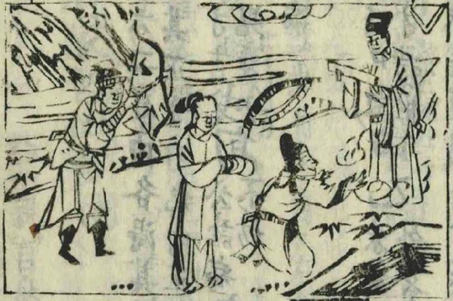
- 圖中：一人張弓，一帶在水邊，雲中文書，貴人拜綬，婦人攜手。三點。
- 卦圖象解：
	- 一、一人張弓：暗算，破壞也。
	- 二、一帶在水邊：事滯也，棄官也。
	- 三、雲中文書：突而來之喜訊也。
	- 四、貴人拜受：綬命也。
	- 五、婦人攜手：家和之象，此卦卜婚姻大吉。

### 人间道——家人

- 上一卦[《地火明夷》](#《地火明夷》（游魂）坤上%20离下#人间道——明夷)——下一卦[《火泽睽》](#《火泽睽》（四世）离上%20兑下#人间道——睽)

> [!引申] 
人之傷於外而必後返於內，故家人次明夷為序卦，此卦專論家內之道，父子、夫婦、長幼尊卑之倫理與恩義的家人之道。外風內火，乃風自火出，火愈熾（chì）則風生，有自內而出之象，故處家之道，有內明外順象。聖人之謂人能立於家，則必能施於國，以至天下大治。故治天下猶治家也。

- 家人：利女貞。
	- 家人之道，利在女正且堅，女能正，則家道正矣。
- 《彖》曰：
	- 家人，女正位乎内，男正位乎外，男女正，天地之大義也。
		- 家人之道，正位且堅心，男主外，女主內，其有尊卑有道，乃合乎天地陰陽之道。
	- 家人有嚴君焉，父母之謂也。
		- 父母為一家之君長，無尊嚴則無人孝，無大小，則倫理廢，故君嚴則家正。
	- 父父子子，兄兄弟弟，夫夫婦婦，而家道正，正家而天下定矣。
		- 父母兄弟夫妻各適其位，則家道正矣。能治家道，其道亦可推而治天下。
- 《象》曰：風自火出，家人。君子以言有物，而行有恆。
	- 君子觀風自火出之象，知正身之道，皆由內出，故言必有物，行必有恆，身正而能治家。
- 初九：閑有家，悔亡。
	- 家人道之始為初九，须以陽剛立家道，如無法則度量，則終至人情流放，必悔。
	- 《象》曰：閑有家，志未變也。
		- 閑即預防之法則也，閑必於始初而立。在正志未流散之前，變動而法規之，因始立規之時，必不傷恩，不失義，如於志變後再思治，則多有傷，必有悔。
- 六二：无攸遂，在中饋，貞吉。
	- 常人處家，唯骨肉親情，故常以情勝禮，以恩去義，偏私之人多矣。獨有能剛之人不以私愛而不顧理。今以陰柔之人治家，必無可為，唯婦人之道可以柔順，如能處正，居中協調，則必能吉。
	- 《象》曰：六二之吉，順以巽也。
		- 今以陰柔居中，能順從而動其心，此為婦人之正道。
- 九三：家人嗃嗃（xiào），悔厲吉，婦子嘻嘻，終吝。
	- 嗃嗃乃嚴厲約束意，家人之道如約束過嚴，必有悔，然能令人心敬畏，也比讓婦人之放肆，喜樂無節，終至家敗而來得好。同理，人能剛立，必知忠義，喜愛玩樂必不能正倫理，知恩義也。
	- 《象》曰：家人嗃嗃，未失也；婦子嘻嘻，失家節也。
		- 雖過嚴厲傷恩，但猶未失家人之道。但令婦人喜節無度，失家之道，必亂矣。
- 六四：富家，大吉。
	- 能有其富，於家道大吉，保有富之人，而能保其家，此吉之大也。
	- 《象》曰：富家大吉，順在位也。
		- 以巽順之道而能保其家富，此家之大吉也。
- 九五：王假有家，勿恤，吉。
	- 能剛又處君位，位尊而中正，又能順應內，此治家之至正至善。是故修身來齊家，家家能正，則天下大治，此不須憂勞而天下自治矣。
	- 《象》曰：王假有家，交相愛也。
		- 尊位又能有家之道，不但能使其順從而已，必使其能從內心而化合。丈夫能愛內助，婦能愛其威治於家，此交相愛，為家之至道。
- 上九：有孚威如，終吉。
	- 此言治家之道，非至誠之心不能也。己能守其规如常則人自化，如己不能守，況於他人乎？家之患必在禮法不足，下犯上，上凌下。如能守正禮法，又有威嚴，則必能吉。
	- 《象》曰：威如之吉，反身之謂也。
		- 此即言治家之道，以正身為本，當先嚴其身，後有威望於人，則人能服。此反身之意。

## 《风雷益》（三世）巽上 震下

~~~
  伏 神        【本 卦】
              ▆▆▆▆▆▆▆▆▆     兄弟辛卯木   应
              ▆▆▆▆▆▆▆▆▆     子孙辛巳火
              ▆▆▆   ▆▆▆     妻财辛未土
官鬼辛酉金     ▆▆▆   ▆▆▆     妻财庚辰土   世
              ▆▆▆   ▆▆▆     兄弟庚寅木
              ▆▆▆▆▆▆▆▆▆     父母庚子水
~~~
鸿鹄遇风之卦，滴水天河之象。
判曰：益者，损也。风雷相举，益道如然。小人达情，刑狱之愆。君子位变，见善则迁。利有攸往，行人速还。

### 卦象——此卦冉伯牛有疾，卜得之，乃知謾師之過也。

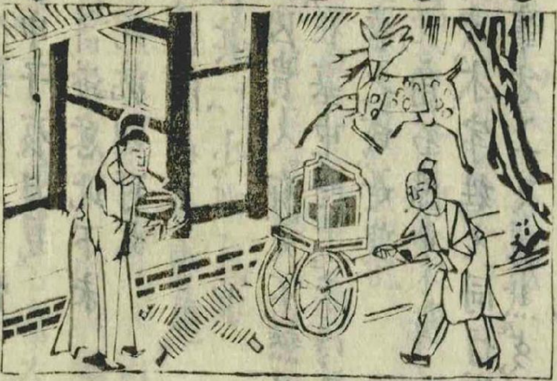
- 圖中：官人抱合子，一人推車，一鹿一錢。
- 卦圖象解：
	- 一、官人抱合子：倌人，丈夫也，事必先成後破。
	- 二、一人推車：因時而動之象，空坐相請。
	- 三、一鹿一錢：才祿俱備，有回祿之災，財有破損，憂心忡忡。
	- 四、不為財货，不畏時尚之變，明知先成後破，仍走馬上任，以損上益下之道，天下或事業亦能平治。

### 人间道——益

- 上一卦[《山泽损》](#《山泽损》（三世）艮上%20兑下#人间道——损)——下一卦[《泽天夬》](#《泽天夬》（五世）兑上%20乾下#人间道——夬)

> [!引申] 
損而不己必生益，自古盛，衰，損，益，天理循環，損至極生益，所以繼損也。此卦巽上震下，風雷二物互相增益，雷受風則迅，風受雷激則烈，互相助威，所以成益象。損上益下，故為益，前卦乃損下益上故損，以其義而推，吾人可知，民厚則國安。

- 益：利有攸往，利涉大川。
	- 益，乃有益於天下之道，故可濟險難，利涉大川。
- 《彖》曰：
	- 益，損上益下，民説无疆，自上下下，其道大光。
		- 益之本義，其道在損於上而益於下，民必悦之且無盡無窮，從上而降，下之下亦受之，益道乃光顯而大也。
	- 利有攸往，中正有慶。利涉大川，木道乃行。
		- 以中正之道助益天下，天下受福，故往吉。萬物中唯木助益人類最大，舉凡葯材，車船，築室等皆不離木，木於平時尚未顯其要，但於艱危困頓時，則助益乃大，益道亦如是。
	- 益動而巽，日進无疆。天施地生，其益無方。凡益之道，與時偕行。
		- 益道之動乃在乎順，動不順乎理，必不成益。天道滋始，地道成物，而化育萬物，各正性命，使益之道廣大無邊。聖人體天地之道，知能利乎天下之道，必須順乎時應乎理，因時制宜，乃益之大道。
- 《象》曰：風雷，益，君子以見善則遷，有過則改。
	- 風與雷二物相互助益，君子觀其象，而知益於己之道，乃在見善則遷，則可盡天下之善，有過能改，則無過矣。
- 初九：利用爲大作，元吉，無咎。
	- 初九為陽剛之賢，如遇六四上位之順時，亦即居下位而有能力之賢才，能得上位之順從支持，必做大益於天下之事，此為大作，如不能持此原則，不但悔咎來臨，且又累上位，此是上位之過也。如益眾人，則必無過。今人多志得意滿，狐假虎威，欺上瞞下，唯圖利自己而已。
	- 《象》曰：元吉无咎，下不厚事也。
		- 下位之人，本就不可擔重大之事，今得上位信賴而出任大事，必须能濟世助人，方可使上位有知人善任之譽，如只會壞事，民怨四起，則上下皆有過失也。
- 六二：或益之，十朋之龜，弗克違，永貞吉，王用享于帝，吉。
	- 人能處於中正之道，又知中虛來求益，且能順從無私，天下何不能受？必不相違，日久更吉。如此則必能通上位，獲吉，人皆相從矣。
	- 《象》曰：或益之，自外來也。
		- 能知益天下之道，且堅守此道，必令眾人自外而來歸矣。
- 六三：益之用凶事，无咎。有孚中行，告公用圭。
	- 六三乃相位，居下民之上統管民事，如能居民上而剛決，其果為益民而決，即令是凶事，亦可無咎。但仍須以誠意通於上，使上能信任，如所為不合中道，即令上信亦不可為也。
	- 《象》曰：益用凶事，固有之也。
		- 居下凡事當稟明於上，乃得誠信。但如遇危難救災之事，可立以剛決，必能無咎，此其大義也。
- 六四：中行，告公從，利用爲依遷國。
	- 居君側，以柔順從君，對下又順應於初陽之剛賢，如此則能令民順而從行。
	- 《象》曰：告公從，以益志也。
		- 其動之志在益天下，上必信從，因其為公不為私，故古人不患上之不從，患己之不正。
- 九五：有孚惠心，勿問元吉，有孚惠我德。
	- 陽剛君王，居尊心中又誠正，必能益於天下，不問可知，天下之人必至誠愛戴，因君之能施恩德也。
	- 《象》曰：有孚惠心，勿問之矣，惠我德，大得志也。
		- 人君有至誠增益天下之心，不须問，天下之民，必懷德承恩，益道大行，人君志必行。
- 上九：莫益之，或擊之，立心勿恒，凶。
	- 以剛處益之極，此專欲利己，不與眾同欲，必招怨，或受攻撃，聖人戒之在人欲，堅心不可有私欲，否則招凶。有則須速改。
	- 《象》曰：莫益之，偏辭也，或擊之，自外來也。
		- 若以私利增益自己，人必與爭之，必不肯之。或言辭偏，或攻擊之，皆自外來。起因皆因己心不合正理，私欲專利而成。

## 《天雷无妄》（四世）乾上 震下（六冲）

~~~
 【本卦】
▆▆▆▆▆▆▆▆▆     妻财壬戌土
▆▆▆▆▆▆▆▆▆     官鬼壬申金
▆▆▆▆▆▆▆▆▆     子孙壬午火   世
▆▆▆   ▆▆▆     妻财庚辰土
▆▆▆   ▆▆▆     兄弟庚寅木
▆▆▆▆▆▆▆▆▆     父母庚子水   应
~~~
石中蕴玉之卦，守旧安常之象.。
判曰：无妄者，天灾也。天雷震响，惊怖如摧。病勿与药，虽凶可为。百凡谋望，居安虑危。

### 卦象——此卦李廣，卜得之，後凡為事皆不利也。

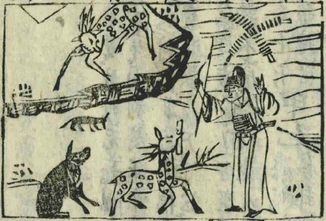
- 圖中：官人射鹿，鹿啣文書，錢一堆在水中，一鼠一豬。
- 卦圖象解：
	- 一、官人射鹿：自亂陣腳。
	- 二、鹿啣文書：財訊至也。
	- 三、錢一堆在水中：得財遇險之象。險中求財，憂心忡忡也。
	- 四、一鼠一豬：遇子、亥年吉，肖鼠人陰謀，肖豬人黑心。
	- 又可以子、亥為孩，亦即孩無子為亥，缺子象。又六字不全，亥月凶，無尾凶，不足六歲，為五歲凶死。
	- 天機象：犬、豬、牛、羊：叱之即去。雞、魚、鵝、鴨：欲用則不生。

### 人间道——无妄

- 上一卦[《地雷复》](#《地雷复》（一世）坤上%20震下（六合）#人间道——复)——下一卦[《山天大畜》](#《山天大畜》（二世）艮上%20乾下#人间道——大畜)

> [!引申] 
因復於道，合於正理，則无妄，故復之後受以无妄。卦乾上震下，此言動以天則為无妄，如動以人慾則生妄矣。故无妄之義大也。

- 无妄：元，亨，利，貞，其匪正有眚（shěng），不利有攸往。
	- 无妄即至誠也。至誠為天道。天能化育萬物，生生不息，且各正其性，此无妄也。人如能合於无妄之道，則能與天地合德，故大吉，君子行無妄之道，能致大吉，須戒在堅心，如失貞，則致災。今人本無邪心，但如不合正理，則妄亦邪心也。
- 《彖》曰：
	- 无妄，剛自外來而爲主於内。動而健，剛中而應，大亨以正，天之命也。
		- 動以天則无妄，今人動以人慾。剛自外而入主於內，乃以正去妄之象。上健而下動，內動而外健，其動乃剛，理正氣壯，道乃大亨，此天道也。今人動之以慾，而無法示誠於外，不夠剛明，乃因內不實，此致妄矣。
	- 其匪正有眚，不利有攸往，无妄之往，何之矣。天命不祐，行矣哉？
		- 无妄，即正也，小失於正，乃妄。入於妄，不知復，乃更往，則必悖天理，為天道所不容，不可行也。
- 《象》曰：天下雷行，物與无妄，先王以茂對時育萬物。
	- 雷行天下，陰陽和而成聲，生發萬物，各正性命，其發而无妄，先王觀此象，體天之道，養育人民，使各正性命，乃對時育物之道也。
- 初九：无妄，往吉。
	- 初進陽剛在內，以无妄之天理行之於外，故往吉。
	- 《象》曰：无妄之往，得志也。
		- 无妄乃誠也，人之至誠，物無不動，君子以之修身則身正，以之治事則得理，以之待人則人化，无往不利也。
- 六二：不耕穫（huò），不菑畬（yú），則利有攸往。
	- 人之欲即妄，理之自然者，非妄，今以耕穫喻之，農（nóng）耕後之穫，乃理之自然也。田一歲為『菑』，三歲曰『畬』，有耕而有穫，有菑而有畬，聖人順時而作，乃為聖也，讀易之人，能知時順勢，得易之道矣。
	- 《象》曰：不耕穫，未富也。
		- 心念於始耕菑之時，乃為求畬，此所以為富。心有欲而為，則妄。故易言人之行但求合於自然，不為人欲所動，故能勝己之欲為大勇也。
- 六三：无妄之災，或繫之牛，行人之得，邑人之災。
	- 人之妄動，由己之欲也，妄動有得，亦必有失，陰柔居相位，動乃因妄，失之大在欲，故妄得之福，災亦隨之，妄得之得，失亦來之，皆非真得也。
	- 《象》曰：行人得牛，邑人災也。
		- 有得有失，不足言得。聖人之得，乃無欲而得，不言有失。
- 九四：可貞，无咎。
	- 四位剛而居之，剛則必無私，永不生妄。
	- 《象》曰：可貞无咎，固有之也。
		- 堅心守无妄之道，剛而無欲，則无災。
- 九五：无亡之疾，勿藥有喜。
	- 九五為尊位，以陽剛應之，下又以陽剛中正順應，則致善也。即令有小疵，不須去治而自癒，如持之以恆，則平安無災，戒之在動，一動生妄，故人君之无妄道即在此。
	- 《象》曰：无妄之藥，不可試也。
		- 人有妄必改，則致无妄，今反以藥治之，反成妄矣。故不可試。
- 上九：无妄，行有眚，无攸利。
	- 此位為卦之極，无妄已至善，人至無妄，又復行，理必過也。過於理，則生妄。
	- 《象》曰：无妄之行，窮之災也。
		- 无妄已為極點，今又復加進，乃生妄矣，故窮極而生災也。

## 《火雷噬嗑》（五世）离上 震下

~~~
 【本卦】
▆▆▆▆▆▆▆▆▆     子孙已巳火
▆▆▆   ▆▆▆     妻财己未土   世
▆▆▆▆▆▆▆▆▆     官鬼已酉金
▆▆▆   ▆▆▆     妻财庚辰土
▆▆▆   ▆▆▆     兄弟庚寅木   应
▆▆▆▆▆▆▆▆▆     父母庚子水
~~~
日中为市之卦，颐中有物之象。
判曰：噬嗑者，啮也。上下相合，物在颐间，饮食之事，聚会相延，财爻持世。求之不难。所为事理，内外俱安。

### 卦象——此卦蘇秦説六國，卜得之，後為六國丞相。

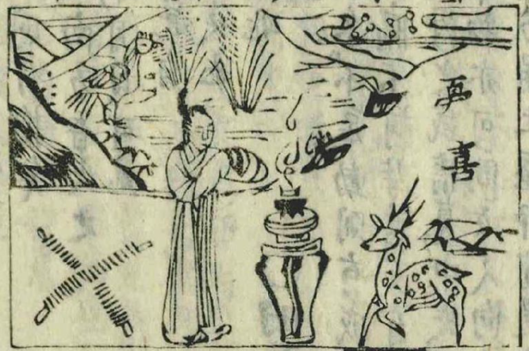
- 圖中：北斗星，婦人燒香拜，憂字不全，喜字全，一雁食稻，一錢財，一鹿。
- 卦圖象解：
	- 一、北斗星：君王也，夫君也，公職也。
	- 二、婦人燒香拜：妻於人事無助，乃求助於天。
	- 三、憂字不全喜字全：乃無又喜象。
	- 四、一雞食稻：果被食，無果也。
	- 五、一錢財、一鹿者：於財祿事憂心忡忡也。
	- 六、禽：字解為『離多會少』之象。

### 人间道——噬嗑

- 上一卦[《风地观》](#《风地观》（四世）巽上%20坤下#人间道——观)——下一卦[《山火贲》](#《山火贲》（一世）艮上%20离下#人间道——贲)

> [!引申] 
觀之後而有來合者，所合者，噬嗑也。故為觀之序。卦才中有一剛居，意為口中有物隔其上下，不得嗑狀，必咬之則得嗑，故稱噬嗑，以此理推而天下事，如天下有強梗或讒（chán）邪阻隔其間，使天下事不得合，當用刑法。小則懲戒，大則誅戮以除去，使天下得治。古今萬物皆合而後遂成，如未合必有間阻，若君臣、父子、親人、朋友有怨隙者，因讒言在其間也，除之則合，是故間隔為天下之大害。聖人體噬嗑之道，知此為天下之大用，能去天下之阻間，唯刑與罰。此卦二體明照而威鎮，乃用刑之象。

- 噬嗑：亨，利用獄。
	- 此即天下之事不能亨通，乃因有間阻，非刑獄何以除之。
- 《彖》曰：
	- 頤中有物，曰噬嗑，噬嗑而亨。
		- 如口中有物阻，必用力嗑之，乃能亨通象。用獄之道，所以察情偽，得其情，則知為間之道，而後可以設防與致刑。知噬嗑之道，乃知去間之道，而天下亨通。
	- 剛柔分，動而明，雷電合而章。
		- 此卦才有剛有柔，分而不雜，為明辨之象。察獄之本即明辨，動而以明，震下離上，其動因明也。照與威並行，為用獄之道。人能照，則無隱情，有威則無人不畏，故照與明並用也。
	- 柔得中而上行，雖不當位，利用獄也。
		- 此言治獄之道，如全剛則傷於嚴暴，過柔則失於宽縱。以仁而居剛得中正，則得用獄之道。
- 《象》曰：雷電，噬嗑，先王以明罰敕法。
	- 雷威而電明，聖人觀雷電之象，效法其明與威，而立刑罰法令。法之精神乃在教明事理而設防也。
- 初九：屨（jù 屦）校滅（miè 灭）趾，无咎。
	- 最下位，下民之象，為受刑之人，用刑之始，罪小刑輕，以木械傷其趾，則不敢進惡矣。此即因小懲而有大戒。小人之福，即在此。
	- 《象》曰：屨校滅趾，不行也。
		- 因小罪而小用木械傷其趾，則因懲而不再進為惡也。
- 六二：噬膚（fū 肤）滅鼻，无咎也。
	- 二居中而得正，是用刑得中正象。如此罪惡易服，然遇剛強之人，刑之必须深痛，故致滅鼻而无災。
	- 《象》曰：噬膚滅鼻，乘剛也。
		- 此用刑於剛強之人，不得不深痛，乃有戒也。
- 六三：噬臘（là）肉遇毒，小吝，无咎。
	- 本身不正又用刑於人，則人不服而怨對反駁，如食臘肉遇毒，反傷於口。此雖有小議，但無大災也。
	- 《象》曰：遇毒，位不當也。
		- 受刑之人難（nán）服，乃因其用刑之人位不當也。今之他國人在本國犯罪，即見之。
- 九四：噬乾胏（fèi），得金矢，利艱貞，吉。
	- 九四乃居近君之位，乃意愈大，則用刑必重。至此得剛直之道，可克艱其事，又因貞固本身操守，且執意行之，則无咎。
	- 《象》曰：利艱貞吉，未光也。
		- 此時，乃有不足，故雖堅心，但仍未光大也。此貞亦艱也。
- 六五：噬乾肉，得黃金，貞厲，无咎。
	- 因五乃居君位，至尊故勢大，以此刑下，較易如吃乾肉，故為君之道，時天下之間阻物大，須得中而剛，心懷危懼，持續下去，方吉。
	- 《象》曰：貞厲无咎，得當也。
		- 當正位，以剛而能守正又慮危，故無災。
- 上九：何校滅耳，凶。
	- 受刑之極，乃起因於惡之積也，其凶可知。小惡不懲，必成大惡。
	- 《象》曰：何校滅耳，聰不明也。
		- 人之為惡不悟，積其惡以致極大，至此何教之？今之人聰而不明，不知止惡於初，教正以刑，乃至大惡。

## 《山雷颐》（游魂）良上 震下

~~~
  伏 神        【本 卦】
              ▆▆▆▆▆▆▆▆▆     兄弟丙寅木
子孙辛巳火     ▆▆▆   ▆▆▆     父母丙子水
              ▆▆▆   ▆▆▆     妻财丙戌土   世
官鬼辛酉金     ▆▆▆   ▆▆▆     妻财庚辰土
              ▆▆▆   ▆▆▆     兄弟庚寅木
              ▆▆▆▆▆▆▆▆▆     父母庚子水   应
~~~
龙隐深潭之卦，迁善远恶之象。
判曰：颐者，养也。谨言节食，能养其身。震动艮止，万物皆春。恶事消散，不害于人。

### 卦象——此卦張騫尋黄河源，卜得之，乃知登天位也。

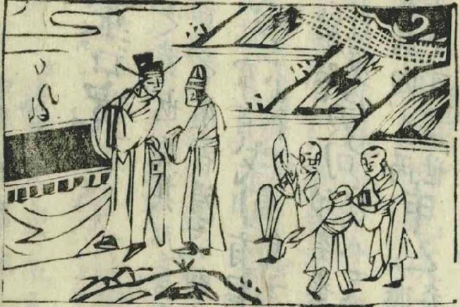
- 圖中：雨下，三小兒，日當天，香案，金紫官人引一人。
- 卦圖象解：
	- 一、雨下：受恩澤也。
	- 二、三小兒：乃合心之象，有德之國也。
	- 三、日當天：君明之象。父全。
	- 四、香案：求取之象。
	- 五、金紫官人：天子身側之人。
	- 六、引一人：提攜，推薦（jiàn）也。

### 人间道——颐

- 上一卦[《山天大畜》](#《山天大畜》（二世）艮上%20乾下#人间道——大畜)——下一卦[《泽风大过》](#《泽风大过》（游魂）兑上%20巽下#人间道——大过)

> [!引申] 
萬物畜聚之後，必有所養，無養不成，故頤者，養也，次大畜之序卦。上艮下震，乃上止而下動，外實中虛象，如人頷頤物於口中象。人之口所以飲食，乃能養人之身，此為頤。此論頤養之道，大至於天地養萬物，聖人養賢，人之養生，養形，養德，養人，養才，皆屬頤養之道。

- 頤：貞吉，觀頤，自求口實。
	- 頤之養人，君子觀之，自求口實之道，乃養君子。口不實又不知養，小人。
- 《彖》曰：頤，貞吉，養正則吉也，觀頤，觀其所養也，自求口實，觀其自養也。天地養萬物，聖人養賢以及萬民，頤之時大矣哉！
	- 吾人所養之人及養生之道，皆不外自求口實，皆以正則吉。聖人養賢，使之為天位，使之食天祿，為求賢才施惠於天下。此養賢即養萬民也。
- 《象》曰：山下有雷，頤。君子以慎言語，節飲食。
	- 以象言，雷震於山下，萬物根動而萌芽，此天地養之象。君子知口所以養身，故慎言語以養其德，節制飲食以養身。
- 初九：舍爾（ěr）靈龜，觀我朵頤，凶。
	- 龜之性，能咽息不食，可以不求養於外，故為靈，即明智，而人口腹之慾既動，則必失所養，故凶。
	- 《象》曰：觀我朵頤，亦不足貴也。
		- 人之動為慾，即使有剛健之才，再明智，終亦必失，故不足貴也。
- 六二：顚頤，拂經，于丘頤，征凶。
	- 養之道正，在以上養下，天子養天下，養臣子，臣食君祿，皆以上養下。今女不能自處必從男，陰不能獨立必從於陽，此二爻不能自養反求下之陽剛，故為顛倒，拂違常理，故不可行。丘即上九，為在外而高之物，故往而必凶，此即意示人之才不足以自養，見在上位勢足養人，即非同類之君子，妄往求之，取辱必矣。
	- 《象》曰：六二征凶，行失類也。
		- 征而從上，又非其類，故人求非同類，必得凶矣。
- 六三：拂頤，貞凶，十年勿用，无攸利。
	- 邪柔又動之不正，違反頤之正道，故凶。十為數之終，故終不可用，無所往而利。
	- 《象》曰：十年勿用，道大悖也。
		- 此戒之終不可用，凡人邪而柔，又欲動，反正道大也，此戒之。
- 六四：顚頤，吉，虎視眈眈，其欲逐逐，无咎。
	- 陰柔居大臣之位，陰柔不足以自養，如何養天下？今如與初陽剛相應，而柔順於初陽之賢正，吉。故如己之才不足以養天下，但知求在下之賢而順從之，亦可吉也。但須養其威嚴，眈眈如虎視，以免因己才之陰柔不足養，而受人輕視，造成犯上。但亦須注意所須用者，必逐逐相繼而不缺，若唯取於人又不能繼，困窮至矣。
	- 《象》曰：顚頤之吉，上施光也。
		- 吾人能顛倒求養而又吉者，皆得自陽剛以濟應其事，故能施光明于天下。
- 六五：拂經，居貞吉，不可涉大川。
	- 君位乃養人者，但其質如陰柔，即才不足以養天下，而能順從於陽剛（師）之賢，賴其以濟天下，必須有居安篤信之心，全般信賴，則可輔其身，德澤天下，故吉。但此種狀況可依賴賢能之人於平時，不可於有困艱（jiān）生變故之時，否則招凶。
	- 《象》曰：居貞之吉，順以從上也。
		- 居上位之吉處，乃因能篤信委任剛賢之人，來養天下。
- 上九：由頤，厲吉，利涉大川。
	- 此以陽剛之德，任師之職，君位從而篤信，天下得養也，但須夕惕若厲，戒慎恐懼，方能濟天下之危，故利涉大川。
	- 《象》曰：由頤厲吉，大有慶也。
		- 若上九之大任能謹言慎行，安居已位，不妄圖權利，則必福慶至矣。

## 《山风蛊》（归魂）艮上 巽下

~~~
  伏 神        【本 卦】
              ▆▆▆▆▆▆▆▆▆     兄弟丙寅木   应
子孙辛巳火     ▆▆▆   ▆▆▆     父母丙子水
              ▆▆▆   ▆▆▆     妻财丙戌土
              ▆▆▆▆▆▆▆▆▆     官鬼辛酉金   世
              ▆▆▆▆▆▆▆▆▆     父母辛亥水
              ▆▆▆   ▆▆▆     妻财辛丑土
~~~
三虫食血之卦，以恶害义之象。
判曰：蛊者，事也。干父之体，任用于先，三虫在器，阴害相连。厌昧之事，其疾难痊。求谋欲起，虑恐相干。

### 卦象——此卦伯樂療馬，卜得知馬難治，見三蠱同器皿也。

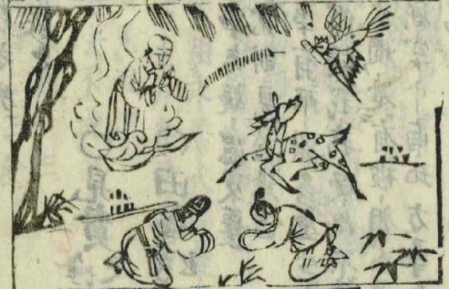
- 圖中：孩兒在雲中，雁啣書，一鹿、一錢，男女相拜。
- 卦圖象解：
	- 一、孩兒在雲中：有天官促成也。不求名利之人。
	- 二、雁啣書：有消息至。
	- 三、一鹿：有大利也。
	- 四、錢在空中：此心中圖利之象也。
	- 五、男女相拜：男女相合，此為利而結合，非正婚也。

### 人间道——蛊

- 上一卦[《泽雷随》](#《泽雷随》（归魂）兑上%20震下#人间道——随)——下一卦[《地泽临》](#《地泽临》（二世）坤上%20兑下#人间道——临)

> [!引申] 
因喜而隨人者，必有事，無事何喜何隨？故蠱以次隨也。山下有風，風在山下，遇山而回，使物亂，是為蠱象，蠱者，壞亂也。長女下於少男，長幼無序也，其亂可知。此卦象言成蠱之因，卦才專言，治蠱之道。

- 蠱：
	- 元亨，利涉大川。
		- 蠱之大者，乃時之艱難險阻，能有治蠱之才，則必亨通。
	- 先甲三日，後甲三日。
		- 甲為十干之首，意言事之始也。先甲三日，乃言治蠱之道，應先思其事之原，再思其事之後，乃知救弊之道。亦強調慮之深，推之遠也。能善於救者，則前之弊可革，能善親備者，則後利長久。此聖人之治蠱道。今人不明聖人先甲後甲之誡，慮淺而事近，故勞於救亂，亂不革，功未及成，弊已生矣。
- 《彖》曰：
	- 蠱，剛上而柔下，巽而止，蠱。
		- 以卦而言，男雖少但居上，女雖長而在下，尊卑得正，上下顺理，治蠱之道也，故以巽順之道治蠱，是以元亨。
	- 蠱，元亨，而天下治也。利涉大川，往有事也。
		- 自古治亂者，能使尊卑上下之義正，在下為巽順，在上有才能安定萬事，如此則天下大治。如正遇天下壞亂之時，持治蠱之道而往濟之，利也。
	- 先甲三日。後甲三日，終則有始，天行也。
		- 有始必有終，終之後必有始，此天道也。聖人體始終之道，故能於事之始而探究其所以然，能於事之終而備其將然，此先甲後甲之慮，故能治蠱而天下亨。
- 《象》曰：山下有風，蠱，君子以振民育德。
	- 山下有風，風遇山而回，致物皆散亂，故為有事之象。君子觀有事之象，在己則養德，在天下則濟民，君子所事此二者為最大。
- 初六：幹父之盎，有子，考无咎，厲終吉。
	- 庶民之道，即子幹父蠱之道。子能居其位而知正，則無災，不然，則為父之累，故必惕厲為戒，終吉。初六為最下之道，故言子與父之關係。
	- 《象》曰：幹父之蠱，意承考也。
		- 子幹父蠱之道，意在能承擔父事，常懷惕厲，只敬其事，盡誠於父，則終吉。
- 九二：幹母之蠱，不可貞。
	- 婦人本陰柔，若子只顧強伸己陽剛之道，反逆之，則傷恩，所害大也，唯有屈下己意柔順將成，使之身正而事乃治，故曰不可貞。如同陽剛之道輔柔弱之君，須盡誠竭忠致使其於中道即可，不會有大做為的。
	- 《象》曰：幹母之蠱，得中道也。
		- 居臣位，不過剛，乃得幹母蠱之道完整者。
- 九三：幹父之蠱，小有悔，无大咎。
	- 九三乃以陽剛之才居相位，克盡所事，雖以剛過而小有悔，但終無大災，但如以事親之道，則並非善事親之人也。
	- 《象》曰：幹父之蠱，終无咎也。
		- 此因剛而明斷之才，雖剛因不失正，故終無災。
- 六四：裕父之蠱，往見吝。
	- 此柔順之才而以正道處事，只能自守其道而已，若遇非正之事，因柔順之本質，而無法矯正，故不能而招罷斥。
	- 《象》曰：裕父之蠱，往未得也。
		- 柔順之才，守於寛裕之時可以，如要前行，則不可得也，再加其任務，必不能勝任之。聖人知柔順之才可以守成，但不可用於發展，委之重任，必不成也。
- 六五：幹父之蠱，用譽。
	- 此君位之人但質柔，但下應九二陽剛之位，意其能用陽剛之才為臣，但因本實陰柔，故可為承其舊業，而不能為開創事業之才。自古創業之事，非剛明之才不足以成事。不能用剛賢之人，只可以守舊袓業而已。
	- 《象》曰：幹父用譽，承以德也。
		- 陰柔之君主，能承下陽剛之才，以在下位之賢而能用之，乃因此而聲譽顯。
- 上九：不事王侯，高尚其事。
	- 上九乃居蠱之終，乃無事之地，處事之外。此應賢人君子不遇於時，應高潔（jié）自守，不可曲道以遁時，此進退合於道者也。
	- 《象》曰：不事王侯，志可則也。
		- 不臣事於王侯，因知無法施其志，此乃賢能之人，此可以為法則也。小人皆可曲道而順行，背己逆天，只圖權力名位，此不可法也。

# 坎宫八卦——属水

## 《坎为水》（纯卦）坎上 坎下（六冲）

~~~
 【本卦】
▆▆▆   ▆▆▆     兄弟戊子水   世
▆▆▆▆▆▆▆▆▆     官鬼戊戌土
▆▆▆   ▆▆▆     父母戊申金
▆▆▆   ▆▆▆     妻财戊午火   应
▆▆▆▆▆▆▆▆▆     官鬼戊辰土
▆▆▆   ▆▆▆     子孙戊寅木
~~~
船渡重滩之卦，外虚中实之象。
判曰：坎者，陷也。逢流则注，遇坎则止。出入艰难，随坎不已。阴愁伏匿，共相谋计，千里辞家，始免迍（zhūn）否。

### 卦象——此卦唐玄宗避祿山，卜得之，果身出九重也。

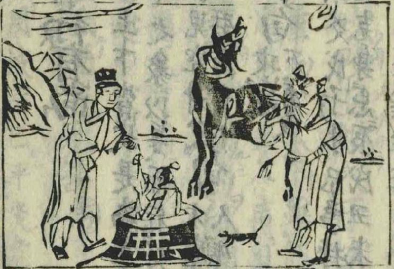
- 圖中：人在井中，人用繩引出，一牛一鼠，人身虎頭。
- 卦圖象解：
	- 一、人在井中：官司，牢獄，陷入險地象。
	- 二、人用繩引出：責人出手相救狀。
	- 三、一牛：勞苦也，春夏凶，秋冬吉，亦肖牛人。
	- 四、一鼠：肖鼠人，陰謀暗害者，暗藏也。
	- 五、人身虎頭：有權威之人，貴人也。

### 人间道——坎为水

- 上一卦[《泽风大过》](#《泽风大过》（游魂）兑上%20巽下#人间道——大过)——下一卦[《离为火》](#《离为火》（纯卦）离上%20离下（六冲）#人间道——离为火)

> [!引申] 
大過之後，過至極必陷，坎者，陷也。重坎即重險，險中有險，此卦專論處險之道，如何用險等。

- 習坎：有孚，維心亨，行有尚。
	- 陽實（shí）在中，乃中有孚信，惟心誠正一，則能亨通，俗謂：至誠可以通金石，入水火，有何險難不可亨？故出險之道在於誠一而行，否則常居險中也。
- 《彖》曰：
	- 習坎，重險也，水流而不盈，行險而不失其信。
		- 習有重覆之意，上下皆坎，即險中有險，水流而不盈，即動於險中仍未出險之時，吾人行險须不失其信，乃可吉。
	- 維心亨，乃以剛中也。行有尚，往有功也。
		- 以剛中之道，抱持至誠之內實，天下何所不通，若止而不行，則常居險中也，故坎險以能行為功。
	- 天險不可升也，地險山川丘陵也，王公設險以守其國。險之時用大矣哉！
		- 天之險乃因高不可升，地之險為山川丘陵，諸王公觀坎之象，知險不可陵越，故設高牆深地為險，以守其國，保其人民，此用險之時也。人間亦然，凡知人之學，分尊卑，分貴賤，區分小人與君子，皆為用於杜絶災殃，限隔上下，此都是體悟了險之用也。
- 《象》曰：水洊（jiàn）至，習坎，君子以常德行，習敎事。
	- 水勢就下，由小而大，歷久不變，君子觀坎水之象，取其有常，不變其德性為真。如人之德行常變，則偽也。政治上發令行教，必使民熟於聞，人人皆從之，故有謂三令五申，即此意。
- 初六：習坎，入于坎窞（dàn），凶。
	- 初以陰柔居坎險之下，因無援，處不當，不能出險，唯益陷深而已，故凶。
	- 《象》曰：習坎入坎，失道凶也。
		- 由險中而加陷入險，乃失正道，加凶。
- 九二：坎有險，求小得。
	- 二爻位，乃陽陷二陰之中，即至險而有險狀，但其本為剛中之才，故雖未出險，亦可自救，不至於愈險，故君子處艱險而能自得，皆因剛中而已。能剛則有才，能執中則動不失所宜。
	- 《象》曰：求小得，未出中也。
		- 此即雖有小得，雖不致於陷險，然亦未能出險狀。
- 六三：來之坎坎，險且枕，入于坎富，勿用。
	- 六三位在坎險之時，以陰柔居而處不正，走下則入險，向上則重險，故有進與退皆遇險，居又有險，枕乃處不安狀，此時唯戒勿用方是。
	- 《象》曰：來之坎坎，終无功也。
		- 以陰柔又處不正，動則唯益險，人出險须有道，如失道，但為能求去，只益增困窮而己。
- 六四：樽（zūn）酒，簋（guǐ）貳，用缶，納約自牖（yǒu），終无咎。
	- 此言大臣當險難之時，唯有至誠於君，不可停交往，而又能打開使君能明之心，則可保无災。人欲求上之篤信，只有求質實而已，如多禮儀而尚服飾，反凶。一樽之酒，二簋之飯，以瓦缶為器，乃求質實之意。再處明之地以明君之心，如此方能入君心，即令艱險，亦可無咎。自古以來，只求剛直攻訐（jié）直言不諱之人，多忤逆君心，而屬温厚明辨者，反而能入君心，改變君主。
	- 《象》曰：樽酒簋貳，剛柔際也。
		- 但求實質，又剛中有柔，必平安。君臣之交能長久，不外乎誠實而已。
- 九五：坎不盈，衹。既平，无咎。
	- 此即九五之尊，有剛中之才，可以濟險，但下無助，獨依君之力無法濟天下之險，則有咎，必待盈平，方可無咎。
	- 《象》曰：坎不盈，中未大也。
		- 剛中之才得居君位，時天下險難，但未至全險，其未能平險，乃因君臣無法協力相濟之故，故此君道未能救濟天下，乃因無臣，故曰不稱其位。
- 上六：係用徽纆（mò），寘（zhì）于叢（cóng）棘，三歲不得，凶。
	- 此意陰柔而深陷險中，聖人以牢獄比喻，縛以徽纏，囚置於叢棘之中，其不能出，至少三年不可免，其凶如此。
	- 《象》曰：上六失道，凶三歲也。
		- 上六以陰柔而處險地，乃因其失道而成。其災延三年不得免，意久也。

## 《水泽节》（一世）坎上 兑下（六合）

~~~
 【本卦】
▆▆▆   ▆▆▆     兄弟戊子水
▆▆▆▆▆▆▆▆▆     官鬼戊戌士
▆▆▆   ▆▆▆     父母戊申金   应
▆▆▆   ▆▆▆     官鬼丁丑土
▆▆▆▆▆▆▆▆▆     子孙丁卯木
▆▆▆▆▆▆▆▆▆     妻财丁巳火   世
~~~
船行风横之卦，寒暑有节之象。
判曰：节者，止也。天地得节，四时所成。节以制度，俭以丰盈。内忧外悦，不出户庭，于身谨节，无不康宁。

### 卦象——此卦是孟姜女送寒衣，卜得之，知夫落亡不吉之兆。

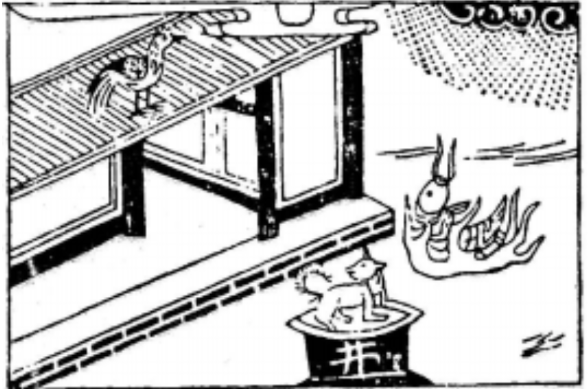
- 圖中：大雨下，火中魚躍出，雞在屋上，犬在井中，屋門開著。
- 卦圖象解：
	- 一、大雨下：陰暗不明，凶象。
	- 二、火中魚躍：飛騰而徒勞無功，又餐飲業。
	- 三、雞在屋上：酉年肖雞人，解救之時與人。
	- 四、犬在井中：招陷，動彈不得，不知節制而招如此。
	- 五、屋門開著：仍可開張，须雞人來助大吉。

### 人间道——节

- 上一卦[《风水涣》](#《风水涣》（五世）巽上%20坎下#人间道——涣)——下一卦[《风泽中孚》](#《风泽中孚》（游魂）巽上%20兑下#人间道——中孚)

> [!引申] 
渙者散也，物不可以終散，必當節止，故渙之後以節卦為序。此卦「澤」上有「水」，澤為有限之水地，如再置水，當滿不容，故有節制之象。

- 節：亨，苦節，不可貞。
	- 節之道，在有制，萬事如知節，必可亨。節之貴在中庸，如限制太過則苦，如節至於苦，必不可常久也，人事如此。
- 《彖》曰：
	- 節亨，剛柔分，而剛得中。
		- 節之道能致亨通，乃因知剛柔並濟，能剛又且能適中，此節之能亨。
	- 苦節不可貞，其道窮也。
		- 如節之致於苦極，必無法堅固守志，則節道必招困窮也。
	- 説以行險，當位以節，中正以通。
		- 此以卦才言，外險內悦，以能悦且又知止，此為節之大義，常人於悦時不知止，遇艱險方思止。當位居尊之人如明節之道，必能中正且亨通矣。今人之權力欲望無盡，居尊不思止，悦而無限，終必至凶，乃不知節之道，明矣。
	- 天地節而四時成，節以制度，不傷財，不害民。
		- 天地之間有節道故四季分明，聖人觀之知立制度，以為節道，所以必不傷財害民，此法治觀念之始，聖人立此道，即因知人之欲望無限，故以節制之，免流於人治，必因私欲，而終致勞民傷財。
- 《象》曰：澤上有水，節，君子以制數度，議德行。
	- 澤之容水有限，故節。君子觀之，知節以制度來限制，下定義來區分君子小人之行為。
- 初九：不出户庭，无咎。
	- 陽剛之性居節之初，必不能節，如居門庭之內，則可無咎。
	- 《象》曰：不出户庭，知通塞也。
		- 不出户庭可以無咎，但須知外之言與行，必以時來定進退之機。
- 九二：不出門庭，凶。
	- 剛陽之性，居陰柔之位，爻義為，處陰且不正之人居當節之時，不知節必合於中道，過與不及皆非節，如此即令不出門庭，亦會招凶。
	- 《象》曰：不出門庭凶，失時極也。
		- 時之義在易中最為重要，不知節之義，又居節之時，失其時，因不合中道之節，過與不及皆不對，即令不出門庭，亦有凶矣。
- 六三：不節若，則嗟若，无咎。
	- 三爻本剛，今陰柔居之，須剛斷而柔性之人居其位，因其柔順，且知自節乃可順於義行，亦可以無過。
	- 《象》曰：不節之嗟，又誰咎也？
		- 知節可以免過失，故不知自節而招禍，又能怪誰呢？
- 六四：安節，亨。
	- 陰居陰位，其正位，於節時，即居高位且有節之象，能安於此，則亨通。
	- 《象》曰：安節之亨，承上道也。
		- 能行節之中道，且安居於此，必亨通義。
- 九五：節，吉，往有尚。
	- 九五尊位，乃居節時之主位，能甘之如飴，盡節之道，必吉，功大矣。
	- 《象》曰：甘節之吉，居位中也。
		- 君王能知節道，用節且甘如飴（yí），必成大功，因其居尊位故也。
- 上六：苦節，貞凶，悔亡。
	- 上六乃居節之極，其必因節致苦，如堅守不改則必凶，終致亡而悔，易之節卦悔亡，與他卦之悔亡，辭同但意不同也。
	- 《象》曰：苦節貞凶，其道窮也。
		- 因節致苦，不知變，失易之神，其凶乃因道之窮盡。

## 《水雷屯》（二世）坎上 震下

~~~
  伏 神        【本 卦】
              ▆▆▆   ▆▆▆     兄弟戊子水
              ▆▆▆▆▆▆▆▆▆     官鬼戊戌土   应
              ▆▆▆   ▆▆▆     父母戊申金
妻财戊午火     ▆▆▆   ▆▆▆     官鬼庚辰土
              ▆▆▆   ▆▆▆     子孙庚寅木   世
              ▆▆▆▆▆▆▆▆▆     兄弟庚子水
~~~
龙居浅水之卦，万物始生之象。
判曰：屯（zhūn）者，难也。象迍（zhūn）之时，动则难生，如常之事，先易后争。时方屯难，切忌远行，婚姻即吉，谋望不亨。

### 卦象——此卦季布遇難，卜得之漢推其忠，乃赦其罪。

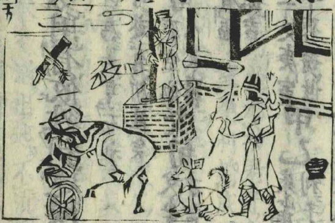
- 圖中：人在望竿頭立，車在泥中，犬頭上回字，人射文書，刀在牛上，一合子。
- 卦圖象解：：
	- 一、人在望竿頭上立：此不明局勢之屯難時也，不可妄動也。
	- 二、犬上回字：乃肖狗之人，狗年，狄姓之人，果為哭之象。
	- 三、車在泥中：進退兩難之象。刀在牛上：解也，牛為貴人象。
	- 四、人射文書：張姓，小人阻礙也。射：同音，色也，緋聞。
	- 五、牛不順道：背道而馳，反其道而為之，吉。
	- 六、人望：人亡也。
	- 七、人立：在位也。
	- 八、盒：先成後破。
	- 九、牛回頭視犬：計無所出，待也。
	- 卜得此卦：動於險中，先成後破也。

### 人间道——屯

- 上一卦[《坤为地》](#《坤为地》（纯卦）坤上%20坤下（六冲）#人间道——坤为地)——下一卦[《山水蒙》](#《山水蒙》（四世）艮上%20坎下#人间道——蒙)

> [!引申] 
雲雷之興，陰陽始交，而未成澤，故為屯，如成澤則為解，此卦動於險中，乃屯之義，如陰陽不交則否，此時機乃天下屯難，未亨泰之時也。

- 屯：元、亨、利、貞，勿用有攸往，利建侯。
	- 此義處屯之時必貞固（堅心），須明非獨力能成，必廣資助，此利見侯之義。不可往，唯利建侯。
- 《彖》曰：
	- 屯，剛柔始交而難生，動乎險中。
		- 剛柔始交而未通暢，則難屯，難生，於此之時，如動即往，乃取險之道。
	- 大亨貞，雷雨之動滿盈，
		- 此言屯有大亨之道，得陰陽交而和洽，則成雷雨，充滿天地之間，此因貞固才能出屯。
	- 天造草昧，宜建侯而不寧。
		- 天時造出地上之草，亂而無序，此暗昧不明時，須建立輔助，可以有助矣，此聖人之戒。
- 《象》曰：雲雷，屯。君子以經綸。
	- 水未能成雨為雲象，君子觀屯象，知須立法規範來經營此時。
- 初九：盤桓，利居貞，利建侯。
	- 初而陽爻居下，意乃剛明之才，當屯難之時，而居下位。此時未便往濟，故盤桓。如遽（jù）進，則犯險遇難。此即示人處屯難時，須守正方是，現今之人，鮮少人於屯難之時守正。聖人戒之於屯時。
	- 《象》曰：
		- 雖盤桓，志行正也。
			- 聖人處屯時，雖有濟屯之志，仍盤桓不動，因時未至也。此居下位之念。
		- 以貴下賤，大得民也。
			- 初陽之剛健，居陰之下，此易以貴下賤之象。即處屯之時，陰柔不能存，唯一陽剛之才，則眾所歸從也。更加此人能自處卑下，所以大得民心。
- 六二：屯如邅如，乘馬班如，匪寇，婚媾，女子貞不字，十年乃字。
	- 此陰爻之柔居屯世。受逼於初剛健之人，故柔處屯時，無法自濟，又受下之陽剛所逼，為難為也。非理而至者為寇，柔守中正不苟合於初剛之意，須十年久久乃通。
	- 《象》曰：六二之難，乘剛也。十年乃字，反常也。
		- 此六二患難，因柔，又居屯時，又有下之陽剛所逼，此患難乃因柔而生，須十年，難久必過。如反其柔之常性，而與陽剛合，則省十年，十為數之終也。
- 六三：即鹿无虞，惟入于林中，君子幾，不如舍，往吝。
	- 此陰爻居三之陽位，此意柔居剛而不中正，則必妄動，貪於所求，必不足自濟，此不安之源。如入山林射鹿，又無嚮導，此不安也。君子見事於微，捨而勿逐，如往取，徒取其咎也。
	- 《象》曰：即鹿无虞，以從禽也，君子舍之，往吝窮也。
		- 事因欲而妄動，此貪禽也。處屯之時，不可動而動，凶也。君子捨之不從，則無咎，如往必困窮也。
- 六四：乘馬班如，求婚媾，往吉，无不利。
	- 此以柔順居近於君位，此得之於上者，而才不足以濟屯時，須求賢自輔，則往而利矣。此即居公卿之位，己之才不足以濟屯難之時，若能求在下之賢人，親而用之，則必平安有利。
	- 《象》曰：求而往、明也。
		- 知己才之不足，往而求賢，以濟己之不足、此乃真明也。
- 九五：屯其膏，小貞吉，大貞凶。
	- 五居尊位得正，當屯時，若有剛明之才為位，則利。如無，則屯其膏，此因無良臣，而施為有所不下於民，民未得其德澤，乃因威權不在己之故也。此屯因威權已去而妄想瞬間正回，此求凶之道。须以渐正之，方吉，如不為會因當屯時不改，以至於亡矣。
	- 《象》曰：屯其膏，施未光也。
		- 膏澤不下及，此人君之屯也，乃因威權不在之象。
- 上六：乘馬班如，泣血漣如。
	- 六此以陰柔居屯之終，此險之極而無援，居之不安，動無所向，此窮厄之極，若陽剛而有助，即屯至極，亦可平安互濟矣。
	- 《象》曰：泣血漣如，何可長也。
		- 如於屯難窮極，而莫知所為，則至泣血顛沛，則必不長久。

## 《水火既济》（三世）坎上 离下

~~~
  伏 神        【本 卦】
              ▆▆▆   ▆▆▆     兄弟戊子水   应
              ▆▆▆▆▆▆▆▆▆     官鬼戊戌土
              ▆▆▆   ▆▆▆     父母戊申金
妻财戊午火     ▆▆▆▆▆▆▆▆▆     兄弟己亥水    世
              ▆▆▆   ▆▆▆     官鬼己丑土
              ▆▆▆▆▆▆▆▆▆     子孙已卯木
~~~
舟楫济川之卦，阴阳配合之象。
判曰：既济，合也。水火相遇，会合之义。往渡得船，成功必济。所求必从，所从必遂。斯不失时，谓之既济。

### 卦象——此卦季布在周家潛藏，卜得之，遂遇高皇帝

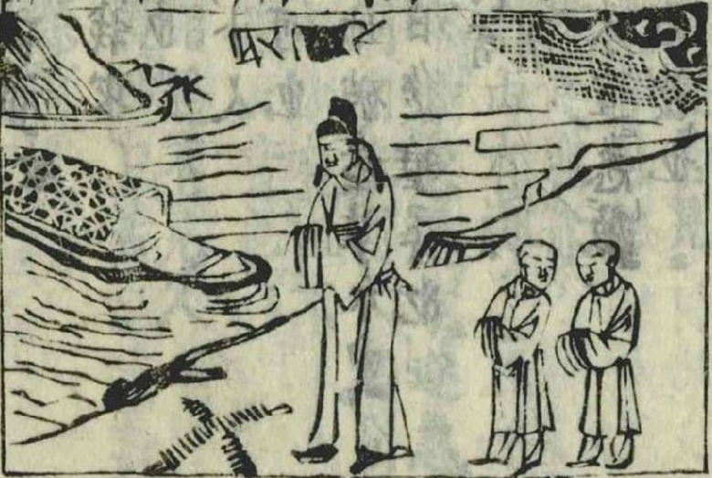
- 圖中：人在岸上一船來，一堆錢，雲中雨下，二小兒在雨中行，文書一策。
- 卦圖象解：
	- 一、人在岸上：泣也，等待也，無目的也。
	- 二、一船來：接引至也。
	- 三、一堆錢：財祿無用也，憂心忡忡也，有竊象，抄家之象。
	- 四、雲中雨下：陰中有果也，夜間至凌晨時。
	- 五、二小兒：主喜也，二人也，二人雨中行也。
	- 六、文書一策：證件，命令也，資料也。

### 人间道——既济

- 上一卦[《雷山小过》](#《雷山小过》（%20游魂）震上%20艮下#人间道——小过)——下一卦[《火水未济》](#《火水未济》（三世）离上%20坎下#人间道——未济)

> [!引申] 
小過乃過於物，能過於物，必能相濟，故受之以既濟。此卦，水在上，火在下，火水相交，則能為用，能互為用，即為既濟，此卦言，天下萬事，己互濟之時也。

- 既濟：亨小，利貞，初吉，終亂。
	- 既濟之時大事必能亨通，然須知小事亦须亨通，方可為吉，必須所有事皆吉，否則濟至極時，終亂。
- 《彖》曰：
	- 既濟亨，小者亨也。利貞，剛柔正而位當也。
		- 陰陽能皆得位，故為既濟，但須無所不亨，乃可也，且貞固守之。
	- 初吉，柔得中也。終止則亂，其道窮也。
		- 其以柔順文明之中道，故可成既濟之功，至既濟之極，若不知變通，必生亂，其亂之生乃因道至盡窮。
- 《象》曰：水在火上，既濟，君子以思患而豫防之。
	- 水火即交，各有其用，為互濟，時當既濟，君子觀象知於既濟之時，必先思慮患害之生，使不至成禍患也。自古以來，天下由治而亂，乃皆因居治不思亂時之戒。
- 初九：曳其輪，濡其尾，无咎。
	- 倒曳輪，使不再進。獸之涉水，必舉高其尾，使尾不濕方可進，無災至。
	- 《象》曰：曳其輪，義无咎也。
		- 於既濟大吉之時，能知止進，則必不至極時，故必無咎也。
- 六二：婦喪其茀，勿逐，七日得。
	- 陰居正位，得五君位應，其志必得遂行，但中正之道，不可廢也，猶婦人出門用茀遮己今喪其茀，則不行，能自守不失，道必復也。待時之至。
	- 《象》曰：七日得，以中道也。
		- 因中正之道非不可用，乃時之未至，於此時自守其中，俟時至必能行矣。
- 九三：高宗伐鬼方，三年克之，小人勿用。
	- 以剛居剛位，居既濟時，其君主威武必令民心服。但若專肆威武，必令民心忿而不服，殘害人民，貪人民之富，故有小人勿用之戒，因惟小人其威武必為滿足其私欲，君子戒之。
	- 《象》曰：三年克之，憊（bèi）也。
		- 既濟之時，必濟天下，於高宗可也，乃因其心為民，道必正，如為己之私欲，則三年民必疲憊而終忿矣。
- 六四：繻（xū）有衣袽（rú），終日戒。
	- 四近君位，陰柔居之，乃適其任，當既濟之時，須如行舟，戒之滲漏，始漏則塞以衣物，且終日戒懼不怠，則必可免患。
	- 《象》曰：終日戒，有所疑也。
		- 當既濟之時，必疑其患之將至，其戒懼之心如此，謹慎如此。
- 九五：柬鄰殺牛，不如西鄰之禴（yuè）祭，實受其福。
	- 九五至尊君位，陽剛人居此，當既濟之時，必以至誠信孚如祭祀之誠，則即令薄禮之祭，也可勝於豐厚之祭，由其至誠之心使然也。易之不重形，而重神，此明而顯矣，故論易須知時，方可得易之神明矣。
	- 《象》曰：東鄰殺牛，不如西鄰之時也，實受其福，吉大來也。
		- 既濟之時，能得時者，即令薄祭，亦可有大吉之福至，此言時之可貴也。
- 上六：濡其首，厲。
	- 既濟至極時，必不安而危，今陰柔居之，居坎險之上，即既濟之終，小人居之，其敗壞必立可見矣。
	- 《象》曰：濡其首厲，何可久也。
		- 藭（qióng）盡之須以水淋其首，其必不可長久也。

## 《泽火革》（四世）兑上 离下

~~~
  伏 神        【本 卦】
              ▆▆▆   ▆▆▆     官鬼丁未土
              ▆▆▆▆▆▆▆▆▆     父母丁酉金
              ▆▆▆▆▆▆▆▆▆     兄弟丁亥水   世
妻财戊午火     ▆▆▆▆▆▆▆▆▆     兄弟己亥水
              ▆▆▆   ▆▆▆     官鬼己丑土
              ▆▆▆▆▆▆▆▆▆     子孙己卯木   应
~~~
豹变为虎之卦，改旧从新之象。
判曰：革者，改也。改故就新，变易之道。交易其所，君子豹变。时有不遇，并宜改革。守旧则凶，从新则吉。

### 卦象——此卦彭越戰項王絶糧時，卜得之，遂能承恩改革也。

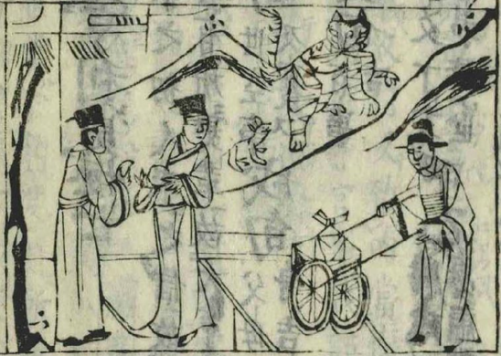
- 圖中：一人把柿全，一人把柿不全，一兔虎，官人推車，車上一印，在大路上。
- 卦圖象解：
	- 一、一人把柿全，乃人肺腑之言。
	- 二、一人把柿不全，一人半真言也。
	- 三、一兔：躍進之象。
	- 四、一虎：威權之象，大人之象，肖虎也。
	- 五、官人推車有一印：如為武官，則訟至。今為文官帶印，主得掛印封帥，須力求變革，果必成。丈夫推車，乃求婚也，帶印必成。
	- 六、虎兔向山行：賢良大人退，後繼有人躍進同行。
	- 七、山頭四點：上位之人，黑暗不明之象。
	- 八、大路：轉變為新且順之象。

### 人间道——革

- 上一卦[《水风井》](#《水风井》（五世）坎上%20巽下#人间道——井)——下一卦[《火风鼎》](#《火风鼎》（二世）离上%20巽下#人间道——鼎)

> [!引申] 
井之為用，在甘潔寒洌，如中有穢物，任其存之必敗，清之則必潔，此乃革之義，故井後，革為其序。此卦澤在上，火在下，乃水能滅火，火亦能涸水之象，人能外悦而內明，乃革之真義。

- 革：巳日乃孚，元亨利貞，悔亡。
	- 革之道，在變其故舊，始初人必未能遽信，必俟至巳日乃人心信從。革之道在求變故後能亨通，但須誠正利於天下，乃能去故從新，不因有大變而生悔。
- 《彖》曰：
	- 革，水火相息，二女同居，其志不相得，曰革。
		- 水火互息互滅，次女少女同居一室，其志不同，其所歸各異，如革也，有生變異之象。
	- 巳日乃孚，革而信之。文明以説，大亨以正，革而當，其悔乃亡。
		- 革之雖變，始初不令人信，但如以正道，日久乃信。能明且悦，則能盡事之理，無事不察，人心和順，必致大亨，此革之至當，必不生悔。
	- 天地革而四時成，湯武革命，順乎天而應乎人，革之時大矣哉！
		- 天地有變革後，乃能生成四時寒暑，萬物因其時節而生。王者之與，能上順天命，下應人心，改舊去新，得易之神，此革之時義大也。
- 《象》曰：澤中有火。革，君子以治歷明時。
	- 水火相消滅，為革道，除舊佈新，君子觀革之象，乃知推演歷數，知日月星辰之變，以明四時之序，則終能合於天地。
- 初九：鞏（gǒng）用黃牛之革。
	- 變革之事為大事，必有時機，有人才，有其地位，謀慮而後動，則可無侮矣。猶如用黃牛之皮來侷束，但求自固而守，不求任意妄動之義。
	- 《象》曰：鞏用黃牛，不可以有爲也。
		- 初革之時，但求能自固守其位，不可妄求有功。
- 六二：巳日乃革之，征吉，无咎。
	- 陰居陰位，乃得才適用之時，此際足以去天下之弊乃上輔於君，行其正道而革之，吉而無災也。
	- 《象》曰：己日革之，行有嘉也。
		- 時至人信乃革之，動則有喜慶。如時至而不動，則必無濟世之心，必因失時而生悔矣。
- 九三：征凶，貞厲。革言三就，有孚。
	- 九三相位，居下卦之上，上有君，於此以陽剛之勢而力革時，乃過於燥動，行之必有凶。但如慎戒敬懼，守貞正之道，知順從公論，行革不為人疑出於私利，則吉，因眾必孚服而順。
	- 《象》曰：革言三就，又何之矣。
		- 革之道經再三察合，知順乎天理，乃事之至當，何須再往呢？
- 九四：悔亡，有孚，改命，吉。
	- 此即以剛處柔位，近君側之人，剛柔互濟，於革之時，行以至誠，致令上信下順，其吉必矣。
	- 《象》曰：改命之吉，信志也。
		- 能改命致吉，必上下能順從信服方成，因至誠感召也。
- 九五：大人虎變，未占有孚。
	- 九五至尊之君，能以中正之道，居革之時，乃能力革之，其必昭著天下，不須占決，知其行為之至當，天下必信。
	- 《象》曰：大人虎變，其文炳也。
		- 事理之明如虎紋之明盛，則天下無不信服。
- 上六：君子豹變，小人革面，征凶，居貞吉。
	- 革之終時，君子必從革後而大變，於至善，小人昏愚難變，即令心智未化，但其面已改，從上之教導。天下之事於始革必艱難，至革成，則患無法自守，故於此須戒之守貞堅志，則果必吉。
	- 《象》曰：君子豹變，其文蔚也。小人革面，順以從君也。
		- 君子變革後，其更精進，如文采之蔚盛。小人因於革，不敢為惡，唯外飾臣服，以從君道，此革道成功矣。

## 《雷火丰》（五世）震上 离下

~~~
 【本卦】
▆▆▆   ▆▆▆     官鬼庚戌土
▆▆▆   ▆▆▆     父母庚申金   世
▆▆▆▆▆▆▆▆▆     妻财庚午火
▆▆▆▆▆▆▆▆▆     兄弟己亥水
▆▆▆   ▆▆▆     官鬼己丑土   应
▆▆▆▆▆▆▆▆▆     子孙已卯木
~~~
日丽中天之卦，背暗向明之象。
判曰：丰者，大也。日中见斗，幽而不明，此事适大，隐映其形。水中见日，无所取呈。求财未得，事卒难明。

### 卦象——此卦莊周説劍，臨行卜得之，果得劍也。

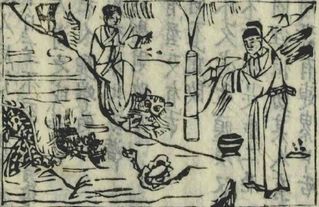
- 圖中：竹简灰起，龍蛇交錯者，官人著衣裳立，一合子，人吹笙竿，腳踏虎。
- 卦圖象解：
	- 一、竹简灰起：簡姓，竹有順象，堅節不變之象，灰起，中空之象。
	- 二、龍蛇交錯：辰巳之年，正邪相爭，蛇虺乃毒謀暗算也。
	- 三、官人著衣裳立：官人、倌人、丈夫也，藏於內也。
	- 四、一合子：先成後破。
	- 五、人吹笙竿：閒情逸志，主喜事臨門。
	- 六、腳踏虎：臨危不亂也，險在下也。
	- 七、旱沼之旁：心力交瘁也。
	- 八、池中無水：旱象，破財也。
	- 九、珠落盤中：先聚後散也。

### 人间道——丰

- 上一卦[《雷泽归妹》](#《雷泽归妹》（%20归魂）震上%20兑下#人间道——归妹)——下一卦[《火山旅》](#《火山旅》（一世）离上%20艮下#人间道——旅)

> [!引申] 
萬物與人能適得所歸，必能成大，故歸妹之後，受之以豐，豐有盛大之義，此卦上震下離，有內明外動之象，能以明而動，動而能明，此為致豐之道，是故明而能照，動而能亨，可以致豐大也。

- 豐：亨，王假之，勿憂，宣日中。
	- 豐之道，在能致亨通，能令天下百姓致豐，唯王者能。豐之道在令人民繁盛，事物豐發，有如日中之明，無所不照，則可以無憂。
- 《彖》曰：
	- 豐，大也，明以動，故豐。王假之，尚大也。
		- 豐之道，在論如何盛大，能明而動，必能成豐盛且大也。王者所追求之，為能及天下之大，致人民以豐，必可永保其治世之道。
	- 勿憂宜日中，宜照天下也。
		- 致豐之道，能如日中之盛明，普照天下，無所不及，如此則可無憂，而能保其豐大及永久也。
	- 日中則昃，月盈則食，天地盈虛，與時消息，而況於人乎？況於鬼神乎？
		- 日正當中，也有暗時，月滿之後亦有缺虧，天地之盈虛，靠時為消息，更何况乎人？何沉乎鬼神？此君子戒之在盛，知盛時须戒，方可長久。
- 《象》曰：雷電皆至，豐，君子以折獄致刑。
	- 電雷並行，乃明動相濟，成豐之象，君子觀明動之象，知用刑制法，在求明與威並行，君子能明則無折獄，慎於用刑。能立威則民服無怨。
- 初九：遇其配主，雖旬无咎，往有尚。
	- 初進之陽剛，居豐之時，知往有豐，雖非有君之對應，但有其左右高位之人能與同志，此往可吉也，所謂「同舟能共濟也」，此於豐之時，可得無咎也。
	- 《象》曰：雖旬无咎，過旬災也。
		- 聖人知時之所至，順時而為，能知降己以相求，若懷己之私意，必招患至。
- 六二：豐其蘚，日中見斗，往得疑疾，有孚發若，吉。
	- 六二乃柔將其位，又居明卦之中，為至明之才，但因所遇之君不明，而無法下求於己，若居豐時，意往而求其君能明己才，必招致猜妒疑惑。惟有盡己之至誠，以求其感而能發，則君之昏蒙可開，如此則吉矣。
	- 《象》曰：有孚發君，信以發志也。
		- 用己之至誠孚實，以求發上之知信，如可成，則吉必至矣。
- 九三：豐其沛，日中見沫，折其右肱，无咎。
	- 九三乃居相位有賢才之人，於豐時，卻不見明主之相應，其日之晦更甚於六二將位，故有如人之折肱無法於行，賢能之人有才，但無法發揮乃因君之不明，故無可歸咎也。
	- 《象》曰：豐其沛，不可大事也，折其右肱，終不可用也。
		- 豐之時，不見上用，無法成大事，猶人折其肱，終無法受重用。
- 九四：豐其薜（bì），日中見斗，遇其夷主，吉。
	- 九四為陽剛之人居君側大臣之位，遇君不明，其賢能陽剛受圍，如日中有缺晦，不得其用，亦無用也，故君子之才須得遇明主，方可有用能成濟世之功。
	- 《象》曰：豐其蔀（bù），位不當也。日中見斗，幽不明也。遇其夷主，吉行也。
		- 有才能卻受圍困，無法致豐，乃位不適當也。豐之時，又有幽暗之處必因君不明，臣位又不適當而造成。惟求遇明主，吉乃可行。
- 六五：來章，有慶譽，吉。
	- 陰柔居君之尊位，己之才不足，但知用下位章美之才，必有福慶，且有美譽故吉。
	- 《象》曰：六五之吉，有慶也。
		- 君位能吉，於豐之時，必可有吉慶及於天下。此因君能用才也。
- 上六：豐其屋，蔀其家，窺其户，闋（què）其無人，三歲不覿（dí），凶。
	- 上六居丰極之時，因處動之終，必燥動，人於丰盛之時，必假謙虛方吉。如不知戒盛，外丰其居，內不明，暗藏其家，又目中無人，三年又不知變，一意孤行，终自招凶。
	- 《象》曰：豐其屋，天際翔也，窺其户，闃（qù）其无人，自藏也。
		- 人處豐之極，不知謙卑，目中無人，猶鳥之翔於天際，不知己才之不足，居高自傲，必招人棄絶，其致如此，乃不知自藏也。

## 《地火明夷》（游魂）坤上 离下

~~~
  伏 神        【本 卦】
              ▆▆▆   ▆▆▆     父母癸酉金
              ▆▆▆   ▆▆▆     兄弟癸亥水
              ▆▆▆   ▆▆▆     官鬼癸丑土   世
妻财戊午火     ▆▆▆▆▆▆▆▆▆     兄弟己亥水
              ▆▆▆   ▆▆▆     官鬼己丑土
              ▆▆▆▆▆▆▆▆▆     子孙己卯木   应
~~~
凤凰垂翼之卦，出明入暗之象。
判曰：明夷者，伤也。火入地中，掩伤明德。君子在厄，三日不食。文王之难，困于丛棘。百凡谋望，且宜止息。

### 卦象——此卦是文王囚姜里，見子不至，卜得知，果子歿（mò）也。

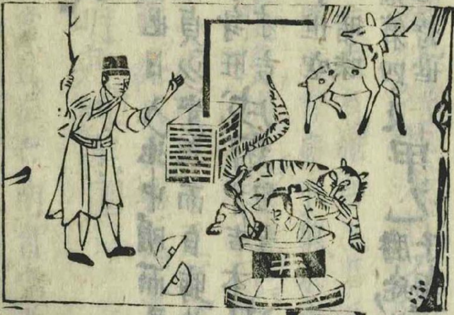
- 圖中：婦人在井中，虎在井上，錢破，人逐鹿，堠上有工尺，珠聚。
- 卦圖象解：
	- 一、婦人在井中：女人招災，或頸部災，家內有災。
	- 二、虎在外：外人虎視眈眈。
	- 三、錢缺：財傷也。
	- 四、人逐鹿：財失也，爭相為祿，逐鹿中原。
	- 五、堠在人鹿中：猴作梗也。
	- 六、「：尺也，工匠獨有，匠，將也，武官人。
	- 七、堠：不動也，尊位也，姓侯，肖猴。
	- 八、鹿回頭：回祿也，火災。
	- 九、人手上木枝：休象。
	- 見此課，必傷且凶矣。

### 人间道——明夷

- 上一卦[《火地晋》](#《火地晋》（游魂）离上%20坤下#人间道——晋)——下一卦[《风火家人》](#《风火家人》（二世）巽上%20离下#人间道——家人)

> [!引申] 
物進不已，必有所傷，故明夷為序卦，夷者，傷也，此卦坤上離下，乃明入地中之象，為晉之反卦，故義亦反，晉為明且盛，上明君下群賢並進之時。明夷乃暗君在上，明者見傷之時，日入於地中象。

- 明夷：利艱貞。
	- 君子處明夷之時，須知時之艱難，必求不失正道，方為君子。小人則阿諛奉承，唯利是圖，順附勢而為，不顧正道。
- 《彖》曰：
	- 明入地中，明夷，内文明而外柔順，以蒙大難，文王以之。
		- 君子處明夷之時，知明者必見傷，故求內明外順之態勢，應對大難之時，如此可內不失明，外又可遠禍患。易之妙即在此，卦之德本亦卦之解也。
	- 利艱貞，晦其明也，内難而能正其志，箕子以之。
		- 處艱難時，能知晦藏其明，不知藏晦，必生禍患，不能守正，必非賢人。
- 《象》曰：明入地中，明夷，君子以莅眾，用晦而明。
	- 君子觀明入地中，明夷之道，乃知不極其明察而用晦之道，於莅眾之時，如此必能容物和眾，眾親而安，猶水至清則無魚，人至明則無徒亦然。
- 初九：明夷于飛，垂其翼。君子于行，三日不食，有攸往，主人有言。
	- 明夷之初，乃見傷之始，暗君在上，陽剛之人不得上進，猶鳥飛而傷翼，小人害君子皆害其所以行。君子之人能見事於微末，始見傷，則避之，即令困窮亦退避之，取適之位而往，絶不以世俗之見而遲疑所行也。常人無法見傷於始，不知退避，至傷於己時，已不能退也。
	- 《象》曰：君子于行，義不食也。
		- 義之所至，即令困窮，亦不所為不正，故君子能安之於苦悶。
- 六二：明夷，夷于左股，用拯馬壯，吉。
	- 六二乃陰居陰位，得中正之德，順時知處，乃至善也。但處明夷之時，亦不免有所損傷，但須如馬之壯，可獲免傷而吉，如自處之道不壯，則傷之深矣。
	- 《象》曰：六二之吉，順以則也。
		- 順處且有原則，合於中正之道，故必能處明傷之時，而能保吉也。
- 九三：明夷於南狩，得其大首，不可疾貞。
	- 因上卦暗極，而又正居明之極，明即將與暗衝（chōng）突之時也。居此，君子必前進除害，以獲之魁首，為要務，至於舊疾敗俗，必不能立刻改變，須知渐進之道，教其渐改，如求劇革必令不安，非上策也。
	- 《象》曰：南狩之志，乃大得也。
		- 用下位之明，來除上位之暗，唯求目的在除害而已，如不然則為背亂之事也。
- 六四：入于左腹，獲明夷之心，于出門庭。
	- 此爻意陰邪之小人，處近君之位，乃以柔順附於君主時，為保其固交，乃以柔邪之法，隱敝之交而結於上。而君本陰邪之人，必受蠱惑其心，而行之於外。故君必求明，守正道，而不為小人所煽動，所利用也，即此。
	- 《象》曰：入于左腹，獲心意也。
		- 此以邪惡之陰道惑於君心，而逞其私慾，君為小人，必始終不悟也。
- 六五：箕子之明夷，利貞。
	- 此爻言暗傷至極，乃謂明見傷之主，若於此時顯示其明，必見傷害。要如箕子之知晦藏，則可免於難，若不知晦藏其明，則害大矣。
	- 《象》曰：箕子之貞，明不可息也。
		- 箕子知晦藏其明於暗傷之時，且能不失意志，同與陰暗之人合污，其明必能不滅，小人若受禍患所逼，必失其節守也。
- 上六：不明晦，初登于天，後入于地。
	- 明之至高而又傷於此時，本可遠照，今傷於明，必不明反昏悔，反失其道也。
	- 《象》曰：初登於天，照四國也，後入于地，失則也。
		- 始登於天，能明照四方，今傷於昏暗，反失其道。

## 《地水师》（归魂）坤上 坎下

~~~
 【本卦】
▆▆▆   ▆▆▆     父母癸酉金   应
▆▆▆   ▆▆▆     兄弟癸亥水
▆▆▆   ▆▆▆     官鬼癸丑土
▆▆▆   ▆▆▆     妻财戊午火   世
▆▆▆▆▆▆▆▆▆     官鬼戊辰土
▆▆▆   ▆▆▆     子孙戊寅木
~~~
天马出群之卦，以寡伏众之象。
判曰：师者，众也。独行越师，最不宜动。君子有命，小人勿用。共相克伐，政道成讼。

### 卦象——此卦周亞夫將欲排陣，卜得之，果獲勝。

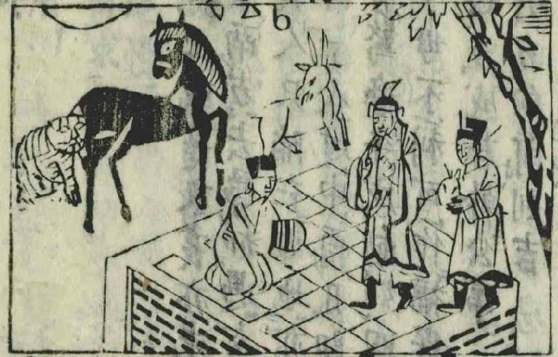
- 圖中：虎馬羊待命，將軍臺上立，一文一武綬印，人跪台上受印，棋盤在下。
- 卦圖象解：
	- 一、肖虎、馬、羊之人三合：可戰。
	- 二、文武二官綬印：得萬人服之帥。
	- 三、人立棋盤上：圍棋愈下愈多，但須有謀略方可成事。
	- 四、將軍臺上立：示有兵權也。生殺之專權也。武職大利。
	- 五、羊回首：回陽也，病危之人卜之，有自陰間回陽間之象。
	- 六、虎在馬後：為馬之靠山，馬因虎威而動。故馬回首視虎。

### 人间道——师

- 上一卦[《天水讼》](#《天水讼》（游魂）乾上%20坎下#人间道——讼)——下一卦[《水地比》](#《水地比》（归魂）坎上%20下坤#人间道——比)

> [!引申] 
師之興，因有爭議也。此卦本體上順下險之象，亦即地下有水，內外分即內險外順，有行險之道如何順行之義。水在地下必聚，如部隊之集結，如九五為一陽，餘為諸陰，則為天子之象，今九二為將位，統帥諸陰，則為將帥之象。此卦申明處師之時，內須戒慎警惕，不可掉以輕心，外須統一專權，命令如一，方能行順之義。

- 師：貞，丈人吉，无咎。
	- 此言，師之道必有正名，因師之與，天下萬民必傷，如不以正，則民心不從，致凶之道。丈人，即尊貴有眾望之人，故出師必立帥將，此人必民所聽從順同，不能服眾人，安得民心。如此則無災。故興師必有二道：正名與主將。
- 《彖》曰：
	- 師，眾也；貞，正也，能以眾正，可以王矣。
		- 師為帶眾之道，必以正，如能使眾人皆正，即可王天下。此用師之正道。
	- 剛中而應，行險而順。
		- 出師之將帥，須得君王之專信也。此王者之帥，民心從之，雖有險必順矣。
	- 以此毒天下，而民從之，吉又何咎矣。
		- 如從前面所論之師道下手，則雖因出師傷下之百姓，民仍從之，故吉而無災。
- 《象》曰：地中有水，師，君子以容民畜眾。
	- 水在地下相聚，為眾聚之象，君子之人須以包容民眾，為使民順從之法。
- 初六：師出以律，否臧凶。
	- 師之出，必以誅亂制暴而動，行師之道，须以律法，合於義理，如不按此法，即致勝亦凶。
	- 《象》曰：師出以律，失律凶也。
		- 師出必有律法，失律法，致凶之道。
- 九二：在師中，吉，无咎，王三錫命。
	- 此言九二之道，為為將之道，君之事為人臣絶無敢專權，但出師作戰之時，則將在外君命有所不從，君王須順從其命，以專信任之。
	- 《象》曰：在師中吉，承天寵也。王三錫命，懷萬邦也。
		- 人臣如無君之專寵，則不得專制之權，更何論成功。
- 六三：師或輿（yú 车）尸，凶。
	- 左次，乃知不可進而退。此言，師之常法，見可而進，知難而退，進退有據，平安無災。六四為陰爻，主陰柔，而師必以強勇，中有陰柔，即兵家之風、林、火、山同義。
	- 《象》曰：左次，无咎，未失常也。
		- 言師之道，退亦未必為失道，退須得宜，無災。
- 六五：田有禽，利執言，无咎。長子帥師，弟子輿尸，貞凶。
	- 五為君之位，此為興師之主，此君主興師任將之道。師之興，必以生民受災，蠻（mán）夷賊寇，此正名以誅之。如禽獸之入於田中，害五穀，於義宜獵（liè）取，則獵取之，如此之動，則吉。如無禽獸入田，則出不因禽，凶。此有禽之義。
	- 《象》曰：長子帥師，以中行也，弟子輿尸，使不當也。
		- 任將授師之道，必以長子帥師。此長子義，非定為真長子，而示意為任用可信任之如長子者，可以為帥，以其專任後之權必大，故必有信：方可。若以眾人主之，無主將帥之師，雖名正出師於義，亦凶道也。
- 上六：大君有命，開國成家，小人勿用。
	- 師之終極，言功之成也。此時君主以爵位財祿賞賜有功之人，並任用之。但於軍旅征戰中，查覺出之小人，不能因其有功而任用之，致凶之道。
	- 《象》曰：大君有命，以正功也。小人勿用，必亂邦也。
		- 君王有持恩賞之權柄，来表揚軍旅之功，小人雖亦有賞，用之必亂邦，史上小人持功而亂邦，有太多案例了。

# 艮宫八卦——属土

## 《艮为山》（纯卦）艮上 艮下（六冲）

~~~
 【本卦】
▆▆▆▆▆▆▆▆▆     官鬼丙寅木   世
▆▆▆   ▆▆▆     妻财丙子水
▆▆▆   ▆▆▆     兄弟丙戌土
▆▆▆▆▆▆▆▆▆     子孙丙申金   应
▆▆▆   ▆▆▆     父母丙午火
▆▆▆   ▆▆▆     兄弟丙辰土
~~~
游鱼避网之卦，积小成高之象。
判曰：艮者，止也。纯艮危危，安静无亏。时止则止，时移则移。钱财散失，失在小儿，寻求不得，东北宜之。

### 卦象——此卦是漢高祖困榮陽時，卜得知，只宜守舊。

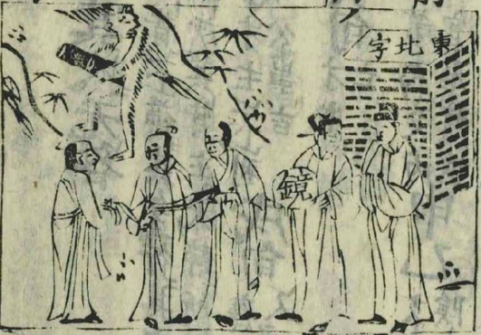
- 圖中：堠上東北字，猴執文書，官吏執鏡，三人繩相繫縛
- 卦圖象解：
	- 一、堠上東北字：候也，停滯等候也，陳姓。
	- 二、猴執文書：候其時，待公文命令至也。
	- 三、官吏執鏡：清明之法官，政治清明。
	- 四、三人繩相繫縛：三人相牽連招訟事也。

### 人间道——艮为山

- 上一卦[《震为雷》](#《震为雷》（纯卦）震上%20震下（六冲）#人间道——震为雷)——下一卦[《风山渐》](#《风山渐》（归魂）巽上%20艮下#人间道——渐)

> [!引申] 
震乃動也，物之動其終必止，艮，止也，故為震之序卦。此卦上下皆艮，艮為山，故有安重堅實之象，外內皆止，皆靜，此止於其所也。人能知安於止，則得艮之道也。

- 艮其背，不獲其身，行其庭，不見其人，无咎。
	- 艮為止之道，人之不知止，乃私欲作為，背為不見之處，如不能見，則無欲以亂其心志人能忘我，則止矣，今人見利則欲據為己有，失止之道。知止之道，則可無咎也。
- 《彖》曰：
	- 艮，止也，時止則止，時行則行，動靜不失其時，其道光明。
		- 艮之道，言止也，動靜之間不以時，失止之義也，君子貴乎時，時可行則行，時之義於君子，則重視之，人能不失時，知所進退，道乃光明。
	- 艮其止，止其所也。上下敵（dí）應，不相與也。
		- 艮止之道，其功在能止於適止之所，此唯聖人能成之。此卦上下二體皆為山，有因同而相敵應也，互相背而不相與也。
	- 是以不獲其身，行其庭不見其人，无咎也。
		- 相背而不見，行不見其人，則欲無處生則能止，能止則無咎也。
- 《象》曰：兼山，艮，君子以思不出其位。
	- 上下皆山，故為兼山，乃重艮之象，君子觀艮止之道，知思安於所止，不越其本位。
- 初六：艮其趾，无咎，利永貞。
	- 初六居最下，乃足趾之象，趾乃人動之最先，於始動即知止，必可無咎，且須患己之性陰柔，故戒之在堅心守道。
	- 《象》曰：艮其趾，未失正也。
		- 能止於始初，必易，乃不失正也。
- 六二：艮其腓，不拯其隨，其心不快。
	- 陰居陰位，得止之正道，然居二位為猶人之腿肌位，股動則肌動，二雖正道，然受三爻之影響，即中正之道，無法救助於上位時，唯勉而隨之，因言不聽道不隨，故其心不快。
	- 《象》曰：不拯其隨，未退聽也。
		- 上位之人，未能從下意，不須救助之，唯隨之可也。
- 九三：艮其限，列其夤（yín），厲薰心。
	- 九三陽剛居陽位，乃意其剛極而使上下分隔，不復進退，其堅強如此，則必造成獨限一隅，而世人不相與，故無法安定其心。故止之道，貴在時宜，行止之間必以時，則吉。
	- 《象》曰：艮其限，危薰心也。
		- 堅固己之剛性，不能因時知進退，必有危懼生其心內也。
- 六四：艮其身，无咎。
	- 居君側之人，位高權重，然於艮止之時，當止而不能止，乃因君位過陽剛，不能信孚於臣位之人，居此際，惟自止其身，可無咎，但如臨施政，則生咎矣。意即在上位之人只能獨善其身，必無可取也。
	- 《象》曰：艮其身，止諸躬也。
		- 居大臣之位，卻只能獨善其身，不能行止之道，乃不適其位也。
- 六五：艮其輔，言有序，悔亡。
	- 人之所當止者，唯言與行，今陰柔居君位，於止之時，其才不足任此位，如此則須言行一致，不可脱序，古言：君無戲言，即此，故雖己之才不足任此位，但謹言慎行，亦可無慮於敗亡。
	- 《象》曰：艮其輔，以中正也。
		- 君位之人能止於中道，言行不脱序於中正之道，即令無足之才能，亦可免禍故易示人之言行之重要如是。
- 上九：敦艮，吉。
	- 以剛陽之性居艮之終極，可見其止之道，性之堅實如此。常人於止之時，難於持久，晚節不保等事常見，人能敦厚知止，如此堅心，此所以吉也。
	- 《象》曰：敦艮之吉，以厚終也。
		- 人常於始能行止之道，至終則無法堅持到底，始終如一是易之神，艮致终能吉，乃因其能終守不變。

## 《山火贲》（一世）艮上 离下

~~~
  伏 神        【本 卦】
              ▆▆▆▆▆▆▆▆▆     官鬼丙寅木
              ▆▆▆   ▆▆▆     妻财丙子水
              ▆▆▆   ▆▆▆     兄弟丙戌土   应
子孙丙申金     ▆▆▆▆▆▆▆▆▆     妻财己亥水
父母丙午火     ▆▆▆   ▆▆▆     兄弟己丑土
              ▆▆▆▆▆▆▆▆▆     官鬼己卯木   世
~~~
猛虎负嵎之卦，光明通泰之象。
判曰：贲者，饰也。光彩烜赫，火色含丹，文章交错，应杂其间，进退荣益，束帛戋戋。

### 卦象——此卦管鮑卜得之，果獲全，彼此相遜，終顯名義也。

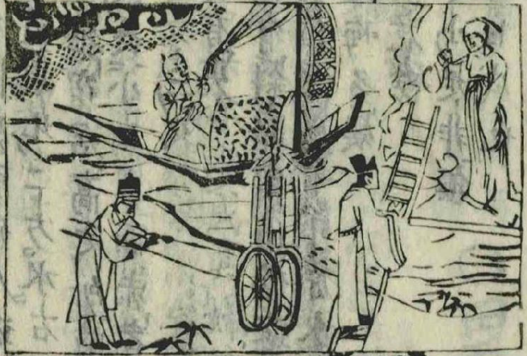
- 圖中：雨下，車行路，舟張帆江中，官人著公服登梯，仙女雲中執珪。
- 卦圖象解：
	- 一、雨下：滿也，潤澤也，成也。
	- 二、車行路：前往任官象，行走四方也。
	- 三、舟張帆在江中：此行順風大利也。
	- 四、官人著公服登梯：升遷在外地象。任公職主官外調象。丈夫從公職升官也。
	- 五、仙女雲中執珪：受陰人提攜象。

### 人间道——贲

- 上一卦[《火雷噬嗑》](#《火雷噬嗑》（五世）离上%20震下#人间道——噬嗑)——下一卦[《山地剥》](#《山地剥》（五世）艮上%20坤下#人间道——剥)

> [!引申] 
物之合後則必立文，文乃飾之意。賁者，飾也，故為之序。人因合聚則有威儀上下，物之合聚則必有次序行列。此卦山下有火，草木百物聚於山處，下有火，則能照見草木百物，且增益其光彩，有賁飾之象。

- 賁：亨，小利有攸往。
	- 物有外飾而後有立，但须有內實而加外飾，則可以亨。因文飾之道可以增加光彩，故必利於小進。
- 《彖》曰：
	- 賁亨，柔來而文剛，故亨。分剛上而文柔，故小利有攸往，天文也；文明以止，人文也。
		- 賁之道能亨，實由飾而來，飾之道，須來往以柔，求文飾以剛，名須正，故利小吉。賁飾之道，並非能增其內實，只外加文彩而已。今人但求外飾，不求內實，富侈表面，內無實才，比比皆是，上位者所用皆富有之人，此敗亡之初始象也。
	- 觀乎天文以察時變，觀乎人文以化成天下。
		- 天文，為日月星辰之錯列，四時寒暑之變化。人文為人理之倫序，觀人文以教化天下，此聖人用賁之道也。
- 《象》曰：山下有火，賁。君子以明庶政，无敢折獄。
	- 山下有火，草木為其明照而有光彩，此賁飾也。聖人觀此明照之象，以修明庶政，成文明之治，無敢於用文飾，掩飾實情，枉法不顧，故君子以用明為戒。
- 初九：賁其趾，舍車而徒。
	- 初九乃君子有剛明之德，居於下也。因其無位，無法施濟天下，唯求賁飾自己而已。君子修飾之道，在正其所行，守節處義，凡不正則寧不與同行。
	- 《象》曰：舍車而徒，義弗乘也。
		- 於義不可同行，寧舍車而步行。
- 六二：賁其須。
	- 外飾於物，無法改變其本質，須因其本質如何加飾，乃賁之道。
	- 《象》曰：賁其須，與上興也。
		- 須賁之道，須與上隨，隨上而動，動靜歸依於所主。
- 九三：賁如濡如，永貞，吉。
	- 賁之盛，須戒永正，則吉，因永正之心及行，很難維持。
	- 《象》曰：永貞之吉，終莫之陵也。
		- 如飾之變化多且非正，人所陵侮也，故戒之永正則吉。
- 六四：賁如皤（pó）如，白馬翰如，匪寇婚媾。
	- 賁外飾為白色，白馬亦為白色，但志不同，由外飾同，而終有婚遂相應也。今人之求門當户對也。
	- 《象》曰：六四當位，疑也；匪寇婚媾，終无尤也。
		- 四與一為應爻，六四當位時，中離間隔二三位，故疑也，但因一與四為正應，理直義勝，終必無災也。
- 六五：賁于丘園，束帛戔戔，吝，終吉。
	- 此雖君位，但本質陰柔，不足自守，但求外賁於設險守國，田園近城，山丘在外，據險而守，即令陰柔之質，受人裁制其外，雖君子吝之，但終平安。
	- 《象》曰：六五之吉，有喜也。
		- 君能從人以成賁之功，此吉有喜也。
- 上九：白賁，无咎。
	- 賁飾之極，則失於外偽，唯能質白於賁，則無過飾之災。故尚質素，不失其本真，千萬不可外飾過於華美而失其本質，此戒賁也。
	- 《象》曰：白賁无咎，上得志也。
		- 處賁之極，則有過華偽失實之慮，故戒之，以質素則可無災，飾不可過也。

## 《山天大畜》（二世）艮上 乾下

~~~
  伏 神        【本 卦】
              ▆▆▆▆▆▆▆▆▆     官鬼丙寅木
              ▆▆▆   ▆▆▆     妻财丙子水   应
              ▆▆▆   ▆▆▆     兄弟丙戌土
子孙丙申金     ▆▆▆▆▆▆▆▆▆     兄弟甲辰土
父母丙午火     ▆▆▆▆▆▆▆▆▆     官鬼甲寅木   世
              ▆▆▆▆▆▆▆▆▆     妻财甲子水
~~~
积小成高之卦，龙潜大壑之象。
判曰：大畜者，聚也。刚健笃实，积聚丰隆。居官食禄，建立其功。论讼有益。道理亨通。利涉大川，后吉先凶。

### 卦象——此卦昔神堯，卜得之，果登天位也。

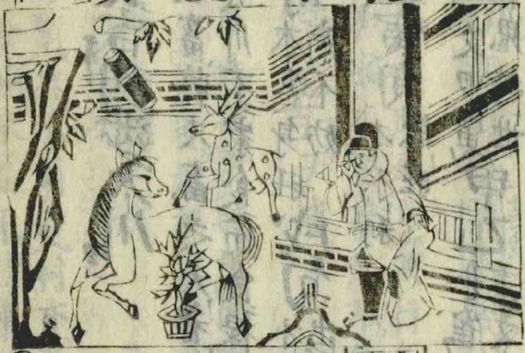
- 圖中：一鹿一馬，月下有文書，官人憑欄，盆內蒼發茂盛。
- 卦圖象解：
	- 一、一鹿一馬：祿馬交馳，大富之象。
	- 二、月下有文書：明而有往，中秋時節，文書在空中尚未到手。
	- 三、官人憑欄：無事狀，遥望所失之國度。又欄為木，人靠木，休也。棺也。
	- 四、花在盆中：有限也。
	- 此卦求官不利，求財大利。

### 人间道——大畜

- 上一卦[《天雷无妄》](#《天雷无妄》（四世）乾上%20震下（六冲）#人间道——无妄)——下一卦[《山雷颐》](#《山雷颐》（游魂）良上%20震下#人间道——颐)

> [!引申] 
無妄則至善，可以積畜，故大畜為序卦。畜為止，又為聚，止而後聚，此卦天至大，而在山中，有所畜至大之象。外止內健為畜象，吾人視萬物外則無欲，即止也。內則運行不斷，必有大積畜於其中。

- 大畜：利貞，不家食，吉，利涉大川。
	- 大畜於人亦同，人之畜在學術道德充積於內，乃至大之畜，若為邪端異（yì）説畜又何用？今人重大畜於錢財，不重視學術修養，所畜何用？不為大畜。
- 《彖》曰：
	- 大畜剛健，篤實輝光，日新其德。
		- 人须能剛健篤實，其畜乃大，又因充實而光辉，德必日新。
	- 剛上而尚賢，能止健，大正也。
		- 居尊位能剛明用賢，又能持之永恆，此大正之道。今之君王剛而不明，用人乃因私慾，而不以賢能為基準，故非大正之道。
	- 不家食吉，養賢也；利涉大川，應乎天也。
		- 大畜學術道德之人，施其所畜，利於天下，因而不在家食，乃吉。能涉大川而無險，乃應乎天地也。
- 《象》曰：天在山中，大畜，君子以多識（shí）前言往行，以畜其德。
	- 君子觀天之至大而畜山中，故知人之能畜大，乃由學而大，學之道在多聞古聖賢之言行，取長為己用，察言以求其內心，乃大畜之真義。
- 初九：有厲，利己。
	- 初爻為陽剛，必上進不已，則有危厲，此時，利在己之畜而不進，待與上合志乃動。
	- 《象》曰：有厲利己，不犯災也。
		- 此即不度局勢而進，不利己，乃災至。戒不可犯危而行。
- 九二：輿説輹。
	- 二為六五位所對應，雖陽剛但亦不可力進，進則如車輪脱軸，不得行也。
	- 《象》曰：輿説輹，中无尤也。
		- 至善為剛中，柔不可過柔，因位居下，仍不足以進。易之道，乃知所進退也。
- 九三：良馬逐，利艱貞，曰閑輿衛，利有攸往。
	- 三為相位，以剛健之才，能與上位合志而同進，就如良馬之馳，速也。唯雖速，但須切忌不可持才之健，而忘戒備（bèi）與謹慎也。
	- 《象》曰：利有攸往，上合志也。
		- 因能與上合志，故往而利也。
- 六四：童牛之牿，元吉。
	- 此言近君位之人，须上畜止人君之邪心，下畜止天下之惡。凡人之惡能止於初始，則易如童牛加桎梏。俟惡盛而後禁，必相隔而難勝。故聖人止惡於初。
	- 《象》曰：六四元吉，有喜也。
		- 大畜之道在止惡於初，此大善而吉，必能不勞而易治。
- 六五：豶（fén）豕之牙，吉。
	- 豬之去勢，則雖有牙，而剛躁必自止。君子體之，知天下之惡，不可力制之，須査其根本，不靠刑法嚴峻而能止惡。聖人教修政教，使人人足用，知廉恥之心，方為至善。
	- 《象》曰：六五之吉，有慶也。
		- 在上者止惡有道，乃天下福慶也。反用強力嚴刑與民為敵，傷又無功矣。
- 上九：何天之衢（qú），亨。
	- 大畜之道，能如行空中，橫行無阻，必散之天下，吉也。
	- 《象》曰：何天之衢，道大行也。
		- 道路空曠，而能大行，乃大畜之極也。

## 《山泽损》（三世）艮上 兑下

~~~
  伏 神        【本 卦】
              ▆▆▆▆▆▆▆▆▆     官鬼丙寅木   应
              ▆▆▆   ▆▆▆     妻财丙子水
              ▆▆▆   ▆▆▆     兄弟丙戌土
子孙丙申金     ▆▆▆   ▆▆▆     兄弟丁丑土   世
              ▆▆▆▆▆▆▆▆▆     官鬼丁卯木
              ▆▆▆▆▆▆▆▆▆     父母丁巳火
~~~
凿石见玉之卦，握土为山之象。
判曰：损者，益也。损上益下，后易先难。本非走失，事主忧官。必损而已，何以为安。

### 卦象——此卦薛仁貴將收燕，卜得之，大破燕軍。

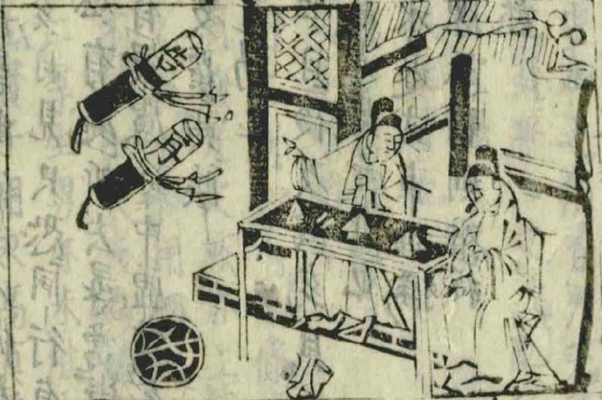
- 圖中：二人對酌，酒瓶倒案上，毬在地上，文書二策，有再告二字。
- 卦圖象解：
	- 一、二人對酌：二人夾木，來也。
	- 二、酒瓶倒案之：目前無指望也。
	- 三、毬在地上：所求不成狀。
	- 四、文書二策有再告二字：再次求，方成。
	- 居此之時唯求有益於人，乃得損之真道也，損其多餘，同志乃至。

### 人间道——损

- 上一卦[《雷水解》](#《雷水解》（二世）震上%20坎下#人间道——解)——下一卦[《风雷益》](#《风雷益》（三世）巽上%20震下#人间道——益)

> [!引申] 
解，散也，斥去也，其後必有所失，故損為序。此卦「艮」上「兑」下，山體高在上而澤體深在下乃有損下益上之義。如損上而益下，為益卦，取下而求益上，則為損，故居人上而施恩澤於下則益，如取下而求自足，乃損。

- 損：
	- 有孚，元吉，无咎，可貞，利有攸往。
		- 損之道須持之正理，來自誠正，則損因順理而至大善，此可吉也。堅固常行必利有所往。常人之損，有過或不及或不常皆不合乎正理。
	- 曷（hé）之用？二簋（guǐ）可用享。
		- 人間祭祀之禮，文繁節褥，常人多備祭品，聖人以儉為禮之本，示以至誠之心敬天，如求祭物過多，乃求飾其誠，實示人偽矣。故知凡人之慾望若有過者，其始初皆起於奉養，常久以後則成宮樓峻牆，酒池肉林，聖人有見於此，故先制其本以儉，故損之精義在損滅人欲以近乎天理而已。
- 《彖》曰：
	- 損，損下益上，其道上行。
		- 損之成，乃損下而益於上，故道乃上行。
	- 損而有孚，元吉，无咎，可貞，利有攸往。
		- 損之道在至誠，堅心如此，乃可盡損之道也。
	- 曷之用？二簋可用享，二簋應有時，損剛益柔有時。
		- 吾人應損去外在浮飾，使至誠見，萬事之始，必有長幼尊卑，然於事之末，往往已流於形式，損之時乃知何時須損剛益柔，此損之道必以時乃吉。
	- 損益盈虛，與時偕行。
		- 須損須益，求盈求虛，只隨時之一念而已，易之於時義於此可見。
- 《象》曰：山下有澤，損，君子以懲忿窒欲。
	- 君子觀損之象，以損己為上，修己之道在忿與欲上，能知損己之忿與欲，乃得真損之時義。
- 初九：已事遄往，无咎，酌損之。
	- 損之道，在損剛益柔也。今居下之人為益上，當以功與之，不求己居，事畢則速去，不求居功，乃能無過。若求享其功之美，此離損下益上之道，不可也。
	- 《象》曰：已事遄往，尚合志也。
		- 事畢後退居不居功，能與上合志也。
- 九二：利貞，征凶，弗損益之。
	- 剛中之人與君位柔性相應，居損時，用柔悦態度求應於上，則有失剛中之德，其動必凶，乃因不知堅心於陽剛也。此適足以損也。
	- 《象》曰：九二利貞，中以爲志也。
		- 九二陽剛之人能守中正之道，則何有不吉。志存乎中道，則必自正也。
- 六三：三人行，則損一人。一人行，則得其友。
	- 天下沒有獨一之人，必有二者，如男女之往，由其精一，故能生也。一陰一陽，無法加入故三人因志不專一，必生損一人，一人獨行，由其志為專，故必有一友能同其志，故天地之間損義之明且大哉，莫過於此。
	- 《象》曰：一人行，三則疑也。
		- 一人行而能得友，三人行則易生疑，於此時須明損之道，損去一人，乃損多餘。
- 六四：換其疾，使遄有喜，无咎。
	- 陰柔之人居損時，須自損以從陽剛中正之道，即損不善而從善，必有喜而無災。人之損過失，唯患不速，如速則此過必不至深，為可喜也。
	- 《象》曰：損其疾，亦可喜也。
		- 知損之道，得損之時，速去其不善，此可喜也。
- 六五：或益之，十朋之龜，弗克違，元吉。
	- 君王能柔順居尊位，處損之時，知虛中自損，順從在下陽剛之賢人，人君能如此，則天下人必從其德，咸以損己為美，故有眾民之公論助之，因合正理，即龜筮亦不相違，可謂大善之吉也。古云：「謀能從眾，則合天心。」
	- 《象》曰：六五元吉，自上祐也。
		- 人君能盡眾人之見，合於天地之理，天必降福祐也。
- 上九：弗損益之，无咎，貞吉，利有攸往，得臣无家。
	- 損道之終極，能居上而不損其下又益增在下之人，則天下莫不服從，人心歸順，無遠近內外之區限。
	- 《象》曰：弗損益之，大得志也。
		- 居上而不損下，又能增益之，君子必能遂行其志，故簡言之，君子之志，唯在如何益於人而已。

## 《火泽睽》（四世）离上 兑下

~~~
  伏 神        【本 卦】
              ▆▆▆▆▆▆▆▆▆     父母己巳火
妻财丙子水     ▆▆▆   ▆▆▆     兄弟己未土
              ▆▆▆▆▆▆▆▆▆     子孙已酉金   世
              ▆▆▆   ▆▆▆     兄弟丁丑土
              ▆▆▆▆▆▆▆▆▆     官鬼丁卯木
              ▆▆▆▆▆▆▆▆▆     父母丁巳火   应
~~~
猛虎陷井之卦，二女同居之象。
判曰：睽者，背也。志不相得，作事乖违。口舌相伴，财散人离。病者难瘥，行者不归。

### 卦象——此卦武則天聘尚賈至精魅成，卜此除之。

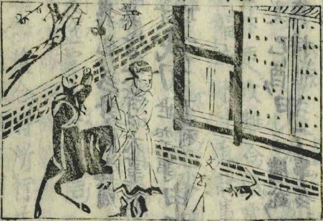
- 圖中：人執斧在手，文書半破，牛鼠，桃開鬥掩，雁飛鳴。
- 卦圖象解：
	- 一、人執斧在手：求快也，行刑之人，執法之人，有權柄也。
	- 二、文書半破：無望象，毁約也。
	- 三、牛鼠：秋冬吉，春夏凶。
	- 四、桃開：逃開也。
	- 五、門掩：牢獄之災，閉也，隔也。
	- 六、雁飛鳴：悲也，孤單也，報凶訊也。

### 人间道——睽

- 上一卦[《风火家人》](#《风火家人》（二世）巽上%20离下#人间道——家人)——下一卦[《水山蹇》](#《水山蹇》（四世）坎上%20艮下#人间道——蹇)

> [!引申] 
家之道到窮途，則生乖違離散，故睽卦為之序。此卦上火下澤，二體相違，此睽之義，二女三女同居一室，但所歸各異，乃因志之不同也。

- 睽：小事吉。
	- 睽違之道於小之事，可言吉。如與不良之人乖離，與不正之事違背也。
- 《象》曰：
	- 睽，火動而上，澤動而下，二女同居，其志不同行。
		- 睽，以卦才言火在上而動，澤在下位，此二物性反，其義猶二女三女其本志同而共處，及長所歸各異，其志不同也。
	- 説而麗乎明，柔進而上行，得中而應乎剛，是以小事吉。
		- 內悦順而又應乎外明，麗明居上，以柔求進，又能得中正之道相應，處睽之時雖無法去天下之睽，但於小處則吉矣。
	- 天地睽而其事同也，男女睽而其志通也，萬物睽而其事類也，睽之時用大矣哉！
		- 天上地下雖睽然天陽下降地陰上升而成萬物，其事本同也。男女之質不同，但互相求之志卻同也。天下萬物不同是暌，然皆稟天地之氣而成，則相同也。是故物雖異而其本同，聖人用睽之道，能令天下不同之群眾，合而為一，故其事大矣哉。
- 《象》曰：上火下澤，睽，君子以同而異。
	- 火在上，澤在下，二物之性相違，為睽象，君子觀睽而知於世俗所同者，有時須獨異於世人，中庸曰和而不流，即義此也。
- 初九：悔亡，喪馬勿逐，自復；見惡人，无咎。
	- 卦之初，即睽之始時，於睽時又剛動於下，其悔可知，於此時因不能行而喪其馬如勿逐則馬自復回。因睽時小人必眾，若棄之，則必天下而仇己乎？就會喪失坤德之含弘功能，乃致凶地。不但無法使之化善，更遑論能合之，故有必見惡人之議，所以自古以來能化姦邪為善良，去仇敵而為臣民者，皆因不拒絶見之。
	- 《象》曰：見惡人，以辟咎也？
		- 於睽時人情乖違，為求和合，若因其惡人而避之，則生眾仇於君子，故見惡人乃為避免怨咎之悔也。
- 九二：遇主于巷，無咎。
	- 睽違之時乃陰陽不合，且剛戾相對，即令為陽剛之中臣，當以委曲而婉轉之善道將就於主，期使之合，絶非求附君主而屈道相向也。
	- 《象》曰：遇主于巷，未失道也。
		- 此意即當以至誠以動君心，使明義理而能求相合，不可屈道迎逢，乃真未失道。今之小人明知不正，然於乖違，之時，只知迎合奉承，為求己利，枉顧正道，故因時局而戀志之人乃真小人也。
- 六三：見輿曳，其牛掣，其人天且劓（yì），无初有終。
	- 三爻位為下卦之上，本離下卦而求進於上，今逢四之剛為阻，而下二爻之陽剛於後，處此之時又逢乖違不和，猶牛車之行具，牛受掣阻於前，後有車輿在後，如以此狀況，又求力進，則必重傷於上，宜剛守中正之道與其對應，待睽終極之時必合，方為善處之道。
	- 《象》曰：見輿曳，位不當也，无初有終，遇剛也。
		- 見車牛之負掣後拖曳而行，知位所不當，聖人知理順行，知時而守，待遇剛而能合。
- 九四：睽孤，遇元夫，交孚，厲无咎。
	- 四爻近君位，君不與應，乃睽乖之時，故為孤，唯求與同德之人相合，且至誠相與交往，能如此，雖處危，但仍可無咎也。
	- 《象》曰：交孚无咎，志行也。
		- 睽乖之時，上下至誠相交，不止無咎，且其志必可行，故救睽之道，唯君子以陽剛之才，至誠相輔，何所不能濟也。
- 六五：悔亡，厥宗噬膚（fū），往何咎。
	- 陰柔又居尊位，於睽時，其危可知，然有九二陽剛之賢相輔，可以悔亡，且陽剛之賢又能成黨，且深入之，則往而有慶也，如劉襌之庸，有孔明之輔，乃成中興之態勢。
	- 《象》曰：厥宗噬膚，往有慶也。
		- 人君之才不足，如知信任賢輔，使其道能深入於己，亦可為也。今人不知己之才不足，以為博士就是好的，不但不能成事，且造成乖違之勢愈烈，果必凶。
- 上九：暌孤，見豕負塗，載鬼一車，先張之弧，後説之弧，匪寇婚媾，往遇雨則吉。
	- 睽極之時，必反復正道，猶人見污濁之豕，且全身爛泥，又車載一群惡鬼，心厭惡之乃欲張弓射之，後思之如動必反，而弗射，化仇寇為婚媾，陰陽交合而成雨，故始因疑而睽，睽至極因不疑而合，猶天地陰陽上為雨，往而遇之，則吉也。
	- 《象》曰：遇雨之吉，群疑亡也。
		- 雨之成，乃因陰陽之和，故所以合和能成，乃因疑慮盡消亡也。

## 《天泽履》（五世）乾上 兑下

~~~
  伏 神        【本 卦】
              ▆▆▆▆▆▆▆▆▆     兄弟壬戌土
妻财丙子水     ▆▆▆   ▆▆▆     子孙壬申金   世
              ▆▆▆▆▆▆▆▆▆     父母壬午火
              ▆▆▆   ▆▆▆     兄弟丁丑土
              ▆▆▆▆▆▆▆▆▆     官鬼丁卯木   应
              ▆▆▆▆▆▆▆▆▆     父母丁巳火
~~~
如履虎尾之卦，安中防危之象。
判曰：履者，礼也。如履虎尾，防虑宜深。坚冰之患，戒慎兢兢。安中防危，忧中望喜。眇而能视，跛而能履。

### 卦象——此卦子路出行，卜得之，遇虎拔其尾也。

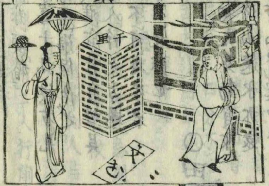
- 圖中：笠子下一女笠子，文書破，手中有傘，軍旗官人邊坐，堠上有千里字，地上兩點足印。
- 卦圖象解：
	- 一、女人在笠下：妾也。
	- 二、千里堠：遠離外出封侯象。
	- 三、文書破在地：憑證承諾無效象。
	- 四、傘下：有庇蔭也。
	- 五、軍旗下官人坐：主有官司、訴訟、牢獄之災象。
	- 六、二點在地：踐踏之足印也，示人處危之時，有禮之道，乃能行危而無殃也。

### 人间道——履

- 上一卦[《风天小畜》](#《风天小畜》（一世）巽上%20乾下#人间道——小畜)——下一卦[《地天泰》](#《地天泰》（三世）坤上%20乾下（六合）#人间道——泰)

> [!引申] 
天地間萬物由畜道而止之後，有禮生焉，履者，禮也，故畜之後為履。所有物之聚大小不同，高下不等，有美惡之分，是故物聚後必有禮。人到何處，必有禮也。卦體天在上，澤在下，上下區分，尊卑立見，此理所當然也。此以柔藉剛，謙卑而順，説禮之道也。澤有卑順之意，卦象『外健內卑』，禮之本也。

- 履虎尾，不咥人，亨。
	- 有禮之道即入險中，如踐虎尾，不見其反食人，乃因有禮也，所以亨也。故常言伸手不打笑臉人，同此。
- 《彖》曰：
	- 履，柔履剛也。説而應乎乾，是以履虎尾，不咥人，亨。
		- 兌為澤，為悦，兌以柔順之藉乾剛，與乾剛相乎應，又有禮於下，故踐虎尾而不相害也。
	- 剛中正，履帝位而不疚，光明也。
		- 九五以陽剛又居君位，又得履道之善，此不病之因，乃得光明也。
- 《象》曰：上天下澤，履。君子以辯上下，定民志。
	- 天在上，澤在下，尊卑有分，此天下之正理也。人之禮常如是，有禮乃行也。君子觀履象，以辨上下之區分，來立民志，民因上下區分明顯而志定，自此乃可言治。立法複雜，民無所從，治世將不再。是故人各安其位，此得其分內也，如佔位又不進德，除之，由君子進任，士人進修學識，到一定程度而君子求之。士農工商各行業之人，因所享有限，而能有定志，則天下一心也。今人自下至公卿，日所志為尊榮，農工商人，日思於富侈，億兆之心交相為利，天下皆如此，心如何一致？要它不亂也難矣！皆因上下無定其志也。君子觀履，分區上下，使各當其位，用此以定民心之向也。
- 初九：素履往，无咎。
	- 初處於下，陽剛之才可以進，但外則表現其卑下之位的素養，無咎。
	- 《象》曰：素履之往，獨行願也。
		- 安於有禮之往，因非為利也，乃各有其志也。如人有行道之心，又有名利之心，交戰於中，豈能安履。
- 九二：履道坦坦，幽人貞吉。
	- 二為陰位，陽居，即意其待人之禮坦蕩蕩，平易之道也。因為陽進，故須有防人嗤之禮數之誹，是以安幽清靜之心情處此時，則吉。
	- 《象》曰：幽人貞吉，中不自亂也。
		- 履之道（禮之道）在於安靜，其因正，則所履安也，心中躁動，則不能安於禮道，此即有禮於人，必以心中安靜，如以利欲交爭於心中，必自亂。
- 六三：眇能視，跛能履，履虎尾，咥人凶，武人爲于大君。
	- 三為陽位，柔居之，乃志欲剛而體本柔，不能堅心為履道。就如盲人之視而不見，跛人行路而不遠，意乃才能不足，又處時之不順遂，則禮道非正，乃履於危地，因不善履道，入危地召凶，禍患立至，故咥人凶，就如武暴之人卻居人上，又任意為之，不知禮，乃凶之道。
	- 《象》曰：
		- 眇能視，不足以明也，跛能履，不足以與行也。
			- 陰柔乃才不足之人，視不明，行又不遠，今又居剛之上，災難來矣。
		- 咥人之凶，位不當也，武人爲于大君，志剛也。
			- 此凶之致，乃因才不足，以武人為喻，其居陽剛之位，但才不足，又強出之，則所履不由本道，屬於志剛又妄動。
- 九四：履虎尾，愬愬終吉。
	- 在近君之側，知伴君如伴虎，愬愬，畏懼之貌，意如能畏懼，則終必吉。上位之陽剛，雖近處，能敬慎畏懼，即入危地終亦必吉也。
	- 《象》曰：愬愬，終吉，志行也。
		- 畏懼之貌，入危而終吉，因本心在於能行己之志願，故須居此位，故為行其志，而示畏懼之態，終得吉，其志遂行。
- 九五：夬履貞厲。
	- 夬乃剛決之意，九五雖示君位之人，居此位，任意剛決而行之，即得正，仍危厲也。古之聖人，居天下之尊，仍納眾言，明足以照，剛足以決，必以明而動，動則志剛，此之所以為聖也，若自以為剛明，決行不顧，即使行正，亦屬危道也。
	- 《象》曰：夬履，貞厲，位正當也。
		- 居正當之尊位，須戒剛決自任，否則招凶。
- 上九：視履考祥，其旋元吉。
	- 人之禮，須視其終，若始終完備，善之至也。今人淺視人之表面禮遇，而不考證其始終，禮之至善，其『始終如一』方是。
	- 《象》曰：元吉在上，大有慶也。
		- 人之所以履善終能吉，貴乎有終，始終如一，禮之至極也。

## 《风泽中孚》（游魂）巽上 兑下

~~~
  伏 神        【本 卦】
              ▆▆▆▆▆▆▆▆▆     官鬼辛卯木
妻财丙子水     ▆▆▆▆▆▆▆▆▆     父母辛巳火
              ▆▆▆   ▆▆▆     兄弟辛未土   世
子孙丙申金     ▆▆▆   ▆▆▆     兄弟丁丑土
              ▆▆▆▆▆▆▆▆▆     官鬼丁卯木
              ▆▆▆▆▆▆▆▆▆     父母丁巳火   应
~~~
鹤鸣子和之卦，事有定期之象。
判曰：中孚，信也。天地养育，万物安居，泽被草木，信及豚鱼。利涉大川，厄难消除。

### 卦象——此卦辛君屯邊，卜得之，遂果得梅妃之信也。

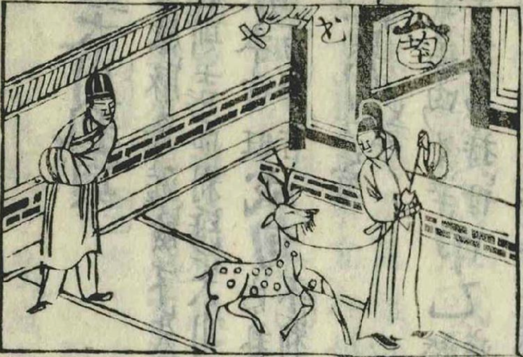
- 圖中：望子上文書，人擊柝（tuò），貴人用繩牽鹿，雁啣書。
- 卦圖象解：
	- 一、望子上文書：科甲高中，刑法更吉。
	- 二、人擊柝：預警也。
	- 三、貴人用繩牽鹿：守成，不可攻也。
	- 四、雁啣書：喜事將至，有南徙之象。
	- 五、人立庭中：蒞庭也，防官司或打官司保身也。

### 人间道——中孚

- 上一卦[《水泽节》](#《水泽节》（一世）坎上%20兑下（六合）#人间道——节)——下一卦[《雷山小过》](#《雷山小过》（%20游魂）震上%20艮下#人间道——小过)

> [!引申] 
人有節，而後有信，故中孚次之。節本有節制，不可過越之意，人能信而後行之，上位知信守，下位知信從。此卦澤上有風，風行于澤上能感於水為中孚之象，此因一、二爻位，五六爻位，皆實陽，而三、四爻位，為中虛之象，全卦有外實中虛之義，此中孚之象。

- 中孚：豚魚吉，利涉大川，利貞。
	- 中孚之道，其中心之誠信，能使豚魚都有感，則無所不至矣。故利涉大川，週行無限也。
- 《彖》曰：
	- 中孚，柔在内而剛得中。
		- 中孚之中虛乃至誠之象。此示意剛之道能得中正，故吉。
	- 説而巽，孚乃化邦也。豚魚吉，信及豚魚也。
		- 上位以至誠而順從於下，下位以至誠以求上悦，由其中孚之至誠，必教化邦國，此信能令豚魚皆感，此道之至善也。
	- 利涉大川，乘木舟虛也。中孚以利貞，乃應乎天也。
		- 中孚道之吉，猶乘舟渡川，內無實物，不虞覆船，即處艱困，能以中孚則必可亨通，能堅守中孚之道，此天道之極至也。
- 《象》曰：澤上有風，中孚，君子以議獄緩死。
	- 風在澤上，澤有感于風，因水體本虛，故風能入。君子觀之，知人心虛，則物必感之，此中孚之象，君子于議獄，本為盡忠而已。於決死之際，但求緩之，寬之。
- 初九：虞吉。有它，不燕。
	- 陽剛居始進，於中孚之道並非了解，人初志必不定，故如能以愚誠信之，且專一之志，若生異志，必不得安矣。
	- 《象》曰：初九虞吉，志未變也。
		- 始信之時，志未能從，但能愚誠專一至信，則吉矣，故吾人初始，必求能為己所信之道，方以愚誠，如此方不致迷。
- 九二：鳴鶴在陰，其子和之，我有好爵，吾與爾靡之。
	- 內剛外柔，陽居陰位，中孚之感，因外柔必能感通，猶鶴鳴於幽谷，人不聞也，而其子必應和，乃心感通也。故能中心孚誠，千里能感之，能化邦國。
	- 《象》曰：其子和之，中心願也。
		- 子能與合，乃中心誠意能通故也。
- 六三：得敵，或鼓或罷，或泣或歌。
	- 柔居陽剛之位，居位高但才不能濟，故勢必唯所信而從，其外在之鼓張，罷廢悲泣，歡歌皆因導於內心之所信，因才不足，故只有信，而不知吉凶，此非長才之君。
	- 《象》曰：鼓鼓或罷，位不當也。
		- 居不適位，無所心主，惟能從於所信而已。
- 六四：月幾望，馬匹亡，无咎。
	- 近君之位，以柔順得信，其盛必如月之滿盈。即同類同屬亡失，亦可無咎。
	- 《象》曰：馬匹亡，絕類上也。
		- 求上之孚信，即令同類亡，亦不顧而求，此所以吉也。
- 九五：有孚孿如，无咎。
	- 君位之人，以中孚至誠之道，感通天下，民心之信服，固結如抽掣也。
	- 《象》曰：有孚孿如，位正當也。
		- 五居君位以陽剛，用中正之道，天下民心固結信服，其稱位如此，君之道乃能致極矣。
- 上九：翰音登于天，貞凶。
	- 中誠孚信致於極，有信終則衰，華美其外，內無忠篤，猶翰音登天，不知止之，貞固如此，不知變，乃自招凶。孔子曰：好信不好學，此敝也贼。意即固守而不通也。
	- 《象》曰：翰音登于天，何可長也？
		- 守誠信至窮極而不知變，必不能長久？此固守不知變之戒，招凶至矣。

## 《风山渐》（归魂）巽上 艮下

~~~
  伏 神        【本 卦】
              ▆▆▆▆▆▆▆▆▆     官鬼辛卯木   应
妻财丙子水     ▆▆▆▆▆▆▆▆▆     父母辛巳火
              ▆▆▆   ▆▆▆     兄弟辛未土
              ▆▆▆▆▆▆▆▆▆     子孙丙申金   世
              ▆▆▆   ▆▆▆     父母丙午火
              ▆▆▆   ▆▆▆     兄弟丙辰土
~~~
高山植木之卦，积小成大之象。
判曰：渐者，进也。渐进之义，动静皆宜。食无求饱，款曲施为，婚姻和合，行人将归。

### 卦象——此卦齊晏子應舉，卜得之，後果為丞相也。

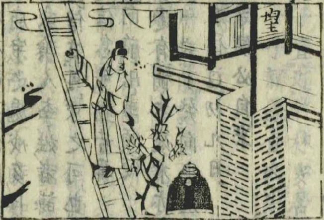
- 圖中：一望竽在爽高處，一藥爐在地，一官人登梯，一枝花在地上。
- 卦圖象解：
	- 一、一望竿在爽高處：家人望歸象。
	- 二、一藥爐在地：平安，無災也。
	- 三、一官人登梯：升官之象，衣錦還鄉也，棺也。
	- 四、一枝花在地：落第象，不久之象。

### 人间道——渐

- 上一卦[《艮为山》](#《艮为山》（纯卦）艮上%20艮下（六冲）#人间道——艮为山)——下一卦[《雷泽归妹》](#《雷泽归妹》（%20归魂）震上%20兑下#人间道——归妹)

> [!引申] 
艮止之後，必有所生，其生乃因前之有止，故此生必渐進，故渐為艮之序。渐，有渐進緩進之意，其進能緩，必有序，而不踰越。此卦上「巽」下「艮」，巽為木，而生於山上，此木之高乃因在山之上，故渐之道在知高之因，在知進退消息之理據。

- 漸：女歸吉，利貞。
	- 渐之道，其有序，且緩進，吾人可於女之出嫁而見之，女歸時，以渐進有序，必吉，且始終如一，更吉。猶臣之入朝侍奉天子亦同，必當有序，如失序則為欺陵主上，必生禍害。
- 《彖》曰：漸之進也，女歸吉也。進得位，往有功也。
	- 渐乃論進之道，知進必有序，猶如女之歸夫，必吉。進時能剛柔並濟，適得其位，此進必有功也。進以正，可以正邦也。其位，剛得中也。止而巽，動不窮也。以正道而進，可以興邦正德也。故凡進皆須稟持以正道則吉。正得其位之定義，必以剛中而得，方可謂得位。內止外順，其人之進如此，方可得吉，如進之以欲，乃生燥，必失渐道，阻力乃生，故能做到內無欲，而外和順，此進方可無窮無盡矣。
- 《象》曰：山上有木，漸，君子以居賢德善俗。
	- 木在山上，其高有自，故君子觀渐象，乃知居賢能正德，美化風俗，其能成功，皆歸之在渐，人之錯習，遽（jù）改生反，教化之於人，勢必以渐進方可入於人心，此渐之道也。
- 初六：鴻漸于干，小子厲，有言，无咎。
	- 鴻鳥之以時而遷動，又群聚而生且有序，此渐也。初陰居卑下，上又無援助，君子知時，故處之不疑。但小人及無知之人只能見眼前之事，不知患於未來，洞察事理，唯以剛而求進，失渐矣，進則生咎，不進無災。
	- 《象》曰：小子之厲，義无咎也。
		- 初始時，雖有小人之危懼不安之心，但因於義理仍合，故有無咎。
- 六二：鴻漸于磐，飲食衎衎（kàn），吉。
	- 柔居柔位，得中位得當，居渐之時，進必不速，穩若磐石狀，其能安居如此，故可飲食和樂，其吉必然。
	- 《象》曰：飲食衎衎，不素飽也。
		- 中正之人，得正位，適居之狀，能飲食安樂，心志愉快，不光是飽食而已。
- 九三：鴻漸于陸，夫征不復，婦孕不育，凶，利禦寇。
	- 九三陽剛居下卦之上，即將進入上卦，意言，人之將上進之時，理應守正道以得時至，萬不可以欲而進，以遂私志，此己失渐道，猶為求進而不顧於道之夫，婦人受孕不以正，亦不可育同義，此凶即致矣。惟可堅守正道，摒除邪念，可得吉。
	- 《象》曰：夫征不復，離群醜也，婦孕不育，失其道也，利用禦寇，順相保也。
		- 夫但知征而不知復，乃因欲而失正道，叛離群類，可醜也。婦人之孕乃不正，故不可育也。皆因失其正道，唯利在堅守正道，棄絶邪惡，可因順正道而保平安也。
- 六四：鴻漸于木，或得其桷，无咎。
	- 此陰柔在高位，下有陽剛欲進之人，必不得安處，猶鴻鳥近於木，立木高處，必不安也，如能立在横枝上，自處安寧，則可無災。
	- 《象》曰：或得其桷，順以巽也。
		- 此意求平安自寧之道，惟有順於義，行乎正，能如此者，何處會不安呢？
- 九五：鴻漸于陵，婦三婦不孕，終莫之勝，吉。
	- 鴻鳥所止於至高之地，象君之尊位，此渐之時至，乃知惟下二爻位，可與同心同德，居中之三，四位相隔，猶即令婦人三年不孕，亦無用於事，相隔正道之不正，其終必消，正道必合，惟時較久而已。終吉。
	- 《象》曰：終莫之勝吉，得所願也。
		- 君臣以中正之道相交，其終必合，所願必遂也。
- 上九：鴻漸于陸，其羽可用爲儀，吉。
	- 鴻能飛於天上，毫無阻礙，人之賢能如此，進至終極，又不失渐之道，其賢能通達之能可以為表率，猶鴻之羽，可以用禮儀一樣，必吉。
	- 《象》曰：其羽可用爲儀，吉，不可亂也。
		- 君子之進，必有以渐，有序渐循之，乃可以為吉，此進因不失序，故吉，序亂招凶。故可以為禮法而遵循之。

# 坤宫八卦——属土

## 《坤为地》（纯卦）坤上 坤下（六冲）

~~~
 【本卦】
▆▆▆   ▆▆▆     子孙癸酉金   世
▆▆▆   ▆▆▆     妻财癸亥水
▆▆▆   ▆▆▆     兄弟癸丑土
▆▆▆   ▆▆▆     官鬼乙卯木   应
▆▆▆   ▆▆▆     父母乙巳火
▆▆▆   ▆▆▆     兄弟乙未土
~~~
生载万物之卦，博厚无疆之象。
判曰：坤者，顺也。乃顺成天，万物资生。用动则浊，用静则清。所作有顺，万物皆成。

### 卦象——此卦漢高袓與項羽交爭卜得之，乃知身霸天下。

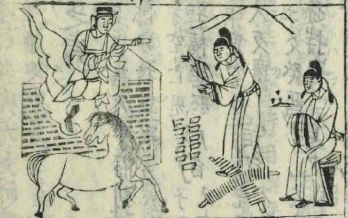
- 圖中：十一箇口，一官人，坐看二串錢。一官人立受命，一馬，金甲神人在台上乘雲下，綬文書與官，土堆上有四點。
- 卦圖象解：
	- 一、十一口：吉也，陳姓人也。
	- 二、一官人：倌人，丈夫也。公務員也。
	- 三、坐看二串錢：欲拿不得，憂心忡忡狀。
	- 四、一馬者：肖馬人；指官貴；指調動也。
	- 五、金甲神：示民心也。
	- 六、授文書與官：授官封侯。
	- 七、土堆上有四點：黑也，背有陰謀也。

### 人间道——坤为地

- 上一卦[《乾为天》](#《乾为天》（纯卦）乾上%20乾下（六冲）#人间道——乾为天)——下一卦[《水雷屯》](#《水雷屯》（二世）坎上%20震下#人间道——屯)

- 坤：
	- 元、亨、利牝馬之貞。
		- 坤乃地之厚德，示人效地之性，如牝馬之柔順而健行也，貞示堅心，但與乾不同，乃堅心於柔順之念也。
	 - 君子有攸往。
		  - 君子因行柔順，且表裡一致，合乎坤地之德性。
	- 先迷後得，主利。
		- 陰從陽也，即不了解但知須從陽剛之中正，如不知而欲進，則迷錯，損失在己，須居於後，則利，如君臣之道，柔順乃臣之職（zhí）也。
- 西南得朋，東北喪朋，安貞吉。
	- 西南為陰位，東北為陽位，陰必從於陽，陽之正而陰亦正，由陽剛之中正，去蕪存菁，故能成化育之功也。
- 《彖》曰：
	- 至哉坤元！萬物資生，乃順承天，坤厚載物，德合无疆。
		- 坤之道大也，萬物因乾而始，因坤而生，猶父母之道，坤之德厚，故能持載萬物。
	- 含弘光大，品物咸亨，牝馬地類，行地無彊，柔順利貞，君子攸行。
		- 含弘光大此四者，用来形容坤道，含，包容也，弘，寬裕也，光，昭明也，大，厚且博廣。聖人有此四德，故能成天之功，牝馬因柔順而能行，故健。
	- 先迷失道，後順得常。西南得朋，乃與類行；東北喪朋，乃終有慶（qìng），安貞之吉，應地无疆。
		- 因先迷而從陽剛之德，後必得理，西南為陰，同類而行，故得朋，東北陽方，離其類而喪朋，因離其類而從陽，故能成物之功也。終必吉，又因能安心堅守此道，則無所不可往矣。
- 《象》曰：地勢坤，君子以厚德載物。
	- 坤地之道至大，聖人體之，君子以地之柔順且厚能載物之德處事。
- 初六：履霜，堅冰至。
	- 聖人於陰之始生，知其將長，此時戒之，猶人之履及霜，則知後必有堅冰，故小人始雖甚微，但絶不可使其長，長盛則凶也。
	- 《象》曰：“履霜堅冰”，陰始凝也，馴（xùn 顺从）致其道，至堅冰也。
		- 陰始凝為霜，渐盛則至堅冰，故聖人戒小人於初，如任小人因循不阻止，則終至凶。故吾人須戒之於初，小人表面常有可憐，博人同情，示弱以求憫恤，實則內心有所圖，今人不知濟弱扶倾與姑息養奸乃一線之差，一昧以濟弱扶倾為自傲，殊不知其姑息養奸，而至今小人才盛。
- 六二：直方大，不習，无不利。
	- 聖人以地之直、方、大三德以盡地之道。直者，直來直往，不迂迴作假。方者，原則不因局勢而改變，且正。大者，容載萬物之胸襟乃大也。不習，謂順其自然，則無往不利。亦可云，因又直且方，氣勢乃大也。
	- 《象》曰：六二之動，直以方也，不習，无不利，地道光也。
		- 地道之光顯，由其直且方大，人人順其自然，則奸人何所遁形，無往不利。
- 六三：含章可貞，或從王事，无成有終。
	- 六三居相位，為臣之道，如有含章之美，即不居其功，將善歸於君王，乃可因王無忌惡之心，終必吉。
	- 《象》曰：
		- “含章可貞”，以時發也。
			- 處臣下之道，不當有功，免招君忌，但義之當為時，須立行之，此因不有其功，不失其宜，皆因時也。今人含而不為，皆不忠之人。
		- “或從王事”，知光大也。
			- 聖人知含章之光大，故能養晦，小人有善唯恐人不知，此君子小人之分野。
- 六四：括囊，无咎，无譽。
	- 六四為居近君之側位，藏口而不露，則平安無災，此沈默之功也。
	- 《象》曰：“括囊无咎”，慎不害也。
		- 能隨時謹言，不妄言，此無害之因慎也。
- 六五：黄裳，元吉。
	- 坤本論為臣之道，今臣居尊位，或婦人居尊位，须有黄裳之戒，應守中而居下，不可揚溢無節制，否則必有非常之變。
	- 《象》曰：“黃裳元吉”，文在中也。
		- 因黃裳之美，乃內積至美，執中不過，位高但謙居下，故吉。
- 上六：龍戰於野，其血玄黃。
	- 六爻為極盛之位，陰至極則陽至，故有抗爭，因六又再進不已，故必戰，戰必有傷，故血色現，天之血色為玄，地之血色為黃。
	- 《象》曰：“龍戰于野”，其道窮也。
		- 道因陰至極而無道，故有龍戰於野之象現。
- 用六：利永貞。
	- 此為用陰之道，如乾有（用九）之道同。陰道柔而難常，有朝令夕改之憂。故利在常而堅固。
	- 《象》曰：用六“永貞”，以大終也。
		- 聖人自此悟之，始終如一，堅心不變，必利，其終極必大。今人朝夕所思不同，自視甚重，角色不能認清，小人有太過之行為，常人從俗只見愚善，致小人極盛，積非成是，故積重難改。

### 文言曰

- 坤至柔而動也剛，至靜而德方。後得主而有常，含萬物而化光，坤道其順乎？承天而時行。
	- 坤之道雖柔，但如動亦須剛，坤之體至靜，但其德也须方正。動而不違方正，再得同道之呼應，成萬物光大之功，故坤道之順大，皆因王時之至也。
- 積善之家，必有餘慶，積不善之家，必有餘殃。臣弑其君，子弑其父，非一朝一夕之故；其所由來者漸矣，由辨之不早辨也。易曰：“履霜堅冰至”，蓋（gài）言順也。
	- 學者讀此段，必可自悟矣。故聖人戒小人於初，其道大也。
- 直，其正也；方，其義也。君子敬以直内，義以方外，敬義立而德不孤。“直方，大，不習，无不利”，則不疑其所行也。
	- 君子外敬內直，堅守義以方其外，故內敬直，外義方，其德之盛，順其自然，不须裝飾，無人會疑其所行也。
- 陰雖有美含之，以從王事，弗敢成也。地道也，妻道也，臣道也，地道无成，而代有終也。
	- 臣下之道，不表其功，含晦以為王行事，至終而不敢有其功，如地道代天終萬物，而成功又歸之於天，妻之道同此。今之妻如何，吾人試自問之？
- 天地變化，草木蕃。天地閉，賢人隱。易曰：“括囊，無咎無譽”，蓋言謹也。
	- 天地相交，則能興發草木，天下因君臣相往而道亨。今天地隔絶，萬物不成，猶君臣無道，賢者隱退，此時易道為閉口含藏，雖無聲譽，但無災，皆因言論謹慎也。
- 君子黃中通理，正位居體，美在其中，而暢於四支，發於事業，美之至也。
	- 君子知謙守下之道而通於事理，居君王位故美積其中，暢於四體，現於事業，此美之極也。此段乃示柔中有剛，乃至大至美，今人有柔善而無剛，或過剛而無仁，皆不足之美也。
- 陰疑於陽必“戰”，爲其嫌於无陽也，故稱“龍”焉；猶未離其類也，故稱“血”焉。夫“玄黃”者，天地之雜（zá）也，天玄而地黃。
	- 中醫之至道在此，陽大陰小，陰乃從陽，故經方派乃用陽藥，如人間亦然。如令陰到極盛，陽受陰盛而外走，此不相從必戰，傷而見血，天地之色變，亦言傷之大也。

## 《地雷复》（一世）坤上 震下（六合）

~~~
  伏 神        【本 卦】
              ▆▆▆   ▆▆▆     子孙癸酉金
              ▆▆▆   ▆▆▆     妻财癸亥水
              ▆▆▆   ▆▆▆     兄弟癸丑土   应
              ▆▆▆   ▆▆▆     兄弟庚辰土
父母乙巳火     ▆▆▆   ▆▆▆     官鬼庚寅木
              ▆▆▆▆▆▆▆▆▆     妻财庚子水   世
~~~
淘沙见金之卦，反覆往来之象。
判曰：复者，反也。内悦外顺，举动无违。世应相合，迁官益财。失而复得，往而复来。婚姻占得，夫妇和谐。

### 卦象——此卦唐太宗歸天，卜得之，七日復還魂也。

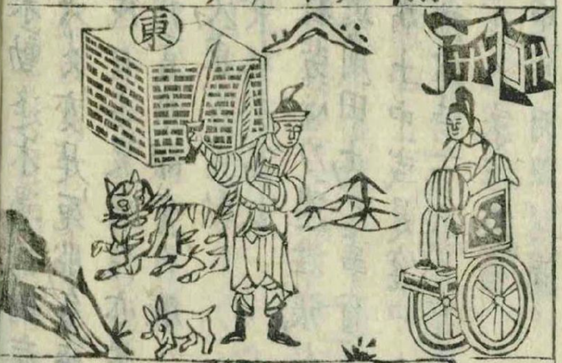
- 圖中：官人乘車，上兩隻旗，堠上東字，一將持刀立，一兔一虎。
- 卦圖象解：
	- 一、官人乘車：使節也；車姓、連姓也；軍隊也；官大也；調職也。
	- 二、上兩隻旗：鬥也；將、帥也；一方之主也。
	- 三、堠上東字：猴發木形人。東：有心約束，十八日至。十日來人封侯象。
	- 四、一將持刀立：武威之人，司法執行人。
	- 五、一兔：肖兔之人，劉姓之人。
	- 六、一虎：肖虎之人，王姓之人。
	- 此卦云：君子之道，既消而復，始復必不能力勝小人，必待其朋類渐盛，協力致勝可也。

### 人间道——复

- 上一卦[《山地剥》](#《山地剥》（五世）艮上%20坤下#人间道——剥)——下一卦[《天雷无妄》](#《天雷无妄》（四世）乾上%20震下（六冲）#人间道——无妄)

> [!引申] 
萬物無剝盡之理，故剝極必復來。復為之序卦。此卦一陽生於五陰之下，有陰極生陽象，如同冬至極寒，則必生陽，亦同。雷在地下，有復生之象，外順內動，此為復之始。

- 復：
	- 亨，出入无疾，朋來无咎。
		- 萬物既復則必亨，如君子之道將復，雖微，但同類將渐進，故亨且盛矣。故復之時至，並無法立勝小人，必待其同朋相繼，則協力能勝也。
	- 反復其道，七日來復，利有攸往。
		- 此為消長之道，易之論數，以立準（zhǔn）則，小有七日乃復，大有七年方復，此復之道也。
- 《彖》曰：
	- 復，亨。剛反，動而以順行，是以出入无疾，朋來无咎。
		- 此以卦才來論，復之道，陽剛因消弱至極而反來，其法動而取順行法，是故出入皆無災，朋之來，亦因順而動來也。
	- 反復其道，七日來復，天行也。利有攸往，剛長也；復其見天地之心乎！
		- 復之返來，順天之運行，故言七日。因君子道長，故利前往，陽復生於下，乃是天地生物之心，以為動之始也，故外見動，而始生於內也。
- 《象》曰：雷在地中，復。先王以至日閉關，商旅不行，后不省方。
	- 以卦象而言，如雷乃陰陽相搏而成聲，時陽之微，未能發也。如聖人順天之道，於日陽之始生，安靜養之以閉關，使商旅不得行，人君不視四方，此順天也，於人亦以此安養其陽為復原之道。
- 初九：不遠復，无祇悔，元吉。
	- 有失而後有復，此復之始時，因失之不遠，故復必不至於悔，故吉。
	- 《象》曰：不遠之復，以脩身也。
		- 此即知不善而速改，為君子修身之道。學問之道即在此，知不對立改，為君子也。
- 六二：休復，吉。
	- 二為切近初陽之位，君子道始生於下，若二位志向於陽，今陽在下從之，故能下之道為仁。吉。
	- 《象》曰：休復之吉，以下仁也。
		- 仁者天下之公，善之本源，能體會而近於下之仁，乃休復之美。
- 六三：頻復，厲，无咎。
	- 從復之道，又頻復履失，致危之道也。故須厲，即戒此可无咎，頻失致危，其過乃在失而不復也。今人迷途不知返，比之皆是，又知返而不戒又入迷，凶也。
	- 《象》曰：頻復之厲，義无咎也。
		- 戒之在屢復，復而又失，失之過，故堅心於復不失，無災殃也。
- 六四：中行獨復。
	- 四於眾陰之間，能自處於正，但因力弱，不足克濟，此言獨復，不一定無災。
	- 《象》曰：中行獨復，以從道也。
		- 以獨復於小人間，如從陽剛，君子之道也。
- 六五：敦復，无悔。
	- 君王於復之道，能敦篤而行之，但臣下均陰柔之輩，因無助，但能無悔而不能無災，君子戒之。
	- 《象》曰：敦復无悔，中以自考也。
		- 五以陰居尊位，能敦篤善道，以中道自成，此可無悔也。
- 上六：迷復，凶，有災眚（shěng），用行師，終有大敗，以其國君凶，至于十年不克征。
	- 陰柔居復之終，乃意終迷不復者，大凶。招凶，皆因己之迷而不返，動則必有過失，以之出師必大敗，以之為國君，大凶。迷於道，而終不可行也。
	- 《象》曰：迷復之凶，反君道也。
		- 人君居上而治天下，當從天下之善，如迷於復，反復無常，皆招凶也。

## 《地泽临》（二世）坤上 兑下

~~~
 【本卦】
▆▆▆   ▆▆▆     子孙癸酉金
▆▆▆   ▆▆▆     妻财癸亥水   应
▆▆▆   ▆▆▆     兄弟癸丑土
▆▆▆   ▆▆▆     兄弟丁丑土
▆▆▆▆▆▆▆▆▆     官鬼丁卯木   世
▆▆▆▆▆▆▆▆▆     父母丁巳火
~~~
凤入鸡群之卦，以上临下之象。
判曰：临者，大也。以大临小，以上临下，内柔外和，人非欺诈。居官进升，文才和雅。纵有灾害，不能相惹。

### 卦象——此卦蔡琰去和番，卜得知，必還故國也。

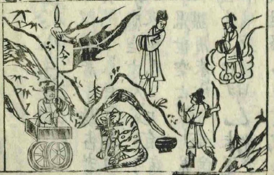
- 圖中：婦人乘風，一車上有使旗，人在山頂，虎在山下坐，一合子，人射弓。
- 卦圖象解：
	- 一、婦人乘風：外援為陰女，美人也。
	- 二、一車上有使旗：出使之象，以謀略可解災，謀之對象為女人也。連姓、車姓人。
	- 三、人在山頂頭：盛極將衰，招困也，即將下坡也。
	- 四、虎在山下坐：人受虎困之象。
	- 五、一合：先成後破象。
	- 六、人射弓：張姓人士，夷狄之人，以弓射獵，故外族入侵象。
	- 故自古天下安治，未有久而不亂者，皆因不能戒盛而已。

### 人间道——临

- 上一卦[《山风蛊》](#《山风蛊》（归魂）艮上%20巽下#人间道——蛊)——下一卦[《风地观》](#《风地观》（四世）巽上%20坤下#人间道——观)

> [!引申] 
有事之後乃有可大之心，臨者，大也，故序卦為臨。為卦澤上有地，乃岸也，因與水相近故曰臨，天下之事最近臨者，唯水與地，故地上有水，為此卦，澤上有地，為臨；臨，即臨民臨事，凡所面臨的，皆有臨之道。

- 臨：
	- 元，亨，利，貞。
		- 言臨之道，可致大亨也。
	- 至于八月有凶。
		- 二陽才剛生於下，聖人戒之於方盛，方盛而慮衰，則可以防自滿，圖其永久，衰而後戒，無及也，此乃戒盛之道。今人富而多驕，為安樂而壞綱紀，忘禍亂而任小人奸邪，皆因不知戒盛。
- 《彖》曰：
	- 臨，剛浸而長，説而順，剛中而應，大亨以正，天之道也。
		- 剛中得正道，而有應助，故能大亨。天道，能化育生萬物，皆因其剛正而和順而已。以此道來臨事，臨人，臨天下，莫不大亨通也。
	- 至於八月有凶，消不久也。
		- 此乃聖人知戒於盛時，不以自滿，則凶不至也。
- 《象》曰：澤上有地，臨。君子以敎思无窮，容保民无疆。
	- 地與水之臨近為至近，君子以此知臨之道乃親民如此，才能教導人民。有寬容保民之心，才能廣大無窮的包容。
- 初九：咸臨，貞吉。
	- 初為卑下之位，而以正道與四位感應，為所信任而得行其志，故吉。
	- 《象》曰：咸臨貞吉，志行正也。
		- 陽剛之志在於行正，志正也。
- 九二：咸臨，吉无不利。
	- 九二居將位，能以陽剛之心臨人，臨事，不愧於人，吉無不利。
	- 《象》曰：咸臨，吉无不利，未順命也。
		- 九二乃應於五之尊位，因以剛德之長，又得中道，此至誠相感，而得吉，並非因順上之命而得吉也。
- 六三：甘臨，无攸利，既憂之，无咎。
	- 三居相位，柔陰居之，此居上位又不以中正臨下，此失德也，不利。如能憂於此而立改之，則無災也。
	- 《象》曰：甘臨，位不當也，既憂之，咎不長也。
		- 陰柔之人，處臨人事不以中正，又居下之上，乃不適其位，如能知懼而憂之，則必自改其災不長也。
- 六四：至臨，无咎。
	- 此臨之至也，臨道乃由近而生，此位居上之下，又切臨於下，乃處近君之臣位，守正任賢，如親臨於下，則无咎。
	- 《象》曰：至臨无咎，位當也。
		- 居近君之臣，陰柔對之，為得正道，與下之剛賢相應，故能無咎。
- 六五：知臨，大君之宜，吉。
	- 以一人之身，君臨天下之廣，若皆以自任，必不能周於萬事，如自認為皆知者，正明示其不知也。唯有能得天下之善，用天下之智者，則無所不周，這就是不以自認皆知，故其知乃可大。
	- 《象》曰：大君之宜，行中之謂也。
		- 君臣合道，皆因同氣相求，君能倚任剛中之賢，則能成臨之功，此知臨之意。
- 上六：敦臨，吉，无咎。
	- 此位乃臨之極位，以坤順而居此位，乃意尊而應卑，高而從下，尊賢取善，此為敦厚之極也。皆因其能敦厚於順剛，是以吉而無災。
	- 《象》曰：敦臨之吉，志在内也。
		- 內心敦厚篤實，志順於陽剛，其吉可知。

## 《地天泰》（三世）坤上 乾下（六合）

~~~
  伏 神        【本 卦】
              ▆▆▆   ▆▆▆     子孙癸酉金   应
              ▆▆▆   ▆▆▆     妻财癸亥水
              ▆▆▆   ▆▆▆     兄弟癸丑土
              ▆▆▆▆▆▆▆▆▆     兄弟甲辰土   世
父母乙巳火     ▆▆▆▆▆▆▆▆▆     官鬼甲寅木
              ▆▆▆▆▆▆▆▆▆     妻财甲子水
~~~
天地交畅之卦，小往大来之象。
判曰：泰者，通也。天地交泰，阴阳和光，麒麟悉出，丹凤来翔。小人道灭，君子道昌，求谋顺遂，恶事消亡。

### 卦象——此卦堯帝將襌位，卜得之，乃得舜而遜位。

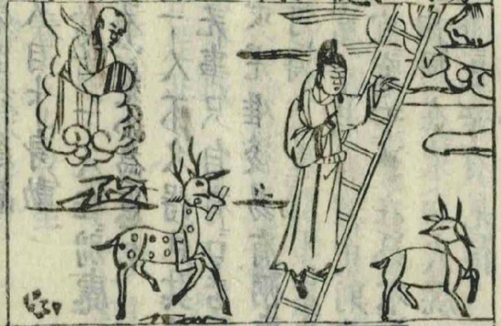
- 圖中：月中桂開，官人登梯，鹿銜書，小兒在雲中，羊回頭，地下亂點。
- 卦圖象解：
	- 一、月中桂開：清明政治之時。
	- 二、官人登梯：升遷順遂之意，官人亦倌人，即丈夫也。
	- 三、鹿銜書：受天子恩賜祿位。
	- 四、小兒在雲中：少年得志象。得天官貴人助也。
	- 五、羊回頭：回陽間也。亦楊姓人，發肖羊人成格。

### 人间道——泰

- 上一卦[《天泽履》](#《天泽履》（五世）乾上%20兑下#人间道——履)——下一卦[《天地否》](#《天地否》（三合）乾上%20坤下（%20六合）#人间道——否)

> [!引申] 
履之後（有禮而始終如一）則有泰，即履得其所，則舒泰而安也。故泰所以次履也，坤柔在上，乾陽居下，乃天地陰陽之氣相交合，萬物生成，故表通泰狀。卦象外柔內健，此為致泰之道。

- 泰，小往大來，吉亨。
	- 陽氣下降，陰氣上升，陰陽和暢，萬物生焉，此天地之泰。人間之泰，大則居上，小則臣下，君王推誠任下，臣盡誠以事君，上下同志，朝廷之泰。君子，小人亦如是，君子處君位，小人居下位，天下之泰也。
- 《彖》曰：泰，小往大來，吉亨。則是天地交而萬物通也，上下交而其志同也。
	- 陰往而陽來，天地氣相交，萬物通泰。人則上下之志相同，互相交通，人之泰也。「內陽而外陰，內健而外順，內君子而外小人，君子道長，小人道消也。」陽進陰退之時，故內健外順，君子之道也，君子在內，小人在外，此所以為泰。
- 《象》曰：天地交，泰。后以財成天地之道，輔相天地之宜，以左右民。
	- 此示人君須體會交泰之道而為法制，使民用天時之宜，輔助教育人民之功，使民有財，輔助於民，民則必賴君上之法制，因法治之宜也，得其生養。
- 初九：拔茅茹，以其彙（huì），征吉。
	- 剛明之才，居於下位，遇泰之時，志而上進，遇同志而行同道，因同類而進，吉。凡君子小人都須賴同類以助，未有人能獨立而不須朋類之助。
	- 《象》曰：拔茅征吉，志在外也。
		- 同類相聚，如拔茅之根相牽連，同欲上進。
- 九二：包荒，用馮河，不遐遺，朋亡，得尚于中行。
	- 九二為將位，以剛明之才，五為柔順而得君位，上下之專信建立，此位乃治泰者，故治泰之道，主將位而能包荒，如人情放肆所為，則政令緩，法度廢弛，治此之道，必有包含荒穢（huì）之量，詳密施政，去其弊端，則人安之。處泰之道，人之常情習於久安，惰於因循，不敢變更，用馮河，乃奮發改革之意，雖至小至微之事亦不可遺漏，自古立法治事，牽於人情，卒不能行者多矣。如禁奢侈則害近戚，限田宅，則防礙貴族之家，此治泰之難。遇治泰，須稟持公正之態度，即中行意。
	- 《象》曰：包荒，得尚於中行，以光大也。
		- 有包含荒穢之量，又配合中行之德，其道則明顯光大。
- 九三：无平不陂，无往不復，艱貞无咎，勿恤其孚，于食有福。
	- 三居諸陽之上，乃泰之盛時。聖人為之戒，在下者必升，居上者必降，泰久而必否，故戒之。故當此時，不敢安逸，居安思危，則無災。故處泰之道須能堅貞，可常保泰。自古以來隆盛皆因內失道而喪敗下來。
	- 《象》曰：无不復，天地際也。
		- 陽降於下，必復上，陰升於上，必復下，此示人明天地交泰之道不常存之理也，聖人戒之。
- 六四：翩翩不富，以其鄰，不戒以孚。
	- 翩翩，疾飛之貌，人富而從其類，為利也。不富而從其者；志同也。上三爻皆為陰，陰在上而失其中實之道，皆欲下從，故為不富而從，此誠意相合也。如至六四位方戒已晚，居三為適中，知戒可保，四位則已過，必生變化。
	- 《象》曰：翩翩不富，皆失實也；不戒以孚，中心願也。
		- 因三陰在上，失其實才，欲行往下，不待其人富而鄰從，皆因失實故也。此已失乃方知戒之意，此時不待告誡而誠意相待，乃出於中心所願也。
- 六五：帝乙歸妹，以祉元吉。
	- 為居君位，古之帝女皆向下嫁，帝乙制禮法，须降其尊貴，以順從其夫也。今六五以陰柔居君位，對應之九二為陽剛，乃能信之，而任用其賢且順從之，猶帝女之下嫁亦然，此成治泰之功也。
	- 《象》曰：以祉元吉，中以行願也。
		- 其能任用剛中之賢，乃因已有中道與之合，志同相交也。
- 上六：城復于隍，勿用師，自邑告命，貞吝。
	- 此致泰之終也，小人處之，行必否矣。掘隍土累積成城，如治道累積以成泰，今城土頹圮（pǐ），又復返於隍也。勿用師，夫用師之道，必得民心，今民心不從，用師必亂，此時即自有天命任之，亦逄羞而凶矣。
	- 《象》曰：城復於隍，其命亂也。
		- 此意城傾圮，又回歸隍土，即令命為正，但亂已不可止矣。

## 《雷天大壮》（四世）震上 乾下（六冲）

~~~
 【本卦】
▆▆▆   ▆▆▆     兄弟庚戌土
▆▆▆   ▆▆▆     子孙庚申金
▆▆▆▆▆▆▆▆▆     父母庚午火   世
▆▆▆▆▆▆▆▆▆     兄弟甲辰土
▆▆▆▆▆▆▆▆▆     官鬼甲寅木
▆▆▆▆▆▆▆▆▆     妻财甲子水   应
~~~
先顺后逆之卦，羝羊触藩之象。
判曰：大壮者，志也。羝羊触藩，其道难全。令人刚强，已成过愆。非利勿贪，善莫大焉。

### 卦象——此卦唐玄宗避安祿山亂，卜得之，乃知不久亨通也。

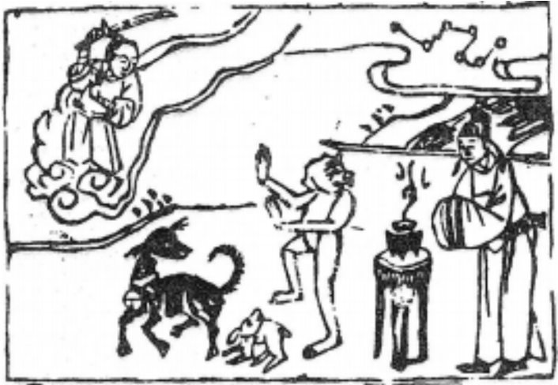
- 圖中：北斗星，天神執劍，一官人燒香拜，一猴，一兔，一犬。
- 卦圖象解：
	- 一、北斗星：帝君，老闆，主事之人。
	- 二、天神執劍：民意歸向，人心也。
	- 三、一官人燒香拜：拜求於天，而不求人，凶。
	- 四、一猴、一兔、一犬：侯，劉，狄姓，在野之人。
	- 五、猴回頭：回吼。
	- 六、兔回頭：回吐。
	- 七、羊回頭：回陽。
	- 此卦示意過剛必招凶，而猴、羊、兔為三貴人，和中近易為處之道。

### 人间道——大壮

- 上一卦[《天山遁》](#《天山遁》（二世）乾上%20艮下#人间道——遁)——下一卦[《火地晋》](#《火地晋》（游魂）离上%20坤下#人间道——晋)

> [!引申] 
君子之退而伸道，多數君子之退且聚合，而成大壯之勢，壯有進且盛義，陽剛而震動此以剛而動，乃大壯之象，猶雷威震在天上也。

- 大壯：利，貞。
	- 大壯之道利在正，理正而勢正，如不得正而壯，只強猛無理而已，非君子之壯。
- 《彖》曰：
	- 大壯，大者壯也，剛以動，故壯。
		- 大且壯為大壯，乾之至剛而動，外動內剛狀，名壯。
	- 大壯利貞，大者正也。正大而天地之情可見矣。
		- 天地之道可運行而長久，乃至大至正始然也，此道之至大能如是。
- 《象》曰：雷在天上，大壯，君子以非禮弗履。
	- 君子觀雷震威在天，此之壯大，而行大壯之道，知唯克己復禮最大。能自勝之人為天地之最壯者，能赴湯蹈火，此唯武夫之勇也。君子能和而不流，大立而不倚。
- 初九：壯於趾，征凶，有孚。
	- 初爻在下，而陽剛居之，乃初進而用壯，必凶，吾人居上用壯，猶須正方可行，初進而剛壯，必招凶辱。
	- 《象》曰：壯於趾，其孚窮也。
		- 在下位而用壯，即令行可信，亦必招窮困阻滯也。
- 九二：貞吉。
	- 二位屬陰位，陽剛居之，乃示人剛柔得中也，人能識得時義之輕重，則必吉。
	- 《象》曰：九二貞吉，以中也。
		- 能得中正，而堅持守之，也吉乎，此意中而不失正。今人中立而為己，已失正道，猶牆頭之草，可嘆也。
- 九三：小人用壯，君子用罔。貞厲，羝羊觸藩，羸其角。
	- 小人尚力，只用其壯勇，而君子用罔，因其志剛，無視於非正之事，無所忌憚也。萬物莫不用其壯，猶羊之壯於首角，一遇藩籬，亦受困也，故用壯，不可強力進，須持之正道，無忌憚於邪吝，方為真罔。
	- 《象》曰：小人用壯，君子罔也。
		- 小人用其強壯之武力，終困，君子志氣剛強，無視邪惡，無所忌憚。
- 九四：貞吉，悔亡，藩決不羸，壯于大輿之複。
	- 時方道之長盛時，如有小失，則必害進之勢，猶大車其輪軸必壯，乃利於行，如輪軸不強，以致大車之不行也，有如藩籬之決開而不復其困也。
	- 《象》曰：藩決不羸，尚往也。
		- 四位未至極，以當盛之陽，又用壯以進，無能阻之，即令藩籬隔而不困其力也。
- 六五：喪羊于易，无悔。
	- 羊性喜群行又互觸其角，猶諸陽並行，如以力制，則必難勝有悔，唯其平和得之，則無所用其剛，使其壯失於和易之道，可以無悔。
	- 《象》曰：喪羊于易，位不當也。
		- 柔居尊位，位不當也，猶人君之勢不足，下又壯進，才有所謂『治壯之道』，治壯之道不可用剛，須以平易近人待之，可化壯也。
- 上六：羝羊觸藩，不能退，不能遂，无攸利，艱則吉。
	- 陰柔又處壯極，猶羊角之觸藩，進退不得，必無所往也，陰柔處壯時，一遇艱困，必不能守，往即凶也。吾人須居艱困時而處柔，必吉。此壯之極，須變義也。
	- 《象》曰：不能退，不能遂，不詳也。艱則吉，咎不長也。
		- 此因自處不詳不慎，以致進退不能也。以柔處艱時，即有咎，亦不長久。

## 《泽天夬》（五世）兑上 乾下

~~~
  伏 神        【本 卦】
              ▆▆▆   ▆▆▆     兄弟丁未土
              ▆▆▆▆▆▆▆▆▆     子孙丁酉金   世
              ▆▆▆▆▆▆▆▆▆     妻财丁亥水
              ▆▆▆▆▆▆▆▆▆     兄弟甲辰土
父母乙巳火     ▆▆▆▆▆▆▆▆▆     官鬼甲寅木   应
              ▆▆▆▆▆▆▆▆▆     妻财甲子水
~~~
神剑斩蛟之卦，先损后益之象。
判曰：夬者，决也。乾兑相刑，恶闻其声。文字契约，事未易成，必须刚断，始得吉亨。

### 卦象——此卦漢高祖欲拜韓信為將，卜得之，知有王佐才也。

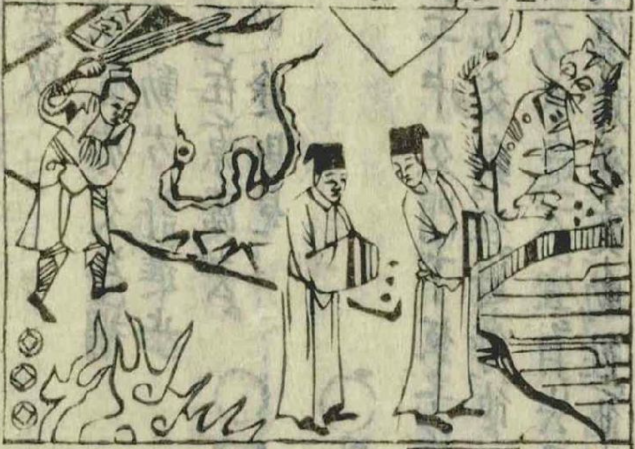
- 圖中：二人同行，前水後火，虎蛇當道，一人斬蛇，竿上有文字，竿下有錢。
- 卦圖象解：
	- 一、二人同行：相輔相成，可成事也。
	- 二、前水後火：前險而後明，宜進取象，土生金象。
	- 三、虎蛇當道：虎，有權威之人。蛇——險奸之小人阻道。
	- 四、一人斬蛇：勇士也，得名將也。
	- 五、竿上有文字：揚竿而起，正名出師。
	- 六、竿下有錢：行動有利也。
	- 七、錢下有火：燒錢狀，主喪服。

### 人间道——夬

- 上一卦[《风雷益》](#《风雷益》（三世）巽上%20震下#人间道——益)——下一卦[《天风姤》](#《天风姤》（一世）乾上%20巽下#人间道——姤)

> [!引申] 
益之至極，猶水之滿溢，必決出之，夬者，決也，必決而後止。以卦体而言，兌上乾下，有水之聚高至頂，則潰決也。如以爻而言，五陽在下，陽之長而陰將退，有眾陽決去一陰之象，故於人間道，則此為君子道長，小人道消之時也。

- 夬：
	- 揚于王庭，孚號，有厲。
		- 夬之道，在小人式微，君子道長，必顯於公堂，使人明善惡，故揚于王庭。於此時敬戒之以至誠以命下民，使民戒之，居安思危，隨時生戒懼之心，必無後患。
	- 告自邑，不利即戎，利有攸往。
		- 夬之道能於至善，必不尚武力，從修已開始，齊家後能治國，以道服眾，如此則可進而往。
- 《彖》曰：
	- 夬，決也，剛決柔也。健而説，決而和。
		- 五陽去一陰，下健而上悦，乃因健而能悦，能和，此決道之至善。
	- 揚于王庭，柔乘五剛也。孚號有厲，其危乃光也。
		- 陰居陽上，此不正也，君子去之，當揚其罪於公堂，使民眾知善惡也。以衷心至誠帶領民眾，使知戒懼，防危之至，君子之道方可顯其力大。
	- 告自邑，不利即戎，所尚乃窮也。利有攸往，剛長乃終也。
		- 夬之時，不可崇武以力取，必須從修治本身之地起，方可有利前進光大君子陽剛之道，待正道至剛時，決不可留一邪吝之道，此剛進至終可吉也。
- 《象》曰：澤上於天，夬，君子以施祿及下，居德則忌。
	- 水之聚而上於天，為夬象，其終必決於上，而灌溉於下，君子觀象法天，故知必施祿於天下，則民皆向之，於安處之時，知須防禁，則無潰散之虞。
- 初九：壯于前趾，往不勝爲咎。
	- 在下位剛健之人，於決之時，必強進執行，如執行中受阻而失敗，必決之過，故凡事欲動之前，必戒之在燥，做最壞之打算，方可行進。
	- 《象》曰：不勝而往，咎也。
		- 君子之行，必度量而進，知不可而力求，必招咎也。小人無此之戒，不量力而進，其果自取其辱。
- 九二：惕號，莫夜有戎，勿恤。
	- 君子去小人之時，必思懷戒備，不鬆懈一時，如此即令夜有兵戎，亦不驚也。
	- 《象》曰：有戎勿恤，得中道也。
		- 衣有兵戎，不驚憂，乃因自處之善，能行中道，知所戒懼也，故學易之人必知時識勢，不知如此，惶論精易。
- 九三：壯于頄（qiú），有凶。君子夬夬，獨行遇雨，若濡有慍，无咎。
	- 九三居相位，上有君王，卻剛於果決，此決乃自任之決，必非合君意，果必招凶。故君子居夬之時，知己道之長，小人之道將消，必不獨與小人合，且面現愠色，必可無咎。今人皆自以為重要，見人之招凶，不論其因為何，一律給予支持，此愚善之表現，徒令小人得逞，不知反悔，反更盛其勢，此禍之端，乃肇因於人之愚善。
	- 《象》曰：君子夬夬，終无咎也。
		- 決必合於正理，君子於當決之時果決之，終不至咎。常人须戒，在不明狀況之前，不做決定就是良策，切不可憑己之所好而蒙決，必害己及他人。
- 九四：臀无膚，其行次且，牽羊悔亡，聞言不信。
	- 陽居陰位，乃示剛決不足之人所犯之過，陽剛正理已明極時，如己之果決不足，必招居不安，行進又難之狀，若能法羊群之群行特性，可無悔，但剛決不足之人，令其以柔進，必不能也，故即令告之，本性如此，必不能信用。自古以來，知過能改，知善能用，克己之欲能如是之人，必剛明者方可做到。
	- 《象》曰：其行次且，位不當也；聞言不信，聰不明也。
		- 此行為受阻，受難，乃居位之人不適其職位。正理之言不信，因其聰聽不明也。
- 九五：莧（xiàn）陸夬夬，中行无咎。
	- 君為決定之主，居夬之時，必立決，以去小人之道，稟持中正之道，必無災。
	- 《象》曰：中行无咎，中未光也。
		- 人能中心至誠，必決之無過也，但人心皆有私慾，一旦涉及私欲，必不能光大中道。
- 上六：无號，終有凶。
	- 此陰將盡之時，君子道顯，小人道必消之際，惟比附於君子之道方吉，否則即令不號咷畏懼，亦終獲凶。
	- 《象》曰：无號之凶，終不可長也。
		- 如示人號咷畏懼，仍招凶，此道必不久也，故君子思去小人之道，非斬盡小人也。

## 《水天需》（游魂）坎上 乾下

~~~
  伏 神        【本 卦】
              ▆▆▆   ▆▆▆     妻财戊子水
              ▆▆▆▆▆▆▆▆▆     兄弟戊戌土
              ▆▆▆   ▆▆▆     子孙戊申金   世
              ▆▆▆▆▆▆▆▆▆     兄弟甲辰土
父母乙巳火     ▆▆▆▆▆▆▆▆▆     官鬼甲寅木
              ▆▆▆▆▆▆▆▆▆     妻财甲子水   应
~~~
云霭中天之卦，密云不雨之象。
判曰：需者，须也。云行于天，见险不前，身将有厄，恐被勾连。大事欲至，忧虑悬悬，光亨贞吉，利涉大川。

### 卦象——此卦蔡順遇赤眉贼，卜得知，乃知必脱大難也。

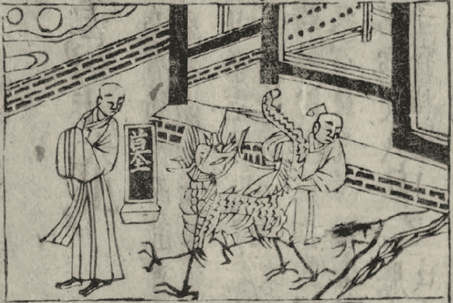
- 圖中：月當天，一門，一人攀龍尾，一僧接，一墓。
- 卦圖象解：
	- 一、月當天：陰人居上位象，無擔當也；清明無災。
	- 二、一門：豪鬥也，官府也。
	- 三、一人攀龍尾：附於貴人，想進據其位也。
	- 四、一僧接引：光頭之人，柔而無慾之象。入空門可解。
	- 五、墓：藏棺之地，有官與財象；置之死地而後生之象。
	- 全意，即使如龍之力大，但動不以時，則有入墓之險，此動為求官與財。佛理亦同：『生死一線，無死焉大生』。

### 人间道——需

- 上一卦[《山水蒙》](#《山水蒙》（四世）艮上%20坎下#人间道——蒙)——下一卦[《天水讼》](#《天水讼》（游魂）乾上%20坎下#人间道——讼)

> [!引申] 
蒙之後須養，此需之時也，飲食之道也。雲之上於天有蒸潤之象，就如同飲食之於人一樣，此養之時，乃待也。乾之性健，必採進法，仍處坎險之下，故須待而後進，即外險內健，此卦之象，乃真養之義。

- 需：有孚，光亨贞吉，利涉大川。
	- 以二卦體而言，乾以剛健，如上進而遇險，此未可進也。需待之。以卦之爻言，五爻陽居陽位，乃陽剛中正之德人，居君位，而誠信充實於內（內卦為乾），則光明而可進，必亨，故利涉大川。
- 《彖》曰：
	- 需，須也，險在前也，剛健而不陷，其義不困窮矣。
		- 因險在前，未可遽（jù）進，须待而進，以乾之剛健，能待而不輕動，則不陷險中，則必不至困窮。時下剛健之人頗多，其動必躁，如能待時而動，則為至善之道。
	- 需：有孚，光亨貞吉，位乎天位以正中也。
		- 孚，中實之義。五位因剛實居中，此孚之象，此居天位而能正中，光明而亨通，且須貞正（堅心），吉也。
	- 利涉大川，往有功也。
		- 因中實（內之學問、操守）而貞正（堅心向道），即涉險阻，亦可有功也。故需之道在以乾剛之性而知待之道，何所不利。
- 《象》曰：雲上於天，需，君子以飲食宴樂。
	- 此自然之象，水上於天未成雨，為雲。猶君子積蓄其才德，而未施於用也，懷其大才，安以待時，飲食以養身體，宴樂和其心志也。
- 初九：需于郊，利用恆，无咎。
	- 初爻因最遠於險，故於郊（曠（kuàng）遠之地），故君子處於曠遠之地，仍安守其常，則無咎災也。如躁進犯難，則必災至矣。
	- 《象》曰：需于郊，不犯難行也，利用恆，无咎，未失常也。
		- 君子處下野，不冒犯險難而行，復宜安處，不失其常，保持恆靜心亦不動，如雖不進而志動，則不能安其常也。
- 九二：需于沙，小有言，終吉。
	- 坎為水，水近則有沙，此二爻之位近險，故需于沙。君子知渐近於險難，雖未至於害，已小有言矣。此示言語之傷，至小者也。二爻以陽爻居之，示人陽剛之才居陰柔位，守中正之德，雖小有言語之傷，而无大害，終也吉。
	- 《象》曰：需于沙，衍在中也；雖小有言，以吉終也。
		- 此寓，二位雖近險，而如以寬裕居中，即小有言語之傷，及終得吉。
- 九三：需于泥，致寇至。
	- 泥，逼近於水也。因逼近於險，而致寇難之至，此居健體之上，有進動之象，苟非謹慎，終致喪敗也。
	- 《象》曰：需于泥，災在外也。自我致寇，敬愼不敗也。
		- 三位居上險之最近，故云災在外。此寇致之因，實乃己之逼也。須敬慎小心，量宜而進，則无喪敗。義在相時機而動，戒之盛也。即盛時須戒之象。
- 六四：需于血，出自穴。
	- 第四爻位以陰柔之質居於險，下又有三陽之進，必傷於險難。因傷於險難，必不可安居，而失其居所，故出自穴。此順時以從，不競於險難，則不至凶也。又無中正之德，只以剛競於險，此適足以致凶之道也。
	- 《象》曰：需于血，順以聽也。
		- 意為陰柔之性居近險之位，不能處，則退，以順從而聽於時，不至凶也。
- 九五：需於酒食，貞吉。
	- 此五君位，陽剛之人居中，只需宴安酒食以待之，所需必得也。堅心，必吉。
	- 《象》曰：酒食貞吉，以中正也。
		- 陽剛中正居五之君位，只需酒食，即可盡其道也。
- 上六：入于穴，有不速之客三人來，敬之終吉。
	- 陰柔於六位，乃需之極限，須安其處，此入於穴之義。安而止居，則下之三陽必來。不速，不促之而自來也。此時須以至誠盡敬之心以待之，雖再剛暴，必無欺凌之理也，此因六位陰位，非三陽乾體之人，志在必奪，故敬之則吉。
	- 《象》曰：不速之客來，敬之終吉；雖不當位，未大失也。
		- 此不當位，意為以险而在上也。聖人明示陰宜居下而今居上，此不當位也。但如能謹慎自處，則陽再剛亦不能欺，終得其吉。

## 《水地比》（归魂）坎上 下坤

~~~
 【本卦】
▆▆▆   ▆▆▆     妻财戊子水   应
▆▆▆▆▆▆▆▆▆     兄弟戊戌土
▆▆▆   ▆▆▆     子孙戊申金
▆▆▆   ▆▆▆     官鬼乙卯木   世
▆▆▆   ▆▆▆     父母乙巳火
▆▆▆   ▆▆▆     兄弟乙未土
~~~
众星拱北之卦，水行地上之象。
判曰：比者，和也。抚临万国，内通外流，水行于地，本性和柔。先王制礼，以亲诸侯，元永贞吉，百事无忧。

### 卦象——此卦陸賈將説蠻，卜得之，果勝蠻王歸也。

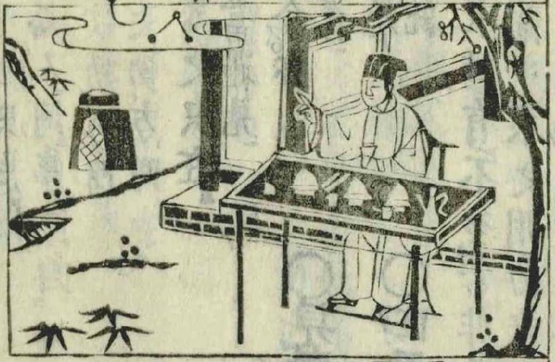
- 圖中：月圓當空，秀才望月飲酒，自酌自斟，藥爐在高處，枯樹開花。
- 卦圖象解：
	- 一、月圓當空：政治清明象。
	- 二、三星拱照：得賢能剛直之人輔助。
	- 三、秀才望月飲酒：示才智之人無憂也。（亦示：作秀之人，於政治清明時，無法出頭）
	- 四、自酌自斟：無慾則剛象，孤獨之象。
	- 五、藥爐在高處：無病無災，故不需用藥也。
	- 六、枯樹開花：晚發也。示心有誠，制度立，事必成。
	- 七、酒：忘憂之物。
	- 全卦：上位清明，三台輔佐，人將無憂，即使枯樹亦能開花。

### 人间道——比

- 上一卦[《地水师》](#《地水师》（归魂）坤上%20坎下#人间道——师)——下一卦[《风天小畜》](#《风天小畜》（一世）巽上%20乾下#人间道——小畜)

> [!引申] 
師之後，師者眾也，眾聚有相比親也。比，相親也，有眾則必有比，故次師也。物之相近莫如水與地，永遠相比附，故卦體為水在地上，地上有水象。水為險，地為順，故外險內順為比卦。險猶戰戰兢兢，恐得罪人象，內心又持順之地道，有坤厚之德性，此比之道也。

- 比：吉，原筮，元永貞，无咎。不寧方來，後夫凶。
	- 比為吉之道。人相親比，必有其道，須視可比而決定比之，不可比而比，凶。如果等到不能自保安寧之時，方開始求親比，幸運的得所親比，可得平安。但如仍獨立自持，求親比之想法不前反後，即使是丈夫之親人，亦招凶矣。
	- 是故君王亦懷柔天下，下位之人亦和親其上，未能獨立也，平日即須有此志，天地之間，沒有不相親比而能獨立生存的。
	- 相比之道，须兩志相求，如互不相求則為睽卦，故戰國策（中山策）有同慾相憎，同憂相親之理。所以好的制度，能使人有所依從，故能互相親和也。
- 《彖》曰：
	- 比，吉也。比，輔也，下順從也。
		- 因相親比為吉之道，有相輔相成之意。但求比之道，須如臣下順從君上一樣，即使地位相同，或上下有別，決不可因持於己之高位，而忘順從之道，此乃真比之道。
	- 原筮，元永貞，无咎，以剛中也。
		- 元、永、貞為相比之道。元為君長之道，永為可以長久，貞謂得正道且堅其心志，人有此三德性，再以陽剛當君主之位，此為君之德也。如此之君主可以無災矣。
	- 不寧方來，上下應也。
		- 上位之念，應知君不能獨立，须保民以此為安。下民知己不能自保，須擁君以求寧，此上下相應之理。如以王之私而行為之，不求下民之附和，凶危立至矣。
	- 後夫凶，其道窮矣。
		- 若眾人之志相和親，則無有不遂，此天地之道，若人之和親不行，則雖夫亦凶矣。
- 《象》曰：地上有水，比。先王以建萬國，親諸侯。
	- 天地之間，物相親比，莫如水在地上，聖人觀比之象，以此建萬國，近諸侯，親近人民，此比之極道。
- 初六：有孚，比之无咎。有孚盈缶（fǒu），終來有它，吉。
	- 此為比之始。孚為中信，故相比之道，以誠信為本，表裡不一致，人誰近之。誠信充實於內，如於缶中之滿，且外不加修飾（它，外也〕，至誠以待之，則無不信。
	- 《象》曰：比之初六，有它吉也。
		- 此即比之道在乎始也。始即能中實誠信，終吉，始無誠信，終凶。
- 六二：比之自内，貞吉。
	- 自內言主之在己也。得正道，而與君道相合，此吉也。即以中正之道，合於上位之所求，乃曰自內。今人汲汲以求比者，非君子自重之道，乃自失之道也。
	- 《象》曰：比之自内，不自失也。
		- 堅守己中正之道，以待上求，乃不自失也。此易之戒。故士人修己，方求上進之道。降志辱身此絶非自重之道。吾人救天下之心，並非不急切，乃因須待禮遇之至方出也。
- 六三：比之匪人。
	- 相親比之人，如為不正當之人，即為匪人，招凶也。
	- 《象》曰：比之匪人，不亦傷乎。
		- 相親於匪人，必將得悔咎，傷之大矣，君子須深戒所親比之人。
- 六四：外比之，貞吉。
	- 六四之位，為近君之位。居此位之人，以柔性坤德向君主親比，且堅心順從，吉也。
	- 《象》曰：外比於賢，以從上也。
		- 六四之位從於五君之位，為外比。因五位剛明之賢為中正，故附從之，此從上之道，絶不可盲從。
- 九五：顯（xiǎn）比，王用三驅，失前禽，邑人不誡，吉。
	- 人君親比天下之道，须誠意以待物，恕已以及人，發政施仁，民之所好好之，民之所惡惡之，為民圖利，使天下蒙其澤，此盡善也。則天下亦盡親於上也。如表彰己之小功，展示自己的權力，違反道德人心，強力施為，致人心不信，社會浮華，人偷敗亡，如此而求天下親比是不可能的。就好比君王出獵，只圍三面開一面，禽獸前去者，免矣，此曰失前禽，只取來者，此王道也。邑者，居邑，誡，期約也。此意臣之效於君，竭盡忠誠，用盡才能，以彰顯親君之道，此為正道。至於用之與否，決定在君，萬不可阿諛奉承，妄求君之親比也。朋友亦然，須修身誠意待人，至於是否願意與己相親，在人而己，千萬不可巧言令色，曲從苟合，以求人之相比。『此顯比之道』。
	- 《象》曰：顯比之吉，位正中也。舍逆取順，失前禽也。邑人不誡，上使中也。
		- 故顯比之所以吉，以其所在之位，得適中之法也。且比之道，须舍逆取順，孟子收徒之道：往者不追，來者不拒也。三面圍網，所失唯前禽，即言此來者撫之，去者不追之理。
- 上六：比之无首，凶。
	- 上六乃比之終極處。凡比之首，其始善，終亦必善矣。多數人皆有其始，而無其終，但從未有人沒有開始，而有終善也。故此言，比之無首（首，始也），至終必凶矣。今天下之人，始親和比之時不以正道，至終必有隔閡，此類人居多數。
	- 《象》曰：比之无首，无所終也。
		- 此即始不以道，則至終必也凶矣。是故交友之道，你來我往，你不來，我何往。如我往，必有求，須以正，否則終將隔隙，互相仇視也。
